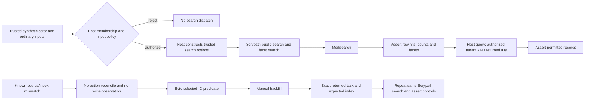

# Phase 166: Host Tenant and Repair Evidence - Research

**Researched:** 2026-09-26
**Domain:** Phoenix host authorization, packaged consumption, Ecto-scoped repair, and evidence freshness
**Confidence:** MEDIUM overall; source observations and recommendations are distinguished below.

<user_constraints>
## User Constraints (from CONTEXT.md)

The following decisions, discretion, and deferred scope are copied verbatim. [VERIFIED: .planning/phases/166-host-tenant-and-repair-evidence/166-CONTEXT.md:16-38,114]

<!-- DATA_c71fa824_START -->
### Named Phoenix host policy
- **D-01:** Extend the existing examples/phoenix_meilisearch consumer with the smallest persisted actor/membership and host-context fixture needed to prove tenant authorization. Run the same named scenario through the existing repository-path and freshly built package-artifact modes. The e-commerce demo already has tenant-aware data, but its visitor-selected URL tenant is not membership authorization and its current workflow is not the existing path/package consumer harness.
- **D-02:** Treat the test-supplied actor as a synthetic principal that has already passed authentication. The host context resolves membership from that actor, derives tenant scope itself, and rejects missing membership, forged/unowned tenant selection, and caller-controlled tenant-scope/filter overrides before Scrypath search dispatch. This proves the named host policy only; it does not prove login, sessions, production identity, or arbitrary adopter security.
- **D-03:** Keep authorization in the host context. Build Scrypath options from the verified membership and an allowlist of ordinary search inputs. Do not treat Scrypath's tenant filter as authentication or authorization.
- **D-04:** Rehydrate returned IDs through a host query scoped by both the authorized tenant and the returned ID set. Assert raw hits separately from hydrated records, counts, and requested facets; host hydration must not hide a foreign raw hit or metadata leak.
- **D-05:** Use a small mixed-tenant fixture with tenant A's allowed published record and excluded draft, plus an overlapping tenant B published positive-control record with a unique forbidden marker. Prove a valid B member can retrieve B's control, while A receives only permitted IDs and no B marker in raw hits, hydrated records, counts, or facets. Limit the claim to the deterministic fixture and configured service tuple; do not imply a general stale-index or session-authentication guarantee.

### Public facet-value follow-up
- **D-06:** Include the exact Phase 165 common-keyword-filter facet-value scenario in the named Phoenix path/package service proof. Exercise public search_facet_values/4 with the trusted tenant scope and the ordinary published-status filter against Meilisearch v1.15, then assert the expected tenant-scoped values/counts and exclusion of the other tenant's marker/value. Phase 165 reproduced and fixed the pre-HTTP serialization failure; Req.Test evidence alone does not close this live/package handoff.
- **D-07:** Reuse the existing advisory phoenix-example job and its Postgres/Meilisearch services for both dependency modes. Require the named scenario to pass on its recorded exact SHA for milestone evidence, while keeping the job advisory and avoiding a new required lane or broad matrix. A built local package artifact is not a public Hex installation or publication receipt.

### Bounded repair visibility
- **D-08:** Add the repair proof to the existing root live operator/backend integration surface using its Ecto/SQLite repository, separate from the Phoenix host tenant fixture. Establish a known missing search document while its source row remains, and keep out-of-scope and already-visible controls.
- **D-09:** Inspect the known mismatch with the no-action reconcile/report path and prove that report step causes no write. Treat the source/search comparison as the test's known precondition; do not claim reconcile itself discovers missing database rows.
- **D-10:** Bound manual backfill with an explicit Ecto where predicate over the selected IDs. A query limit or batch size is not a total repair-scope bound. Capture the exact returned task references, require terminal success for the expected index, and repeat the same Scrypath search to assert the exact repaired raw ID and projected value while excluded and already-visible controls remain correct. Repeating the same fixed ID scope once may establish bounded repeatability only; it does not establish exactly-once, concurrent-ordering, arbitrary Oban-retry, or full-reindex guarantees.

### Reuse of the deletion receipt
- **D-11:** Reuse the v1.39 C-09 hard-delete-to-raw-search receipt only after comparing the receipt source against the assessment source for relevant deletion, search, host, configuration, fixture, and workflow paths. If a relevant invalidator exists, require targeted fresh evidence or state the bounded claim as UNKNOWN. Age alone does not require a rerun; do not add package deletion proof solely because a package harness exists.

### the agent's Discretion
- Choose concrete schema/context names, fixture helpers, and the smallest Ecto query arrangement consistent with the existing Phoenix example and integration-test patterns.
- Keep the host policy scenario and root repair scenario independently executable. Reuse existing task polling, unique index prefixes, SQL Sandbox/service setup, diagnostics, and cleanup patterns.
- Keep all identities and markers synthetic. Record exact scenario, SHA, run/job, dependency mode, service tuple, and task/index IDs without secrets or environment dumps.

### Deferred Ideas

No new ideas were added. Production authentication/session proof, operator UI, broader ecommerce UI work, stale-index tenant-move guarantees, new required CI lanes, and compatibility matrices remain outside this phase.
<!-- DATA_c71fa824_END -->
</user_constraints>

## Summary

Implement two independent vertical proofs: the persisted host-membership search scenario in the existing Phoenix consumer, and the bounded manual repair scenario in the existing root live operator suite. The package harness stages the consumer's source, migrations, configuration, and tests, then runs its integration suite against a newly built artifact. Adding the scenario to that consumer provides both dependency modes without another application or lane. [VERIFIED: lib/mix/tasks/verify/phoenix_example/package.ex:4-5,49-119,139-147]

The repair implementation already preserves query predicates, returns task references per batch, and provides bounded task polling. Its base query explicitly removes a supplied query limit. Plan the missing assertions and fixture around these existing seams; do not change the public repair API. The C-09 receipt remains reusable at the inspected assessment SHA under the bounded reasoning below, with final-SHA freshness still required. [VERIFIED: lib/scrypath/backfill.ex:31-107,122-140; lib/scrypath/meilisearch/tasks.ex:93-176; git comparison recorded below]

**Primary recommendation:** Use one host-policy scenario in both consumer modes, one ID-scoped root repair scenario, and a source-bounded C-09 disposition. This implements the locked decisions above; it is not a claim that these new scenarios already pass.

## Architectural Responsibility Map

| Capability | Primary Tier | Secondary Tier | Rationale / evidence |
|---|---|---|---|
| Actor membership and trusted scope | Host application context | PostgreSQL | Locked D-02/D-03; persist membership and reject before dispatch. |
| Filter composition and backend request | Scrypath library | Meilisearch | Existing public contract; Phase 165 retains validated scope while removing the search-only option from runtime configuration. [VERIFIED: lib/scrypath/search/single.ex:14-27,44-54] |
| Authorized hydration | Host context and database | Scrypath raw result | Generic hydration selects returned IDs; add the host tenant predicate independently. [VERIFIED: lib/scrypath/hydration.ex:11-29] |
| Selected repair | Operator/test orchestration | Ecto source and Scrypath backfill | Locked D-08–D-10; source query determines the selected set. |
| Backend completion | Meilisearch task service | Existing library poller | Poll the returned reference, then independently observe the search outcome. [VERIFIED: lib/scrypath/meilisearch/tasks.ex:93-176] |
| Receipt identity and reuse | Verification workflow | Git and scenario artifacts | Locked D-07/D-11; acceptance is tied to source and scenario. |

<phase_requirements>
## Phase Requirements

Descriptions below reproduce the requirement contracts. [VERIFIED: .planning/REQUIREMENTS.md, Host Tenant Search, Bounded Repair Visibility, Evidence sections]

| ID | Description | Research Support |
|---|---|---|
| HOST-01 | A Phoenix host context derives tenant scope from an explicitly trusted actor with valid membership; missing membership, forged tenant selection, and caller-controlled tenant overrides are rejected before search. The evidence is bounded to the example host policy and does not claim Scrypath provides authentication. | Persisted actor/membership context; fast rejection dispatch observation; same policy in live consumer. |
| HOST-02 | In a mixed-tenant fixture, an authorized tenant search exposes only its permitted record IDs and requested metadata; a separately authorized second tenant is a positive control, and no foreign marker appears in the selected workflow's raw hits, hydrated records, counts, or facets. | Mixed-tenant positive controls; separate raw and hydrated oracles; ordinary facets plus public facet-value follow-up. |
| PKG-04 | The named host tenant workflow succeeds against both the repository path dependency and the freshly built Scrypath package artifact using the existing Phoenix consumer harness, without adding a separate package matrix or required CI lane. | Existing artifact staging includes consumer migrations and tests; existing advisory job invokes both modes. |
| REPAIR-01 | An operator can inspect a known source/index mismatch without a mutation, then select a manual backfill bounded by an explicit Ecto ID predicate; a query `limit` is not treated as the repair bound, and records outside the selected ID set remain unchanged. | Reconcile report/action boundary; retained where predicate; unchanged controls and write observation. |
| REPAIR-02 | After the selected backfill is submitted, the exact returned Meilisearch task reaches terminal success on the expected index and the same Scrypath search returns the exact repaired raw ID and expected projected value while control records retain their expected visibility. | Per-batch references, existing task poller, repeated same-query raw outcome. |
| DELETE-01 | A new condition 3 assessment can reuse the exact-SHA v1.39 hard-delete-to-visible-search receipt when a comparison finds no relevant source invalidator; otherwise it requires targeted fresh evidence or records the bounded claim as UNKNOWN. | C-09 comparison and conditional reuse below. |
</phase_requirements>

## Standard Stack

Keep the repository's existing dependency declarations and lockfiles. This phase needs no new external package or version upgrade. The table records declared constraints, not current registry releases; registry publish dates and new-package legitimacy checks are inapplicable to this recommendation. [VERIFIED: mix.exs:107-120; examples/phoenix_meilisearch/mix.exs:40-54; locked D-01/D-07/D-08]

| Component | Source value, verbatim | Use |
|---|---|---|
| Elixir | `elixir: "~> 1.17"` | Existing language floor. [VERIFIED: mix.exs:14] |
| Ecto | `{:ecto, "~> 3.13"}` | Query and schema boundary. [VERIFIED: mix.exs:109] |
| HTTP and SQLite support | `{:req, "~> 0.6.1"}`; `{:ecto_sqlite3, "~> 0.22", only: :test, runtime: false}` | Existing HTTP and root integration repository. [VERIFIED: mix.exs:112,116] |
| Phoenix/Postgres consumer | `{:phoenix, "~> 1.8.9"}`; `{:ecto_sql, "~> 3.14.0"}`; `{:postgrex, "~> 0.22.4"}` | Existing host scenario. [VERIFIED: examples/phoenix_meilisearch/mix.exs:42-46] |
| Service tuple | `image: postgres:16-alpine`; `image: getmeili/meilisearch:v1.15` | Existing advisory consumer lane. [VERIFIED: .github/workflows/ci.yml:157-164] |
| Hosted runtime | `elixir-version: "1.19.0", otp-version: "28.1"` | Preserve configured lane runtime. [VERIFIED: .github/workflows/ci.yml:169] |

## Architecture Patterns



The diagram prescribes the locked D-01–D-10 workflow. Keep host and repair fixtures independent. Follow the existing context ownership pattern: database changes and explicit sync orchestration belong in context functions. Phoenix's official guide describes contexts as the boundary for data access and validation. [VERIFIED: examples/phoenix_meilisearch/lib/scrypath_demo/blog.ex:25-48] [CITED: https://phoenix.hexdocs.pm/contexts.html]

**Host fixture:** Add the smallest persisted principal/membership representation and tenant association needed by the named policy. Resolve membership using the trusted principal; build backend options from an allowlist. Reject caller tenant/filter overrides before dispatch, and test that dispatch did not occur. Keep ordinary search inputs separate from trusted runtime/service options. Concrete schema names and error shapes are implementation choices, not existing contracts. [VERIFIED: locked D-01–D-03]

**Projection and settings:** The current Post declaration is `fields: [:title, :body, :author_name]`, `filterable: [:status]`, `sortable: [:inserted_at]`. Add the selected tenant declaration and a string facet field with its corresponding settings; wait for settings/indexing tasks before result assertions. Preserve compatibility with existing example fixtures and migrations. [VERIFIED: examples/phoenix_meilisearch/lib/scrypath_demo/blog/post.ex:5-22] The selected additional field/schema names are left to the authorized discretion, not asserted as present.

**Hydration:** Generic hydration constructs `where([record], field(record, ^source_id_field) in ^source_ids)`. It does not add the phase's host membership predicate. Perform host hydration with both authorized tenant and hit-ID conditions; assert raw results first. Preserve returned-ID ordering if the host response promises it. [VERIFIED: lib/scrypath/hydration.ex:23-29; locked D-04]

**Repair:** Establish source records for target A, out-of-scope B, and already-visible C. Establish A/C visibility, remove only A's search document while retaining its row, await fixture task completion, then confirm A/B absent and C present. Call no-action reconcile; observe no write and unchanged search state. Backfill only A's explicit ID set, correlate every returned task/index, and repeat the identical query to assert A's raw ID/projected value, B absent, and C unchanged. These are prospective acceptance steps grounded in D-08–D-10 and the existing live suite. [VERIFIED: test/scrypath/live_operator_verification_test.exs:9-34,94-163; .planning/research/v1.40/C16-REPAIR-VISIBILITY.md:64-69]

**Task boundary:** Backfill returns `batch_results: Enum.reverse(acc)` and each batch exposes `task: public_task(result.task)` with `uid`, `status`, `index_uid`, `type`, and `raw`. The poller succeeds only when `task.state == :succeeded`; failed, cancelled, malformed, and timeout results remain failures. Do not select an arbitrary latest successful task. [VERIFIED: lib/scrypath/backfill.ex:42-49,122-140; lib/scrypath/meilisearch/tasks.ex:133-176] Meilisearch documents asynchronous mutation acceptance separately from task completion. [CITED: https://www.meilisearch.com/docs/capabilities/indexing/tasks_and_batches/async_operations]

## Don't Hand-Roll

| Problem | Use instead | Evidence / reason |
|---|---|---|
| New package consumer or CI matrix | Existing artifact staging and consumer suite | Stages `@staged_files ["mix.exs", "mix.lock", "config", "lib", "priv", "test"]`. [VERIFIED: lib/mix/tasks/verify/phoenix_example/package.ex:4-5,139-147] |
| Task completion loop | Existing task poller and deadline helper | Handles failure states and timeout; helper bounds visibility checks. [VERIFIED: lib/scrypath/meilisearch/tasks.ex:93-176; test/support/meilisearch_integration.ex:102-145] |
| Source/index reconciliation engine | Known test precondition plus report API | Report gathers status, failed work and rebuild visibility; this phase does not add row-diff discovery. [VERIFIED: lib/scrypath/operator/reconcile.ex:83-110; locked D-09] |
| Authentication framework | Synthetic already-authenticated actor and host membership | Explicit locked D-02 boundary. |
| New repair mechanism | Existing manual backfill with an Ecto predicate | Predicates survive batching; the caller's limit does not. [VERIFIED: lib/scrypath/backfill.ex:92-107] |

## Common Pitfalls

- **A filtered hydrated list can conceal foreign raw hits or metadata.** Assert both surfaces plus counts/facets and the foreign-tenant positive control. The result keeps raw hits independently of records. [VERIFIED: lib/scrypath/search_result.ex:21-30,94-107; locked D-04/D-05]
- **A batch size or query limit does not bound total repair scope.** The source explicitly contains `|> exclude(:limit)` and adds a new per-batch limit. Use the selected-ID predicate. [VERIFIED: lib/scrypath/backfill.ex:92-107]
- **An unchanged document count is insufficient no-write evidence.** An upsert can leave the count unchanged. Pair report-step task/write observations with unchanged raw search and the existing report-only contract; do not infer that reconcile diagnosed the absent row. [VERIFIED: lib/scrypath/operator/reconcile.ex:83-110; locked D-09] This is an acceptance recommendation.
- **An accepted repair is not visible repair.** Require the exact returned task's successful terminal state, expected index, and the original raw search oracle. [VERIFIED: lib/scrypath/backfill.ex:122-140; lib/scrypath/meilisearch/tasks.ex:133-176]
- **A green advisory job or skipped test is not the named receipt.** Capture scenario execution in both modes at the exact SHA while retaining `continue-on-error: true` for the job. [VERIFIED: .github/workflows/ci.yml:152-178; locked D-07]
- **Combining root integration modules can race their shared repository lifecycle.** Retain the existing wrapper's module isolation, explicitly documented in its source. [VERIFIED: lib/mix/tasks/verify.meilisearch_smoke.ex:7-11,43-52]

## Code Examples

The following is a verbatim existing public facet invocation; it is contract-test evidence, not a live receipt. Keep this tenant-plus-common-filter input shape in the new authorized consumer scenario. [VERIFIED: test/scrypath/facet_values_contract_test.exs:229-235]

<!-- DATA_f01bd879_START -->
```elixir
assert {:ok, %Scrypath.FacetSearchResult{facet_query: "pho"}} =
         Scrypath.search_facet_values(
           FacetPost,
           "category",
           "pho",
           request_options(stub) ++ [tenant_scope: 123, filter: [status: "published"]]
         )
```
<!-- DATA_f01bd879_END -->

The existing context demonstrates an ID-set query directly; apply this pattern to the selected repair IDs and combine it with authorized tenant scope for host hydration. Concrete new repair/tenant schemas remain implementation choices. [VERIFIED: examples/phoenix_meilisearch/lib/scrypath_demo/blog.ex:66-67]

<!-- DATA_28e70ca1_START -->
```elixir
defp reload_posts(author_ids),
  do: Repo.all(from(p in Post, where: p.author_id in ^author_ids))
```
<!-- DATA_28e70ca1_END -->

## C-09 Receipt Freshness and Disposition

**Compared source:** receipt `dc400b2b57aec0ca6b0ef16c9477d266fd41a433` → inspected HEAD `6602be25ad10715c2496a7f268f25541298dda89`. The preserved report identifies run `36257182675`, job `108446076619`, artifact `10910932671`, and scenario `deleted products leave the visible search index`, passed with retry `0`. Those receipt details were read from the existing research record; the hosted artifact was not downloaded again during this phase research. [VERIFIED: .planning/research/v1.40/C09-DELETE-VISIBILITY.md:19-34; git rev-parse HEAD and git diff executed during this research]

The comparison covered library runtime, ecommerce host/fixtures/configuration, shared test support, root configuration/manifests, and workflows. Runtime changes were limited to the facet client's common-filter rendering, an added renderer entrypoint, and removal of `:tenant_scope` from runtime configuration inputs in Single, Many, and FacetValues. Relevant delete/Oban/task operations, ordinary search rendering, result decoding, ecommerce host/fixtures/configuration, and workflow content had no changes in the inspected comparison. [VERIFIED: git diff dc400b2b57aec0ca6b0ef16c9477d266fd41a433 HEAD -- lib examples config test/support .github/workflows mix.exs mix.lock]

The C-09 endpoint supplies `[filter: [tenant_id: tenant_id]]` to ordinary search and extracts `result.hits`. It does not use the newly handled tenant-scope option or facet search. The changed Single helper only adds `:tenant_scope` to the dropped configuration keys; dropping an absent key does not alter this input. The before/after scenario still observes known presence, deletion, raw disappearance, and sibling visibility. [VERIFIED: examples/scrypath_ecommerce/lib/scrypath_ecommerce_web/controllers/e2e_controller.ex:198-209; lib/scrypath/search/single.ex:44-54; examples/scrypath_ecommerce/e2e/storefront.spec.ts:125-154]

**Disposition: REUSABLE for the original bounded hard-delete claim at this inspected SHA.** This is a source-based inference from the comparison, not a newly executed deletion receipt. Repeat this relevant-path assessment against the final assessment SHA. Any subsequent semantic invalidator requires targeted fresh evidence or UNKNOWN. Preserve the claim limits: source-backed ecommerce hard delete with controlled Oban drain; no package deletion, atomic enqueue, concurrency ordering, production latency, or arbitrary-host claim. [VERIFIED: comparison above; .planning/research/v1.40/C09-DELETE-VISIBILITY.md:9-15,36-47; locked D-11]

## Project Constraints (from AGENTS.md)

- Consult the relevant local architecture and ecosystem briefs; preserve Ecto-first APIs, Phoenix-friendly integration, minimal setup, explicit synchronization and operational semantics, and the release quality bar. [VERIFIED: AGENTS.md:3-22]
- Preserve Meilisearch-first public support, the internal adapter seam, inline/manual/Oban flows, function-oriented core, and first-class telemetry. Do not add a public multi-backend facade, Phoenix-only core, mandatory core supervision, or another initial search product. [VERIFIED: AGENTS.md:26-65]
- Retain the established tooling and follow existing code patterns; this phase introduces no dependency substitution. [VERIFIED: AGENTS.md:43-65,75-78]
- Keep changes focused; run the CONTRIBUTING checks appropriate to changed surfaces; update the product document only if deliberately changing product scope or shipped claims. [VERIFIED: AGENTS.md:90-92]
- Keep main green, prefer PR-first execution for substantial work, and require executable or exact-SHA hosted acceptance rather than pending human UAT. Do not simulate reviewer identity or silently approve trust gates. [VERIFIED: AGENTS.md:96-103]
- Respect the documented idle-state interpretation and do not invent milestone work; this phase is explicitly active in the current state. Preserve the managed developer-profile section. [VERIFIED: AGENTS.md:94-114; .planning/STATE.md:1-12]

## Environment Availability

These are read-only observations from this research session, not service acceptance or test results. [VERIFIED: local availability commands executed during research]

| Dependency | Observation | Planning consequence |
|---|---|---|
| Elixir/OTP | Default `elixir --version` reports no selected version; explicit `ASDF_ELIXIR_VERSION=1.19.5-otp-28 ASDF_ERLANG_VERSION=28.5` reports Elixir 1.19.5 and OTP 28. | Select installed runtime explicitly for local commands; preserve hosted configuration. |
| Docker | CLI and server report 29.5.2. | Existing service provisioning remains available; no service was started here. |
| PostgreSQL | `pg_isready -h 127.0.0.1 -p 5433` reports accepting connections. | Server version, intended database, and credential access remain unverified. |
| Meilisearch | Local health request on port 7700 fails to connect. | Provision the intended service or use the existing hosted lane before claiming live acceptance. |

**Local availability does not prove the intended service tuple or authentication.** Record the actual configured backend version/image and database access at execution, without exposing secrets. Hosted evidence is an existing fallback for unavailable local services, but its named scenario must execute successfully. No implementation tests were run during research. [VERIFIED: probes above; .github/workflows/ci.yml:152-178]

## Validation Architecture

Use existing ExUnit, SQL Sandbox consumer setup, and root integration helpers. The configuration explicitly sets `"nyquist_validation": true`. [VERIFIED: .planning/config.json: workflow; examples/phoenix_meilisearch/test/support/data_case.ex:30-40; test/scrypath/live_operator_verification_test.exs:1-34]

| Requirement | Automated proof to plan | Command / existing surface |
|---|---|---|
| HOST-01 | Membership and override rejection with zero dispatch; positive authorized dispatch | Focused new context tests within existing consumer suite. New scenario is a Wave 0 gap. |
| HOST-02 | Real mixed-tenant raw IDs, hydration, counts, facets, and B positive control | Existing consumer integration surface, extended with the named fixture. |
| PKG-04 | Same named scenario passes in both dependency modes, including public keyword-filter facet values | `mix verify.phoenix_example` and `mix verify.phoenix_example --package`. [VERIFIED: CONTRIBUTING.md:39,98-100] |
| REPAIR-01 | Known mismatch, no-write reporting, selected-ID predicate, unchanged controls | Extend existing live operator test; preserve focused backfill and report contracts. |
| REPAIR-02 | All returned task UIDs succeed on expected index; same-query raw result proves repaired projection | `mix verify.backend`; operator file already appears in the curated integration list. [VERIFIED: CONTRIBUTING.md:35; lib/mix/tasks/verify.meilisearch_smoke.ex:24-29] |
| DELETE-01 | Receipt/assessment relevant-path comparison and explicit disposition | Repeat the comparison recorded in C-09 section against final source; targeted rerun only if invalidated. |

**Sampling:** During implementation run the affected focused file/test, then the canonical backend or consumer commands at the integration boundary. Keep root integration files separate as the wrapper directs. Use the normal fast command `mix test --exclude integration --exclude docs_contract` for applicable root regressions. Run required contributor gates once at the completed change; broaden only for failures or new changes. [VERIFIED: CONTRIBUTING.md:26-46; lib/mix/tasks/verify.meilisearch_smoke.ex:43-52] New scenario duration and any under-30-second quick-test budget are unmeasured; measure them rather than promising a runtime. [ASSUMED]

**Wave 0 gaps:** persisted principal/membership and tenant fixture; host allowlist/rejection dispatch observation; independently scoped hydration; configured string facet and both public facet oracles; known-mismatch repair case and report no-write observation; exact task/index correlation; sanitized scenario receipt fields. These are implementation tasks required by the locked context, not a missing framework installation. Capture scenario, SHA, run/job/attempt, dependency mode, service tuple, pass/skip result, and relevant task/index IDs. [VERIFIED: locked D-01–D-10]

## Security Domain

Apply host access-control, untrusted-input validation, and data-exposure checks to the named fixture. Authentication and session construction remain outside the phase, and no cryptographic feature is added. Reject tenant/filter overrides before dispatch and ensure hydration cannot substitute for raw-hit privacy assertions. [VERIFIED: locked D-02–D-05]

| ASVS control family | Applicability | Planned control |
|---|---|---|
| Authentication / sessions | Boundary only | Synthetic already-authenticated principal; no authentication or session assurance claim. |
| Access control | Yes | Persisted membership, trusted scope construction, host tenant-and-ID query. |
| Input validation | Yes | Allowlisted ordinary inputs; explicit pre-dispatch override rejection. |
| Cryptography | No new implementation | No new token, credential or cryptographic subsystem. |

This is a phase threat/control mapping, not ASVS certification or a versioned requirement-number mapping. The role template's category numbers were not independently checked against a particular ASVS release and must not be presented as verified compliance. [ASSUMED] Threats addressed are forged scope (spoofing/elevation), filter override (tampering), foreign hits/facets/counts (information disclosure), and uncontrolled repair scope (tampering/resource use); the locked fixture and ID predicate supply the corresponding bounded controls. [VERIFIED: locked D-02–D-10]

## Assumptions Log and Open Questions

| Item | Status / consequence |
|---|---|
| New scenario runtime | [ASSUMED] Unmeasured; capture execution duration and do not expand the matrix to compensate. |
| Versioned ASVS mapping | [ASSUMED] Not established; no certification claim is planned. |
| Exact local service tuple/auth | UNKNOWN from availability probes; execution must establish it or use exact-SHA hosted service evidence. |
| C-09 final assessment freshness | Resolved only through inspected HEAD; repeat comparison at final source and keep UNKNOWN if a relevant change cannot be discharged. |
| Proposed host schema/error names | Authorized implementation discretion; no new public library API or product decision is required. |

## Sources

- Local authority: Phase 166 context, REQUIREMENTS, STATE, ROADMAP, PROJECT, AGENTS, and CONTRIBUTING, cited above; Phase 165 context and Plan 02 summary supply the public facet live/package handoff.
- Existing research: v1.40 SUMMARY, C10-C11-HOST-BOUNDARIES, C16-REPAIR-VISIBILITY, and C09-DELETE-VISIBILITY were consulted for the bounded evidence strategy; historical receipt observations remain attributed to their original record.
- Implementation authority: consumer context/Post/Repo/sandbox/smoke test and package task; root backfill, reconcile, task poller, hydration/result handling, live operator/backfill tests, integration helper and curated wrapper; workflow configuration; ecommerce raw-search endpoint and deletion scenario.
- Local briefs consulted: Elixir, Ecto, and Phoenix best-practice research under prompts; use their function/context/query principles subject to current repository contracts, not their historical speculative product scope.
- Official pages opened: [Phoenix contexts](https://phoenix.hexdocs.pm/contexts.html) and [Meilisearch asynchronous operations](https://www.meilisearch.com/docs/capabilities/indexing/tasks_and_batches/async_operations). The research-plan seam selected Jina; that provider was unavailable, so built-in web access opened only these two authoritative pages. No broad ecosystem survey was performed.
- Confidence seam: `query classify-confidence --provider websearch --verified` returned `MEDIUM`. Overall MEDIUM reflects source-based feasibility and inherited receipts; the new host/repair service scenarios remain unexecuted. Research validity is source-bound: reassess when relevant implementation, fixtures, service configuration, or workflows change.
