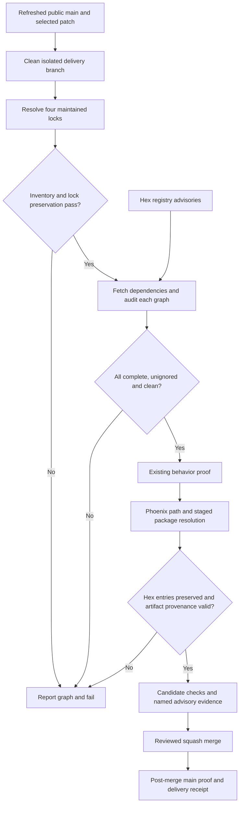

# Phase 168: Dependency Security and Reliable Verification - Research

**Researched:** 2026-09-28, primary-source refresh through 17:54 UTC
**Domain:** Mix dependency graphs, Hex advisory coverage, consumer proof, and public-main delivery
**Confidence:** MEDIUM overall; compatibility and audit cost remain execution questions

<user_constraints>
## User Constraints (from CONTEXT.md)

The following approved decisions, discretion, and deferrals are copied verbatim from the phase context. [VERIFIED: .planning/phases/168-dependency-security-and-reliable-verification/168-CONTEXT.md:16-29,50-56]

<!-- DATA_8c54fe2a_START -->
### Security and effective dependency proof
- **D-01:** Cover root, Phoenix example, ecommerce example and standalone Ops locks. Target Mint 1.11.0+ after refreshing official advisories; include necessary compatible HPAX/subtree changes. Do not substitute ignores or inferred risk acceptance for remediation.
- **D-02:** Prove actual resolved dependencies after Phoenix package staging and reject unexpected Hex-lock drift while allowing the intended Scrypath provenance substitution. Reuse appropriate root/backend, both Phoenix modes, mounted ecommerce and standalone Ops evidence. Ops is absent from manual closeout dispatches; obtain its applicable PR/main result.
- **D-03:** Audit the explicit four-graph inventory in the existing advisory lane, with a cheap omission guard. Preserve locks, report each graph and any ignored/incomplete result, propagate failure, avoid a duplicate root scan and measure incremental fetch/runtime cost. Keep repository-only orchestration outside the shipped package surface. Add no required CI job, broad matrix or exploit suite.

### Delivery and source identity
- **D-04:** Deliver the existing mounted-readiness fix early with focused regression and mounted behavior proof. Use a clean refreshed public-main base through supported GSD isolation. Preserve unrelated local changes; never push the accumulated unpublished branch as the delivery unit.
- **D-05:** Completion requires selected fixes merged with required candidate checks and green post-merge evidence, plus the named advisory/path-selected proof. Keep candidate, merge-ref, squash-main, local-package and published-package identities distinct. Prepared PRs or blocked merges remain incomplete delivery; do not fabricate trust-gate approval.
- **D-06:** Preserve the Ecto-first/Meilisearch-first library boundary and host-owned locks. No new direct Mint dependency policy, public capability, compatibility promise or UI implementation is selected. Ops dependency remediation does not authorize operator UI work.

### Planner Discretion
- Choose coherent PR grouping, whether startup stabilization precedes the security slice, supported isolation setup, audit orchestration, package-lock proof implementation and focused automated verification commands.
- Start from the completed upstream review. Research only unresolved implementation questions and refresh mutable facts before acting; do not repeat the milestone fanout or whole-product assessment. This handoff does not replace phase research or plan checking.
- Existing code/proof may be reused after relevant-source comparison. Choose checks for meaningful happy, failure and boundary behavior and recurring confidence per runtime cost.

## Later Work

- Phase 169: tenant/facet fix delivery, remaining owned-delta dispositions and finite bot PR cohort.
- Phase 170: focused docs, warranted patch/parity and durable terminal six-condition readiness decision.
- Operator UI: only after a fresh passing gate, maintainer availability and separate scope approval.

Do not delay the Phase 168 security correction for bulk historical planning reconciliation or bot triage.
<!-- DATA_8c54fe2a_END -->
</user_constraints>

## Summary

Use the approved four-graph correction. The refreshed official registry reports Mint 1.11.0 as latest stable, published September 28, and HPAX 1.1.0 as latest stable, published September 24. Mint's three September 28 advisories still identify 1.11.0 as the patched version. Its release requires HPAX `~> 1.1`; both releases declare Elixir `~> 1.15`. These are present constraints, not inferred compatibility from missing metadata. [CITED: https://hex.pm/api/packages/mint] [CITED: https://hex.pm/api/packages/mint/releases/1.11.0] [CITED: https://hex.pm/api/packages/hpax/releases/1.1.0] [CITED: https://github.com/elixir-mint/mint/security/advisories]

The implementation seam remains narrow: semantic consumer-lock comparison, repository-only four-graph audit orchestration, and transfer of the existing mounted startup patch onto a clean delivery branch. Current package proof resolves dependencies and checks only the Scrypath artifact entry; the fake success runner discards all Hex entries. Existing deep quality audits only its current project. [VERIFIED: lib/mix/tasks/verify/phoenix_example/package.ex:79-119,123-137] [VERIFIED: test/mix/tasks/verify_phoenix_example_package_test.exs:97-106] [VERIFIED: lib/mix/tasks/verify/capability.ex:67-72,119-132]

**Primary recommendation:** Deliver startup stabilization first, then one coherent security/proof PR containing the four locks, consumer graph checks, and recurring audit protection. Keep implementation plans dependent on an explicit clean-base assertion and finish with required candidate checks, named advisory/path-selected proof, merge, and green post-merge evidence. This sequencing is a recommendation within D-04/D-05 discretion, not another scope decision.

## Architectural Responsibility Map

Recommended ownership, derived from the approved boundary:

| Capability | Primary tier | Secondary tier | Rationale |
|---|---|---|---|
| Dependency resolution | Each Mix project/host | Hex registry | Update each maintained lock independently; consumers own effective resolutions. |
| Recurring security inventory | Repository tooling | Existing advisory CI job | The inventory includes apps excluded from the library artifact. |
| Package graph identity | Phoenix proof harness | Mix/Hex resolver | Compare the graph after the harness substitutes Scrypath provenance. |
| Mounted endpoint readiness | Example startup lifecycle | Compose health/browser probe | Finite preparation processes must not advertise persistent readiness. |
| Source and delivery evidence | Git/GitHub release workflow | Existing verifier/monitor | Candidate, merge ref, and squash-main have distinct identities. |

The host-lock ownership rule comes from official Elixir library guidance; package-file ownership is explicit in the manifest. [CITED: https://elixir.hexdocs.pm/library-guidelines.html] [VERIFIED: mix.exs:265-271]

## Project Constraints (from AGENTS.md)

- Keep the Elixir/Ecto-first, Phoenix-friendly, Meilisearch-first boundary and internal adapter seam. Preserve inline, optional Oban, and manual flows; keep consistency and operational limits explicit. [VERIFIED: AGENTS.md:14-19,37-43]
- Retain the declared support envelope: verbatim values `1.17`, `1.19`, `26`, `28`; do not expand it because newer host runtimes exist. Use the established Ecto/Telemetry, GitHub Actions/setup-beam, Hex/ExDoc/Credo/Dialyxir stack. [VERIFIED: AGENTS.md:25-60]
- Avoid a public multi-backend facade, Phoenix-only architecture, mandatory core supervision, and a new Postgres-search promise. [VERIFIED: AGENTS.md:61-65]
- Consult the relevant prompts; follow existing patterns and CONTRIBUTING verification rules; keep edits focused and update product scope records only when intentionally changing scope or shipped claims. [VERIFIED: AGENTS.md:10,78,90-92]
- Follow the green-main PR-first release train; use executable or exact-source hosted evidence, preserve real trust gates, and do not invent idle work. Respect the documented idle-state interpretation when applicable. [VERIFIED: AGENTS.md:94-105]
- Do not manually modify the managed developer profile. [VERIFIED: AGENTS.md:110-115]
- Current task boundary: research only; no tests, dependency resolution, CI dispatch, merge, or implementation performed in this research session. The research artifact is the only repository file owned by this agent.

<phase_requirements>
## Phase Requirements

The descriptions below reproduce the current acceptance text. [VERIFIED: .planning/REQUIREMENTS.md:13-19]

<!-- DATA_92ab0c7e_START -->
| ID | Description | Research support |
|---|---|---|
| MINT-01 | All four maintained Mix graphs (root, Phoenix example, ecommerce example, standalone Ops) resolve Mint to 1.11.0 or a later available release verified against current primary advisories, including necessary compatible HPAX/subtree updates, and the correction reaches public `main`. Advisory ignores or inferred risk acceptance cannot substitute for remediation. This establishes repository graph security, not an automatic upgrade of adopter locks. | Current release/advisory refresh; independent lock boundaries; scoped resolver update. |
| MINT-02 | Existing root/backend, Phoenix path/package, mounted ecommerce and standalone Ops proof passes for the relevant changed source. Phoenix proof identifies the actual resolved dependency graph and rejects unexpected Hex-lock drift after package staging; the intended Scrypath provenance substitution is allowed. Evidence names its source, graph and claim limits, including advisory/path-selected jobs absent from manual closeout runs. | Lock identity invariant; existing harness seams; PR/main Ops selection. |
| MINT-03 | The existing advisory dependency-audit path checks the explicit inventory of all four maintained graphs, preserves their locks, reports each result and any ignored findings, and fails on an affected graph or incomplete audit. A cheap inventory guard prevents silently omitting a maintained graph. Reuse the existing lane, avoid duplicate root audits, and record incremental dependency-fetch/runtime cost without adding a required job or service matrix. | Repository-only orchestrator, omission guard, strict ignore reporting, failure aggregation and timing. |
| DELIV-01 | The local mounted-readiness correction reaches public `main` through a coherent PR with focused regression and mounted behavior proof, passing required candidate checks and post-merge evidence; unrelated worktree changes remain excluded. | Existing two-file patch; readiness oracle; isolation and delivery receipts. |
<!-- DATA_92ab0c7e_END -->
</phase_requirements>

## Standard Stack

| Component | Version / disposition | Purpose and evidence |
|---|---|---|
| Mint | Target 1.11.0; published 2026-09-28T09:58:18Z | Maintainer release fixes current advisories; no new direct dependency. [CITED: https://hex.pm/api/packages/mint/releases/1.11.0] |
| HPAX | Target 1.1.0; published 2026-09-24T09:44:20Z | Satisfies Mint's required `~> 1.1`. [CITED: https://hex.pm/api/packages/hpax/releases/1.1.0] |
| Mix/Elixir and OTP | Reuse CI tuple; exact source quote: `elixir-version: "1.19.0", otp-version: "28.1"` | Existing advisory/proof runtime; no toolchain upgrade. [VERIFIED: .github/workflows/ci.yml:139-150,167-178] |
| Hex audit | Source/docs reviewed at 2.5.1; record actual execution version | Existing advisory engine; includes advisory and retirement findings. [CITED: https://hex.hexdocs.pm/Mix.Tasks.Hex.Audit.html] |
| ExUnit and existing service proof | Reuse, no added framework | Existing test modules use `use ExUnit.Case, async: false`; existing tasks own service behavior. [VERIFIED: test/mix/tasks/verify_phoenix_example_package_test.exs:1-4] |

**Update operation:** Run `mix deps.update mint` in each maintained project in the isolated delivery workspace, then inspect all lock differences. Mix updates the named dependency and its children; necessary HPAX changes belong to that closure. Do not use an all-dependency update. Solver success and runtime compatibility are still unexecuted. [CITED: https://github.com/elixir-lang/elixir/blob/v1.19.0/lib/mix/lib/mix/tasks/deps.update.ex]

### Refreshed advisory boundary

| Advisory | Affected range | Patched release | Primary source |
|---|---|---|---|
| GHSA-g83f-2j6r-q6m4 | >=0.1.0, <1.10.0 | 1.10.0 | [CITED: https://github.com/elixir-mint/mint/security/advisories/GHSA-g83f-2j6r-q6m4] |
| GHSA-7p8w-j234-7qc8 | >=1.9.3, <1.10.0 | 1.10.0 | [CITED: https://github.com/elixir-mint/mint/security/advisories/GHSA-7p8w-j234-7qc8] |
| GHSA-rj5m-69wp-cxq9 | <=1.10.0 | 1.10.1 | [CITED: https://github.com/elixir-mint/mint/security/advisories/GHSA-rj5m-69wp-cxq9] |
| GHSA-9x8p-qrf4-jq7g | >=1.1.0, <1.11.0 | 1.11.0 | [CITED: https://github.com/elixir-mint/mint/security/advisories/GHSA-9x8p-qrf4-jq7g] |
| GHSA-q95c-ccq6-j5j6 | >=0.1.0, <1.11.0 | 1.11.0 | [CITED: https://github.com/elixir-mint/mint/security/advisories/GHSA-q95c-ccq6-j5j6] |
| GHSA-gvrc-75rc-7gj9 | <1.11.0 | 1.11.0 | [CITED: https://github.com/elixir-mint/mint/security/advisories/GHSA-gvrc-75rc-7gj9] |

The complete repository advisory API was refreshed, not just the six selected pages. One older record has a broad affected range but explicitly says patched `>= 1.9.1`; honor patched-version metadata rather than mechanically calling all later releases vulnerable. Hex release metadata and the tagged changelog cross-check the current target. Neither this lookup nor a registry audit proves exploitation or universal deployment safety. [CITED: https://api.github.com/repos/elixir-mint/mint/security-advisories] [CITED: https://github.com/elixir-mint/mint/security/advisories/GHSA-c59h-fq4p-r36r] [CITED: https://github.com/elixir-mint/mint/blob/v1.11.0/CHANGELOG.md]

### Current graph evidence

Each row quotes the exact package/version prefix read from its source-of-truth lock; omitted tuple tails are not needed for this inventory. These source paths identify inspected files, not claims about a newly generated filesystem layout.

<!-- DATA_f2196db3_START -->
| Graph | Verbatim lock excerpts | Source |
|---|---|---|
| Root | `"mint": {:hex, :mint, "1.10.1"`; `"hpax": {:hex, :hpax, "1.1.0"` | [VERIFIED: mix.lock:20-26] |
| Phoenix | `"mint": {:hex, :mint, "1.9.3"`; `"hpax": {:hex, :hpax, "1.0.4"` | [VERIFIED: examples/phoenix_meilisearch/mix.lock:9-12] |
| Ecommerce | `"mint": {:hex, :mint, "1.9.3"`; `"hpax": {:hex, :hpax, "1.0.4"` | [VERIFIED: examples/scrypath_ecommerce/mix.lock:18-23] |
| Standalone Ops | `"mint": {:hex, :mint, "1.9.3"`; `"hpax": {:hex, :hpax, "1.0.4"` | [VERIFIED: scrypath_ops/mix.lock:26-31] |
<!-- DATA_f2196db3_END -->

The Finch entry quotes `"finch": {:hex, :finch, "0.23.0"` and `{:mint, "~> 1.8"`; that requirement admits the target. The official solver must still confirm the full graph. [VERIFIED: mix.lock:19-19] [VERIFIED: examples/phoenix_meilisearch/mix.lock:8-8] Root directly declares `{:req, "~> 0.6.1"}`; its optional Oban declaration is `{:oban, "~> 2.21", optional: true}`. Removing the optional integration would not remove the Req transport chain. [VERIFIED: mix.exs:107-120] [VERIFIED: mix.lock:19-26,33-33]

## Package Legitimacy Audit

The mandated seam was attempted with the correct ecosystem. It returned `Error: Usage: gsd-tools package-legitimacy check --ecosystem <npm|pypi|crates> <pkg1> ...` for Hex. This is **unsupported**, not an OK/SUS/SLOP verdict. Do not substitute an npm lookup for an Elixir package. Official upstream discovery, package identities, registry versions, publish dates, and repository links were cross-checked directly. [VERIFIED: session command, package-legitimacy check --ecosystem hex mint hpax]

| Package | Registry | Age / observed weekly downloads | Source repo | Seam verdict | Disposition |
|---|---|---|---|---|---|
| mint | Hex | Since 2019-02-25 / 653,156 | elixir-mint/mint | Unsupported ecosystem | Existing dependency; retain target, authoritative provenance established. [CITED: https://hex.pm/api/packages/mint] |
| hpax | Hex | Since 2021-09-22 / 668,517 | elixir-mint/hpax | Unsupported ecosystem | Existing dependency; retain required subtree update. [CITED: https://hex.pm/api/packages/hpax] |

No new package is recommended. No SLOP or SUS verdict was returned. The registry signals are observations, not a substitute claim that the unsupported seam passed. Node postinstall checks do not apply to these Mix releases. The planner should record the gate's ecosystem limitation without inventing an install-approval requirement for the already-approved Mint/HPAX correction.

## Architecture Patterns

### System Architecture Diagram

Recommended control/data flow:



### Component Responsibilities and Recommended Structure

| Existing seam / proposed owner | Plan responsibility |
|---|---|
| Package proof helper | Capture source graph before resolution; compare after resolution; emit identity before compile/tests and cleanup. Existing stages and runner injection can be reused. [VERIFIED: lib/mix/tasks/verify/phoenix_example/package.ex:10-14,79-119,167-183] |
| Live adopter task | Preserve the consumer lock around dependency resolution; report graph identity; fail before tests on drift. Current sequence is quoted `script = "printf 'n\\n' \u007c mix deps.get && mix test"`. [VERIFIED: lib/mix/tasks/verify.adopter.ex:74-96] |
| New repository script under scripts/ — proposed, not existing | Own the four-graph inventory, tracked-lock omission check, per-project subprocesses, timings, result aggregation, and tests. |
| Deep-quality capability / CI wiring | Ensure exactly one root audit. Recommend the repository orchestrator run the full inventory before an internal non-audit quality entrypoint; retain ordinary standalone deep-quality audit behavior. Do not add repository paths to a shipped library module. |
| Mounted entrypoint plus existing focused contract | Transfer the existing two-command fix and its regression to the selected branch. |

The package whitelist includes the exact token `lib` and excludes repository scripts/examples/Ops from its explicit list. Therefore placing the new inventory under the existing library verifier tree would ship it. Keep only reusable proof logic there; keep repository orchestration outside it. [VERIFIED: mix.exs:265-271]

### Pattern 1: Compare semantic lock entries, not text or only versions

**Recommendation:** Parse the source and resolved lock as data using the existing quoted-syntax approach. Normalize keys and metadata, reject malformed or duplicate entries, compare the complete Hex tuples and key sets, and allow only the intended Scrypath substitution. Detect added, removed, downgraded, checksum-changed, and source-type-changed entries. Keep the existing Scrypath URL/tag check. Restrict parsing to literal lock structure; do not evaluate arbitrary lock expressions. Existing code uses `Code.string_to_quoted(lock)` and matches `[:git, ^expected_url, _revision, options | _rest]`. [VERIFIED: lib/mix/tasks/verify/phoenix_example/package.ex:123-137]

A byte comparison is appropriate for preserving a source lock across path-mode fetch/audit; a semantic comparison is appropriate between a source lock and the package-staged lock because one provenance insertion is intentional. `mix deps.get --check-locked` raises on pending lock changes, so use it for unchanged graphs; the package's first resolution legitimately adds Scrypath and needs the semantic postcondition instead. [CITED: https://github.com/elixir-lang/elixir/blob/v1.19.0/lib/mix/lib/mix/tasks/deps.get.ex]

Emit source SHA, mode, source/resolved lock hashes, and a stable sorted resolved package/version identity including Mint/HPAX before the workspace disappears. Avoid dumping credentials, environment values, or secret-bearing URLs. Preserve the existing failure cleanup and redaction behavior. [VERIFIED: lib/mix/tasks/verify/phoenix_example/package.ex:39-45,194-201,225-235]

### Pattern 2: Full inventory, strict results, bounded cost

**Recommendation:** Maintain one explicit list for the four project roots. Compare its derived lock paths with `git ls-files` output using NUL-delimited handling and a basename match for Mix locks. Fail on missing inventory members, duplicate entries, missing manifests/locks, or an additional tracked project lock without disposition. Do not recursively scan dependency/build/temp trees. The current tracked inventory was inspected and contains the four locks listed above. [VERIFIED: session git ls-files '*mix.lock']

For each graph: hash the lock, fetch with lock preservation, audit in a fresh Mix subprocess, retain output/status, verify the hash again, and record elapsed fetch/audit time. Attempt the remaining graphs after one fails, then exit nonzero if any graph is affected, skipped, malformed, unavailable, ignored, or otherwise incomplete. A failed fetch must never be labeled a clean audit. Fail visibly on a missing lock instead of allowing a resolver to create one.

Hex 2.5.1 disables compilation/listeners for audit but still calls dependency-loadpaths. Mix's loadpaths checks dependency availability. Therefore the audit is service-free, not necessarily fetch-free; cache/fetch cost must be measured in execution. [CITED: https://github.com/hexpm/hex/blob/v2.5.1/lib/mix/tasks/hex.audit.ex] [CITED: https://github.com/elixir-lang/elixir/blob/v1.19.0/lib/mix/lib/mix/tasks/deps.loadpaths.ex]

**Ignore handling is a material implementation detail:** configuration can come from the project, environment, or global Hex configuration. Hex prints ignored findings separately and may exit successfully. Recommend treating ignored findings as a non-clean result for this repository security lane, reporting both active and ignored results. Do not add an ignore to obtain a pass. If output parsing is used, pin/document the supported Hex output contract and cover its ignored/warning variants with focused fixtures. [CITED: https://hex.hexdocs.pm/Mix.Tasks.Hex.Audit.html] [CITED: https://github.com/hexpm/hex/blob/v2.5.1/lib/mix/tasks/hex.audit.ex]

The existing advisory job caches root dependencies/build/PLTs and runs `mix verify.deep_quality`; the capability currently includes `run_mix_command!("hex.audit", [])`. Wire one audit owner and keep the remaining quality checks. Measure the added three-graph cost separately from unrelated compilation and Dialyzer. Reuse Hex download cache; add graph dependency caches only if the measured cost justifies them, keying them from their own locks. [VERIFIED: .github/workflows/ci.yml:134-150] [VERIFIED: lib/mix/tasks/verify/capability.ex:67-72]

### Pattern 3: Readiness belongs to the persistent process

The current uncommitted correction scopes the exact commands `PHX_SERVER=false mix e2e.prepare` and `PHX_SERVER=false mix scrypath.demo.seed`; final startup remains `exec env SCRYPATH_E2E_NO_SANDBOX=1 mix phx.server`. Endpoint startup checks the exact expression `server: System.get_env("PHX_SERVER") == "true"`. [VERIFIED: examples/scrypath_ecommerce/docker-e2e-entrypoint.sh:18-37] [VERIFIED: examples/scrypath_ecommerce/config/test.exs:23-30]

Preserve that small ownership correction and the existing focused contract. Do not enlarge probe timeouts to conceal early transient health. The existing contract asserts both command scopes and the final server command; the mounted verifier already checks three consecutive probes and focused scenarios. Historical debug evidence supports the mechanism, but it is not a hosted receipt for a future candidate. [VERIFIED: test/scrypath/phase147_e2e_contract_test.exs:40-52] [VERIFIED: .planning/debug/resolved/ecommerce-mounted-readiness.md:69-88]

### Pattern 4: Assert the isolation base before selecting work

At this refresh, the GitHub main API and local remote ref both returned `40c9978c975dbfb42db75511f44ff0369c8d7d88`; inspected locks/manifests, CI, verifier helpers/tests, CONTRIBUTING and release policy had no committed diff against that public source. The startup correction remains a two-file working-tree delta. [VERIFIED: session gh api repos/szTheory/scrypath/branches/main; git diff origin/main HEAD on named phase seams; git status --short]

Configuration quotes `"branching_strategy": "none"` and `"use_worktrees": true`. These settings do not establish a fresh source base. [VERIFIED: .planning/config.json:9-14,38-40] Installed GSD's none strategy continues on the current branch, and its new-workspace worktree command omits an explicit start point. [CITED: /Users/jon/.codex/gsd-core/workflows/execute-phase/steps/protected-branch.md] [CITED: /Users/jon/.codex/gsd-core/workflows/new-workspace.md]

**Recommendation:** Use supported workspace isolation, then explicitly create/select a clean delivery branch at freshly fetched public main inside that owned workspace. Assert its commit before copying any selected patch; carry only the necessary phase context into its planning workspace. Do not infer clean source from a worktree path or solve divergence by using the accumulated branch as the worktree base. Recheck an existing branch instead of automatically reusing it. Preserve the original dirty workspace throughout.

## Don't Hand-Roll

| Problem | Do not build | Use instead |
|---|---|---|
| Vulnerability matching | Custom advisory scraper/semver engine | Hex audit with explicit orchestration and current upstream release checks. [CITED: https://hex.hexdocs.pm/Mix.Tasks.Hex.Audit.html] |
| Dependency resolution | Manual lock checksum/version edits | Mix's targeted dependency update. [CITED: https://github.com/elixir-lang/elixir/blob/v1.19.0/lib/mix/lib/mix/tasks/deps.update.ex] |
| HTTP exploit regression | New malicious HTTP server/protocol suite | Patched upstream dependency plus existing backend/consumer behavior proof; D-03 forbids a broad exploit suite. |
| Mounted proof lifecycle | Another service/browser runner | Existing mounted capability; quoted command `mix verify.ecommerce_mounted`. [VERIFIED: CONTRIBUTING.md:30-40] |
| Closeout authority | New attestation system | Existing monitor, required gates, and separate named advisory/PR/main evidence. [VERIFIED: CONTRIBUTING.md:67-83,139-157] |

## Common Pitfalls

1. **Treating a staged Git tag as graph identity.** The current fake success case writes only a Scrypath entry and passes. Preserve actual Hex entries, then verify provenance separately. [VERIFIED: test/mix/tasks/verify_phoenix_example_package_test.exs:97-106]
2. **Applying check-locked before the intentional insertion.** It rejects legitimate package provenance changes; use semantic comparison after the first package resolution. [CITED: https://github.com/elixir-lang/elixir/blob/v1.19.0/lib/mix/lib/mix/tasks/deps.get.ex]
3. **Success after ignores or a missing graph.** Hex's success code excludes ignored findings; inventory and completeness must be separate acceptance conditions. [CITED: https://hex.hexdocs.pm/Mix.Tasks.Hex.Audit.html]
4. **Duplicating root audit or shipping repository inventory.** The existing capability already audits root, and the package ships all library files. Choose one audit owner; keep inventory in repository tooling. [VERIFIED: lib/mix/tasks/verify/capability.ex:67-72] [VERIFIED: mix.exs:265-271]
5. **Calling manual closeout sufficient.** Ops selection branches only for push-main and relevant PR changes; schedules/dispatches do not select it. Obtain actual Ops PR/main results. The exact job labels are `deep-quality (advisory)`, `phoenix-example (advisory)`, `ops-ui (path-scoped)`. [VERIFIED: .github/workflows/ci.yml:134-155,180-195]
6. **Reusing historical source receipts after a squash.** Source comparison can justify bounded behavioral reuse, but required candidate and post-merge checks must identify their own tested commit. Completion is delivery, not a prepared PR. [VERIFIED: CONTRIBUTING.md:19-23,67-83] [VERIFIED: .planning/phases/168-dependency-security-and-reliable-verification/168-CONTEXT.md:22-24]

## Code Examples

### Official Mix operations for the implementation phase

```sh
# Run within each selected project's directory, on the isolated delivery branch.
mix deps.update mint

# After intended lock changes are reviewed, preserve them during ordinary fetches.
mix deps.get --check-locked
mix hex.audit
```

Sources: targeted update semantics and the lock-preservation flag are documented in the pinned Mix source; audit is the official Hex task. This example does not assert that package staging can use check-locked before Scrypath is inserted. [CITED: https://github.com/elixir-lang/elixir/blob/v1.19.0/lib/mix/lib/mix/tasks/deps.update.ex] [CITED: https://github.com/elixir-lang/elixir/blob/v1.19.0/lib/mix/lib/mix/tasks/deps.get.ex] [CITED: https://hex.hexdocs.pm/Mix.Tasks.Hex.Audit.html]

### Existing safe parsing seam

Verbatim source excerpt, retained as a pattern rather than a complete graph comparator:

<!-- DATA_a170fc4b_START -->
```elixir
with {:ok, {:%{}, _meta, entries}} <- Code.string_to_quoted(lock),
     {:{}, _tuple_meta, [:git, ^expected_url, _revision, options | _rest]} <-
       Enum.find_value(entries, fn
         {"scrypath", value} -> value
         {:scrypath, value} -> value
         _ -> nil
       end),
     true <- Enum.any?(options, &match?({:tag, ^expected_tag}, &1)) do
  true
else
  _ -> false
end
```
<!-- DATA_a170fc4b_END -->
[VERIFIED: lib/mix/tasks/verify/phoenix_example/package.ex:125-136]

Extend literal parsing and normalization; test malformed syntax and duplicate keys. Do not turn this into an eval-based reader or treat the existing provenance predicate as the full graph comparator.

## State of the Art

| Earlier premise | Refreshed planning position | Evidence |
|---|---|---|
| Mint 1.10.1 is sufficient | Target current 1.11.0 for all maintained graphs | Three September 28 maintainer advisories and release metadata. [CITED: https://github.com/elixir-mint/mint/security/advisories] |
| Root audit covers repository dependency security | Explicit four-project audit plus omission guard | Root-only capability and independently versioned locks above. [VERIFIED: lib/mix/tasks/verify/capability.ex:67-72] |
| Green package provenance implies intended transport graph | Assert the post-resolution graph | Existing harness permits dropped Hex entries. [VERIFIED: test/mix/tasks/verify_phoenix_example_package_test.exs:97-106] |
| Isolation setting implies public-main base | Explicitly assert the selected starting commit | Current none strategy continues on current branch. [CITED: /Users/jon/.codex/gsd-core/workflows/execute-phase/steps/protected-branch.md] |

## Environment Availability

Read-only probes only; services were not started and tests were not run. [VERIFIED: session environment probe]

| Dependency | Available observation | Fallback / execution action |
|---|---|---|
| Host Elixir/Mix | Shims present, commands fail: `No version is set for command elixir` / `No version is set for command mix` | Select an installed compatible toolchain in the task environment or reuse repository Docker tooling; do not edit the user's global runtime configuration. |
| Docker engine / Compose | Client/server 29.5.2; Compose v5.1.3 | Existing image and Compose proof available; images still need source-correct rebuilds after lock changes. |
| Node / GitHub CLI | Node v22.14.0; gh 2.101.0; read API succeeded | Existing monitor and read evidence tooling available; this does not prove merge authority. |
| PostgreSQL | Default local probe accepted connections | Do not assume this is the intended example database/port; use the existing isolated service runbook. |
| Meilisearch | Not probed separately | Existing Docker/hosted service definitions provide the proof environment; verify availability during execution. |
| Context7 / Jina | MCP tools not exposed; ctx7 CLI not found | Official web pages, raw tagged source, Hex APIs, and GitHub API were used. |

No demonstrated execution blocker lacks a fallback. Hex version in a future job must be recorded; the research inspected the 2.5.1 implementation but did not execute it locally.

## Validation Architecture

Configuration explicitly says `"nyquist_validation": true`. [VERIFIED: .planning/config.json:15-20] The following commands are planning targets, not results from this research. No new test framework is needed.

### Test Framework

| Property | Value |
|---|---|
| Framework | Existing ExUnit with the project Elixir runtime; source quote `use ExUnit.Case, async: false`. [VERIFIED: test/mix/tasks/verify_phoenix_example_package_test.exs:1-4] |
| Quick run | Focus the existing package/adopter/capability tests and the mounted contract; add the audit-orchestrator test to this focused selection. |
| Full suite | `mix test --exclude integration --exclude docs_contract`. [VERIFIED: CONTRIBUTING.md:43-47] |
| Infrastructure warning gate | `MIX_ENV=test mix do compile --warnings-as-errors + test --warnings-as-errors --exclude integration --exclude docs_contract`. [VERIFIED: CONTRIBUTING.md:85-90] |

### Phase Requirements → Test Map

| Requirement | Behavior | Type / command | Existing coverage / gap |
|---|---|---|---|
| MINT-01 | Four graphs resolve the reviewed Mint/HPAX closure without unrelated churn | Per-project resolver + direct audit; existing root/backend proof | Existing graphs; target versions and actual audit remain to be executed. |
| MINT-02 | Package staging allows Scrypath replacement and rejects altered Hex entries; path mode preserves its lock | `mix test test/mix/tasks/verify_phoenix_example_package_test.exs test/mix/tasks/verify_adopter_test.exs test/mix/tasks/verify_capability_test.exs` — proposed focused invocation of existing files | Add preserved, removed, added, changed/checksum/source, malformed/duplicate and provenance-mismatch cases. Keep cleanup/redaction assertions. |
| MINT-02 | Actual consumers and transport work | `mix verify.backend`; `mix verify.phoenix_example`; `mix verify.phoenix_example --package`; `mix verify.ecommerce_mounted`; `mix verify.ops_ui` | Existing canonical commands. [VERIFIED: CONTRIBUTING.md:30-40] Named hosted results required, including Ops on PR/main. |
| MINT-03 | Inventory cannot omit a graph; failures/ignores/drift propagate; later graphs are attempted | Proposed repository audit tests with injected subprocess runner; pure fixture tests, no network/services | Wave 0: add focused behavioral tests and wire them into an existing recurring lane. Do not require new services or a required job. |
| DELIV-01 | Finite setup cannot expose endpoint readiness; persistent server still starts | `mix test --no-start test/scrypath/phase147_e2e_contract_test.exs` (existing debug command); `mix verify.ecommerce_mounted` | Existing local correction and contract, but fresh candidate/main hosted evidence required. [VERIFIED: .planning/debug/resolved/ecommerce-mounted-readiness.md:62-76] |

The cited test paths are inspected source files, not newly proposed filesystem products. New audit test/script paths are intentionally left to the planner and must be declared as new files rather than described as existing. Fast-case runtime below thirty seconds is a target to measure, not a verified claim. [ASSUMED: A1]

### Sampling and Wave 0 Gaps

- Per relevant task: focused, service-free tests; warning checks where infrastructure changes require them.
- Per coherent candidate: existing required checks plus relevant named advisory/path-selected graph proof. Avoid rerunning full suites solely for each documentation tracking edit.
- Phase gate: selected changes merged; post-merge main checks and named evidence tied to the actual integrated source. Manual closeout is additional attestation, not Ops proof.
- Wave 0 additions: realistic preserved-lock fake runner; graph comparison error cases; audit runner injection; omission/duplicate/missing-lock fixtures; ignored/nonzero/missing-tool/fetch-failure/drift cases; attempt-all and single-root-count assertions; timing fields; existing lane wiring test.

These are recommended test obligations derived from MINT-02/MINT-03 and the observed seams, not claims of existing coverage.

## Security Domain

Security enforcement was not disabled in the inspected configuration, so this section is included. Use current ASVS 5.0 category names; the template's older authentication/session numbering must not be copied as current. [VERIFIED: .planning/config.json:1-63] [CITED: https://github.com/OWASP/ASVS/tree/v5.0.0/5.0/en]

### Applicable ASVS Categories

| ASVS 5.0 category | Phase applicability | Recommended control |
|---|---|---|
| V15 Secure Coding and Architecture | Primary: dependency inventory, provenance and remediation | Official packages, complete graph inventory, bounded update, real failure reporting. |
| V2 Validation and Business Logic | Tooling boundary | Literal lock parsing, duplicate/malformed detection, explicit graph postconditions. |
| V13 Configuration | Audit configuration and startup ownership | Surface ignore sources and scope endpoint-start configuration to the persistent process. |
| V16 Security Logging and Error Handling | Evidence integrity | Label each graph/status/ignore, redact sensitive output, aggregate failures. |
| V6 Authentication / V7 Session Management / V8 Authorization | No new application policy selected | Preserve host responsibility; do not introduce authentication or UI work. |
| V11 Cryptography / V12 Secure Communication | Preserve existing library/platform controls | Reuse established digests/HTTPS; implement no custom cryptography or weakened TLS. |

Category definitions and component inventory/provenance controls are from the official ASVS 5.0 text; applicability is a phase-scoped recommendation, not a compliance certification. [CITED: https://github.com/OWASP/ASVS/blob/v5.0.0/5.0/en/0x24-V15-Secure-Coding-and-Architecture.md] [CITED: https://github.com/OWASP/ASVS/tree/v5.0.0/5.0/en]

### Relevant Threat Patterns

| Pattern | STRIDE | Recommended mitigation |
|---|---|---|
| Malicious HTTP responses exhaust memory or desynchronize framing | Denial of service / tampering | Current patched Mint in every maintained graph; existing transport behavior proof. |
| Ignored/omitted graph appears clean | Repudiation / tampering of evidence | Explicit inventory, strict ignored/incomplete state, attempt-all reporting. |
| Package graph differs from reviewed lock | Tampering | Full semantic Hex entry preservation plus artifact provenance. |
| Wrong source branch receives a green receipt | Spoofing of evidence | Explicit base/source/merge identity, graph hashes and post-merge proof. |
| Logs expose connection secrets | Information disclosure | Reuse redaction and log package identity rather than environment/credentials. |

Threat selection follows the maintainer advisories, observed harness behavior, and approved source-identity boundary. [CITED: https://github.com/elixir-mint/mint/security/advisories] [VERIFIED: lib/mix/tasks/verify/phoenix_example/package.ex:79-119,194-201]

## Assumptions Log

| ID | Claim | Section | Risk / required disposition |
|---|---|---|---|
| A1 | Focused graph/audit fixture tests can stay under thirty seconds on the configured runtime | Validation Architecture | Measure during execution; optimize scope if needed, without dropping acceptance behavior. This is not a locked performance promise. |

Solver compatibility, exact incremental audit cost, future Hex availability, and future delivery outcomes are explicitly unresolved rather than assumed successful. Recommended internal implementation choices remain planner discretion already authorized by the context.

## Resolved Planning Questions and Execution-Time Checks

All four research questions are **RESOLVED as planning decisions** by the executable tasks below. Audit measurements and clean-fetch outcomes, actual solver results, and delivery authority/merge eligibility are **not yet known** and must be established during execution; these dispositions claim no passing runtime or delivery evidence.

1. **RESOLVED — Exact audit cost and clean-fetch behavior:** [Plan 168-04](168-04-PLAN.md), Tasks 1–2, owns lock-preserving fetches, separate per-project fetch/audit timing, attempt-all failure aggregation, and measurement before additional caching. [Plan 168-05](168-05-PLAN.md), Task 1, measures representative cold and reused caches at the combined candidate, recording the added-three-graph cost separately from root, compilation, and Dialyzer. No services are launched just to audit, and no cost threshold is invented.
2. **RESOLVED — Actual graph solver output:** [Plan 168-02](168-02-PLAN.md), Task 1, owns the isolated bounded update in all four maintained graphs and review of the full lock closure. Authoritative constraints admit the target; the actual resolutions and compatible subtree changes still require execution. This research ran no resolver or tests.
3. **RESOLVED — Audit integration shape:** [Plan 168-04](168-04-PLAN.md), Tasks 1–2, selects the repository-only `scripts/ci/dependency_audit.exs` entrypoint, backed by `scripts/ci/dependency_audit.ex`, followed by the internal `run_deep_quality_without_audit/1` seam in the existing advisory job. The inventory owns root fetch/audit exactly once, standalone deep-quality verification retains its current audit behavior, and the four-project inventory stays outside package code. The owning tasks require executable wiring proof.
4. **RESOLVED — Delivery authority and policy at execution:** [Plan 168-01](168-01-PLAN.md), Tasks 1–2, and [Plan 168-05](168-05-PLAN.md), Tasks 1–2, own fresh public-main bases, candidate checks, current policy/authority and merge-eligibility checks, protected delivery, and source-specific post-merge evidence for the readiness and security PRs. No research result authorizes fabricated reviewer approval; a blocked merge remains incomplete delivery under D-05.

## Sources and Research Method

**Current primary sources:** Mint complete advisory API and tagged changelog; Hex Mint/HPAX package and release APIs; pinned Mix 1.19 dependency task sources; Hex 2.5.1 audit docs/source; official Elixir library guidance; ASVS 5.0 category/dependency text. URLs are attached to the relevant claims above.

**Repository authority:** Approved phase context/requirements/state/roadmap; v1.41 summary/security/delivery reviews; resolved mounted-readiness debug; AGENTS/CONTRIBUTING/releasing; the three required prompts; current manifests, locks, CI, proof helpers and focused tests. The ratchet guidance favors the smallest useful slice, meaningful automated evidence, bounded recurring cost, and real delivery. [VERIFIED: prompts/scrypath-milestone-ratchet-roadmap.txt:123-136,155-175,192-200]

**Lookup seam:** Research-plan selected Jina for advisory extraction and Context7 for Hex/Mix documentation. Neither provider was callable; ctx7 CLI was absent, so official web/API/tagged-source fallbacks were used. The classify-confidence seam returned MEDIUM for verified websearch and LOW for the unrecognized webfetch/GitHub provider IDs; this report conservatively assigns overall MEDIUM and uses CITED for official external documentation. It does not relabel a fallback as Context7 or fabricate HIGH provider confidence. Repository VERIFIED tags mean source files/commands were actually read this session, with discrete values quoted beside them.

**Tool limitations:** This runtime exposes shell reads and apply_patch rather than tools literally named Read/Write. Those filesystem equivalents were used. No repository cache or git commit was written by this agent because the dispatch limits ownership to this artifact; the orchestrator owns documentation commit handling. The research-plan input is temporary. No graph context or project skill directory was present in the inspected discovery paths; agent_skills configuration is the exact empty object `"agent_skills": {}`. [VERIFIED: .planning/config.json:47-47] [VERIFIED: session project-skill/graph discovery]

## Metadata

| Area | Confidence | Reason |
|---|---|---|
| Standard stack | MEDIUM | Current authoritative external release metadata plus inspected repository constraints; no dependency resolution performed. |
| Architecture | MEDIUM | Concrete existing seams and approved scope support the proposed design; implementation remains unexecuted. |
| Pitfalls | MEDIUM | Official ignore/fetch semantics, observed package-test weakness, and inspected isolation/CI selection behavior. |

**Research date:** 2026-09-28. **Refresh rule:** Refresh advisories/releases and public-main/policy immediately before implementation or delivery; static seam findings remain usable only while their source is unchanged. No runtime compatibility, clean audit, test pass, merge, publication, or readiness result is claimed by this document.
