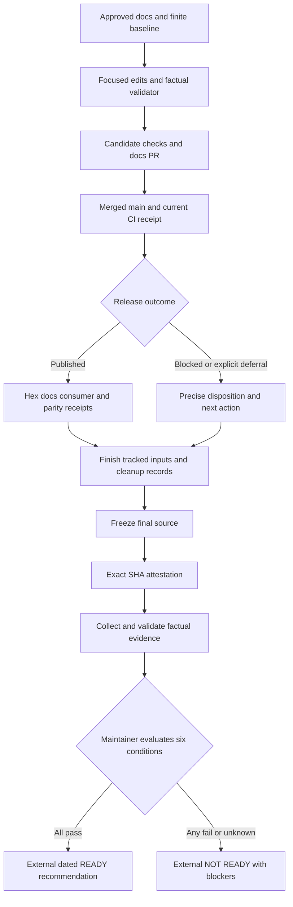

# Phase 170: Documentation and Readiness Closeout — Research

**Researched:** 2026-09-30
**Domain:** Elixir library documentation, source-bound delivery evidence, and terminal readiness records
**Confidence:** MEDIUM

<user_constraints>
## User Constraints (from CONTEXT.md)

The following decisions and discretion are copied verbatim from the phase context. [VERIFIED: .planning/phases/170-documentation-and-readiness-closeout/170-CONTEXT.md:16-33]

<!-- DATA_a7f2c19d_START -->
### Adopter documentation and wayfinding
- **D-01:** Keep README focused on the adopter's first useful result: a short mode-selection summary, the acceptance-versus-visibility caveat, and links to the canonical sync guide and `Scrypath.sync_record/3` API contract. Keep detailed lifecycle and return semantics at their existing guide/API owners. This preserves first-hour context without making the README a competing contract source.
- **D-02:** Consolidate repeated README/JTBD positioning and navigation into a clear route map while retaining unique useful destinations. Preserve the README installation/schema example and the golden path's inline-first sequence. Correct the sync guide heading that currently describes accepted manual/Oban work as completed work. Update only documentation assertions superseded by this consolidation; do not restore a broad required docs-contract suite.
- **D-03:** Treat documentation as the adopter-facing experience. Optimize for the Phoenix/Ecto engineer's first-hour job, plain task-oriented language, clear next steps, low navigation cost, and accurate operational promises. This is a non-UI phase; visual redesign and brand work remain out of scope.

### Terminal readiness authority and evidence
- **D-04:** Retain the terminal six-condition decision in a dedicated GitHub issue as a separately dated maintainer comment. Add a discoverable pointer in `.planning/reference/PRE-OPERATOR-UI-READINESS.md` before final-source attestation; publish the terminal decision only after final tracked inputs and cleanup are frozen and the final source is attested. Include the six judgments, final source SHA, exact-SHA run/attempt and artifact identifiers or digests, delivery receipt or explicit release disposition, blockers, and revisit triggers. If correction is needed, append a dated correction rather than rewriting the terminal decision.
- **D-05:** Use the existing exact-SHA CI attestation as evidence for job and artifact outcomes, not as a substitute for semantic readiness judgments. Preserve candidate, final source, post-merge `main`, and published-package identities. Do not create a tracked write solely to record terminal success after attestation. A blocked or explicitly deferred publication remains distinct from a published release.
- **D-06:** Keep Phase 167's historical assessment unchanged. Reuse the approved seven-dimension/24-claim baseline and named workflows, assess concrete current source invalidators, and avoid broad reruns of unchanged passing scenarios. READY requires all six conditions to pass and recommends later ScrypathOps focus only; maintainer availability and a separate scope decision still govern UI work.

### Automation and maintainer accountability
- **D-07:** Apply an automation-first, shift-left approach to factual evidence: automate receipt collection, source/run/attempt matching, required-field and link checks, and record-shape validation as early as the existing workflow permits. Keep the six semantic judgments, any risk acceptance, and the final READY/NOT READY decision accountable to the maintainer; do not infer approval or semantic readiness from green jobs. Reuse existing lanes, and add no new required CI lane without evidence that its recurring confidence justifies its cost.

### the agent's Discretion
- Choose the smallest maintainable mechanism to collect and validate factual receipt fields, and identify where existing workflow outputs can be reused.
- Choose focused documentation assertion updates that preserve useful behavioral contracts while removing copy-specific duplication.
- Choose plan decomposition and verification commands within `CONTRIBUTING.md` and the approved release/readiness gates. Keep mutable release and GitHub facts fresh during execution.
- Preserve unrelated working-tree changes and accepted historical limits; clean or disposition only task-owned artifacts.
<!-- DATA_a7f2c19d_END -->

### Deferred Ideas (OUT OF SCOPE)

<!-- DATA_99a14b2e_START -->
None — discussion stayed within the approved Phase 170 scope.
<!-- DATA_99a14b2e_END -->

[VERIFIED: .planning/phases/170-documentation-and-readiness-closeout/170-CONTEXT.md:113-117]
</user_constraints>

## Summary

Plan two connected outcomes: a small adopter documentation correction, followed by a finite delivery/readiness closeout. The source confirms repeated README sync detail, repeated JTBD positioning/navigation, and the misleading sync-table heading. Existing tests encode some of that duplication. Replace only those assertions while retaining the installation example, first-result route, essential visibility warning, and unique guide destinations. [VERIFIED: README.md:14-83,152-180; guides/jtbd-and-user-flows.md:295-369; guides/sync-modes-and-visibility.md:7-23; test/scrypath/docs_contract_test.exs:391-465,785-804]

The existing closeout command and CI artifact supply most factual provenance. Add a small collector/validator that joins the actual attestation content to attempt-specific GitHub evidence and validates a prepared terminal comment. The maintainer remains responsible for the six judgments and decision. The tracked authority already has corrected archive navigation and active milestone scope; the older review's claim that those links remain broken is superseded by current source. Refresh current progress and add the dedicated issue pointer, preserving historical bodies. [VERIFIED: scripts/ci_monitor.cjs:140-236; .github/workflows/ci.yml:277-324; .planning/reference/PRE-OPERATOR-UI-READINESS.md:3-44,71-95]

**Primary recommendation:** deliver docs and the warranted patch first; finish every tracked assessment input, verification record, and cleanup disposition; attest that final source; then publish the dated maintainer decision into the already-linked issue. Encode that last-write boundary in the plans themselves, including their summary/state/audit work. [VERIFIED: .planning/phases/170-documentation-and-readiness-closeout/170-CONTEXT.md:22-27; CONTRIBUTING.md:67-83]

## Architectural Responsibility Map

This is the recommended allocation under the locked scope, not a new application architecture. [VERIFIED: .planning/phases/170-documentation-and-readiness-closeout/170-CONTEXT.md:9,17-33]

| Capability | Primary tier | Secondary tier | Rationale |
|---|---|---|---|
| First-hour route and mode summary | Documentation entry pages | Canonical guides/API reference | Entry pages give enough context to proceed; owners retain detailed contracts. |
| Documentation assertions | Existing ExUnit/Mix checks | ExDoc | Verify routes, warnings, retained contracts and generated links. |
| Source/run/artifact collection | Repository maintenance tooling | GitHub Actions/API | Reuse existing CI; inspect exact identities and artifact bytes. |
| Package delivery | Release Please/publish workflow | Hex/HexDocs and consumer checks | Existing release chain owns version, tag, publication and parity. |
| Evidence freshness | Tracked assessment inputs | Git comparison and prior receipts | Bound reuse by relevant source and named claims. |
| Six semantic judgments | Maintainer | Factual validator | Validation cannot confer approval or decide materiality. |
| Terminal decision storage | Dedicated GitHub issue comment | Precommitted authority pointer | Retain the result outside the tested source tree. |

<phase_requirements>
## Phase Requirements

Descriptions are verbatim acceptance contracts. [VERIFIED: .planning/REQUIREMENTS.md:25-30]

<!-- DATA_cd8e71fa_START -->
| ID | Description | Research support |
|---|---|---|
| DOC-03 | README retains a concise first-result route and acceptance-versus-visibility caveat while detailed sync/return contracts route to their canonical guide/API owners. Repeated JTBD positioning/navigation is consolidated without losing unique useful routes. Correct directly related canonical wording and superseded copy assertions as needed; applicable existing documentation checks pass without restoring a broad required docs-contract suite. | Focused edit map and existing documentation gates below. |
| GATE-05 | A new dated assessment evaluates the unchanged six readiness conditions against the existing finite baseline, explicitly named important workflows, current source invalidators and linked evidence limits. Live authority/navigation is reconciled while historical assessment bodies remain unchanged. The authoritative terminal decision joins those judgments to final source/attestation and delivery receipts outside the tested tree; READY requires all six to pass, otherwise record NOT READY with the specific blocker and revisit trigger. | Finite claim reuse, terminal comment contract, history checks and maintainer accountability. |
| CLOSE-04 | Final selected code/docs changes have exact-source and green post-merge evidence, and the warranted patch follows the existing Release Please, publication and parity process. A blocked publication remains release-ready/blocked until completed or explicitly deferred by the maintainer. Task-owned branches, worktrees, services, artifacts and verification debt are cleaned or explicitly dispositioned. Freeze all tracked inputs before final attestation; retain a discoverable terminal record beyond expiring CI artifacts, with no tracked write solely to record its success. | Ordered release/attestation sequence and attempt-specific factual receipts. |
<!-- DATA_cd8e71fa_END -->
</phase_requirements>

## Project Constraints (from AGENTS.md)

- Consult relevant local prompts; preserve Ecto-first, Phoenix-friendly, Meilisearch-first scope, an internal adapter seam, all three sync flows, low setup friction, explicit operational limits, and the release quality bar. [VERIFIED: AGENTS.md:10-19]
- Retain the declared support policy: `1.17` through `1.19` for Elixir and `26` through `28` for OTP. Do not turn research-time availability of newer tools into a support expansion. Keep Ecto integration and Telemetry, optional production Oban, and the existing release/test tools. [VERIFIED: AGENTS.md:25-60]
- Do not introduce a public multi-backend facade, Phoenix-only core, mandatory core supervision, or Postgres-native search promise. [VERIFIED: AGENTS.md:61-65]
- Follow CONTRIBUTING's checks; keep edits focused; update project truth when intentionally changing shipped claims. Use existing patterns; preserve the managed developer-profile block. [VERIFIED: AGENTS.md:69-84,88-105,110-115]
- Keep main green, use PR-first serious work and machine evidence, never simulate review/approval, and do not invent successor work. When STATE later says `Awaiting next milestone`, treat historical phase inventory as history, not active work. [VERIFIED: AGENTS.md:88-105]
- Local prompts reinforce task-oriented docs, source-specific releases, ownership-based cleanup and privacy. Their generic SDK examples and old dated snapshots do not override current scope. [VERIFIED: prompts/scrypath-milestone-ratchet-roadmap.txt:130-145,152-175,189-228; prompts/search-lib-use-cases-deep-research.md:3-11; prompts/elixir-opensource-libs-best-practices-deep-research.md:5-18; prompts/elixir-oss-lib-ci-cd-best-practices-deep-research.md:5-30]

## Standard Stack

Reuse the installed repository stack; this phase needs no package installation or dependency upgrade. The table records source pins, not recommendations to adopt the newest upstream versions. [VERIFIED: .planning/phases/170-documentation-and-readiness-closeout/170-CONTEXT.md:9,27; mix.exs:4-14; mix.lock:16; .github/workflows/release-please.yml:35,55-58]

| Component | Existing version/contract, quoted | Role |
|---|---|---|
| Elixir/Mix and ExUnit | `elixir-version: "1.19.0"`, `otp-version: "28.1"` | Match the existing main CI/release tuple for execution. [VERIFIED: .github/workflows/ci.yml:255-256] |
| ExDoc | `"ex_doc": {:hex, :ex_doc, "0.40.3"` | Existing generated docs and link checks. [VERIFIED: mix.lock:16] |
| Release Please Action | `googleapis/release-please-action@45996ed1f6d02564a971a2fa1b5860e934307cf7 # v5.0.0` | Existing version/tag/changelog owner. [VERIFIED: .github/workflows/release-please.yml:33-39] |
| Node and GitHub CLI | `node scripts/ci_monitor.cjs closeout --push` | Existing exact-source command; use standard-library JSON/process utilities for any extension. [VERIFIED: CONTRIBUTING.md:70-83] |
| Python standard library | Existing historical structural checker | Borrow validation techniques, not its phase-specific schema or pinned identities. [VERIFIED: .planning/milestones/v1.40-phases/167-dated-readiness-and-closeout/check_readiness.py:1-48,90-121] |

**Installation:** none. Package Legitimacy Audit is not applicable because no new external package is recommended. Do not broaden this closeout into a documentation-tool upgrade; the previous triage explicitly kept such churn separate. [VERIFIED: .planning/phases/169-library-fix-delivery-and-pr-triage/169-05-SUMMARY.md:127,132-138]

## Architecture Patterns

### Data flow and final-write boundary

The following is a proposed execution sequence implementing D-01–D-07. [VERIFIED: .planning/phases/170-documentation-and-readiness-closeout/170-CONTEXT.md:17-33]



Create/select the dedicated issue and commit its stable issue URL into the live authority before the final freeze. The final comment ID cannot be known until publication; the issue URL is the pre-freeze discovery anchor. Design the issue body to identify terminal decisions and later dated corrections without requiring a new tracked pointer. [VERIFIED: .planning/phases/170-documentation-and-readiness-closeout/170-CONTEXT.md:22-24; .planning/reference/PRE-OPERATOR-UI-READINESS.md:71]

### Documentation edit map

| Owner | Concrete edit or preservation | Evidence |
|---|---|---|
| README | Preserve installation, schema example and Quick Path; merge scattered wayfinding into one task route map; replace detailed sync table/status/lifecycle duplication with mode selection, the visibility caveat and canonical guide/API links. | [VERIFIED: README.md:14-83,105-126,152-180] |
| JTBD guide | Merge the two opinionated-positioning sections and two next-reading lists; preserve adoption progression and unique routes for app boundary, catalog facets and cross-schema search. Do not rewrite all job narratives. | [VERIFIED: guides/jtbd-and-user-flows.md:295-369] |
| Sync guide | Rename the heading `What completed work means` to a return-boundary description. Preserve detailed lifecycle and recovery text; route exact result keys to the public API. | [VERIFIED: guides/sync-modes-and-visibility.md:9-39] |
| Public API docs | Retain exact result semantics and make them discoverable from README/guide; do not redefine runtime outcomes. | [VERIFIED: lib/scrypath.ex:156-178] |
| Golden path | Preserve the inline-first tutorial and context ownership. No broad example refactor follows from this phase. | [VERIFIED: guides/golden-path.md:1-11,81-115] |
| Existing docs assertions | Replace assertions requiring detailed lifecycle/status in README with checks at their owners plus README links/caveat. Preserve useful install, navigation and schema contracts; adjust ordering/proximity assertions only if superseded by the approved layout. | [VERIFIED: test/scrypath/docs_contract_test.exs:391-465,785-804] |
| Live readiness authority | Refresh current progress and terminal issue navigation. Existing archive links are already corrected; preserve the suffix beginning `## Phase 164 dated assessment` and the entire Phase 167 assessment. | [VERIFIED: .planning/reference/PRE-OPERATOR-UI-READINESS.md:3-44,95-127; .planning/milestones/v1.40-phases/167-dated-readiness-and-closeout/167-ASSESSMENT.md:1-42] |

Do not promise that inline always yields completion: the canonical API explicitly permits accepted results when no Meilisearch task wait applies. Verbatim contract excerpts: `{:ok, map}`, `:mode`, `:inline`, `:oban`, `:manual`, `:status`, `:accepted`, `:completed`; the text says accepted is normal for manual/Oban and “sometimes `:inline` when no Meilisearch task wait applies.” [VERIFIED: lib/scrypath.ex:159-166]

Ecto's official tutorial proceeds through setup/schema/persistence/query; Phoenix describes contexts as the data-access and validation boundary; ExDoc supports additional guide pages and API reference. These support the chosen progressive route and existing ownership boundaries. This is an organizational inference, not a request for new library behavior. [CITED: https://ecto.hexdocs.pm/getting-started.html] [CITED: https://phoenix.hexdocs.pm/contexts.html] [CITED: https://ex-doc.hexdocs.pm/ExDoc.html] Searchkick similarly leads into declaration/index/query; import only that documentation lesson. [CITED: https://github.com/ankane/searchkick#readme]

### Reuse the closeout command; fill the factual join gap

The command selects a newly dispatched exact-SHA run, demands exactly one successful match for every expected job, and verifies that each named artifact is live, has an ID/digest, and matches the requested source. Its stdout contains source, run and artifact summaries but no run attempt; it does not read the attestation JSON. These are inspected implementation boundaries, not claims that CI has failed. [VERIFIED: scripts/ci_monitor.cjs:119-137,140-236]

The workflow itself emits the missing attempt and writes the artifact file. Preserve these exact existing names/fields when joining receipts:

<!-- DATA_b86ae20f_START -->
```text
authority: "github-actions-exact-sha"
event: "workflow_dispatch"
schema: 1
repository, workflow, run_id, run_attempt, run_url, head_sha, required_jobs
coverage: {outcome: "success", artifact_id, artifact_url, artifact_digest}
"core (required)", "package (required)", "repository-contracts (required)", "backend (required)", "ecommerce-mounted (required)"
coverage-report-${{ github.sha }}
closeout-attestation-${{ github.sha }}
> closeout-attestation.json
retention-days: 7
```
<!-- DATA_b86ae20f_END -->

[VERIFIED: .github/workflows/ci.yml:272-275,304-324; scripts/ci_monitor.cjs:214-230] Field names above are quoted tokens from the emitted object, not a second schema definition. The artifact filesystem output is verified at its creation line, not inferred from its upload path.

**Recommended mechanism:** one repository-only, read-only receipt collector plus a pure local validator/render function, using existing Node/GitHub CLI conventions. Leave dispatch in the existing closeout command. Keep the evidence collector's outputs in a caller-selected temporary directory or stdout, outside tracked inputs during terminal execution. Name new files and the terminal schema in the plan; they do not exist yet. Use the existing fake CLI fixture style for deterministic checks. [VERIFIED: scripts/ci_monitor.cjs:23-55,140-236; test/scripts/ci_monitor_test.exs:7-47,78-101]

The collector should enforce the following design requirements derived from D-04/D-07:

1. Fetch the selected run and explicit attempt; retrieve jobs for that attempt, not whatever attempt is latest when collection happens. Cross-check repository, workflow, event, full source SHA, run ID, attempt and completion. [CITED: https://docs.github.com/en/rest/actions/workflow-runs#get-a-workflow-run-attempt]
2. Inspect the downloaded attestation and artifact metadata, and join its coverage ID/digest to the selected coverage artifact. Preserve attestation artifact identity/digest separately from any checksum of extracted JSON bytes; they identify different byte sequences. Check the downloaded artifact archive against its reported digest using standard hashing. [CITED: https://docs.github.com/en/rest/actions/artifacts] [VERIFIED: .github/workflows/ci.yml:291-324]
3. Reject wrong-source, cross-run, cross-attempt, duplicate/missing-job, failed-job, mismatched artifact, missing receipt and malformed field cases before presenting a factual draft. Capture prior failed attempts separately; a later pass must not erase the retry history. [VERIFIED: scripts/ci_monitor.cjs:125-137,193-208; CONTRIBUTING.md:187-193]
4. Preserve separate identities for candidate, merge/main, final tracked source and released package/tag. For reuse, compare relevant source/lock/config/fixture/workflow blobs and document each changed path's effect on the specific claim. A tree match permits bounded behavioral reuse, not transfer of a CI run to another SHA. [VERIFIED: .planning/research/v1.41/DELIVERY-REVIEW.md:29-33; .planning/phases/169-library-fix-delivery-and-pr-triage/169-04-SUMMARY.md:99-106]
5. Validate record shape and the all-six-pass implication only after the maintainer supplies judgments. The tool must never invent risk acceptance, a reviewer, semantic PASS or release deferral. [VERIFIED: .planning/phases/170-documentation-and-readiness-closeout/170-CONTEXT.md:23-27]

### Terminal comment contents and retention

Use a concise human-readable decision plus a fenced machine-readable evidence block. The schema is a proposed Phase 170 implementation choice, not an existing contract. Include:

- Assessment identifier, UTC assessment/publication dates, actual accountable maintainer and separately attributable authorization/decision reference.
- Exact six condition texts, one judgment and rationale per condition, bounded claim/workflow references, evidence dates and source freshness limits.
- Candidate, integrated-main and final-source identities, run/attempt URLs, expected job results, coverage and attestation IDs/digests, and the compact attestation payload.
- Release tag/version/source, publish/consumer/parity receipt or explicit blocked/deferred disposition with owner evidence; never treat local-package proof as publication.
- Owned cleanup/debt inventory, accepted historical limitations, blocker and revisit trigger per unresolved condition, and the resulting recommendation.

These required semantic elements come from D-04–D-07 and the unchanged authority; the proposed representation is deliberately small. [VERIFIED: .planning/phases/170-documentation-and-readiness-closeout/170-CONTEXT.md:22-33; .planning/reference/PRE-OPERATOR-UI-READINESS.md:62-71]

Retain essential factual content directly in the comment, rather than only links to expiring artifacts. GitHub supports updating/deleting comments and exposes created/updated timestamps and the author; append-only correction is therefore project policy, not platform immutability. After publication, read back the comment and compare its body with the approved bytes; record the resulting URL externally. A checksum in the same mutable comment does not independently prove authorship or prevent edits. [CITED: https://docs.github.com/en/rest/issues/comments] GitHub artifact retention can expire or remove artifacts; repository configuration here uses seven days. [CITED: https://docs.github.com/en/actions/how-tos/manage-workflow-runs/remove-workflow-artifacts] [VERIFIED: .github/workflows/ci.yml:275,324]

Immutable GitHub releases protect published assets and tags, while their title/release notes can still change. They do not make the chosen issue comment immutable; no new release-storage service or repository setting change is needed for this phase. [CITED: https://docs.github.com/en/code-security/concepts/supply-chain-security/immutable-releases]

### Finite readiness evidence and delivery sequencing

Keep all seven dimensions and 24 baseline claims visible, but concentrate freshness review on the actual invalidators: dependency graphs/audit harness, mounted setup, tenant/facet implementation and host proof, docs, CI/release inputs and final tracking. Use the Phase 168 delivery evidence for the four graph/security correction and Phase 169 candidate/main evidence for the integrated tenant/facet/repair behavior. Preserve C-09's bounded delete claim and the older baseline's limits. [VERIFIED: .planning/research/v1.41/SUMMARY.md:19-34,46-54; .planning/phases/168-dependency-security-and-reliable-verification/168-DELIVERY.md:49-68; .planning/phases/169-library-fix-delivery-and-pr-triage/169-04-SUMMARY.md:90-106; .planning/milestones/v1.39-phases/162-whole-product-evidence-baseline/162-BASELINE.md:44-48]

Explicitly name the important workflows accepted for condition 3: first indexed/searchable schema and hydration; inline/Oban/related sync in the existing consumer; public tenant/facet composition and the synthetic host membership/response boundary; bounded delete visibility; selected-ID manual repair through terminal task success to visible search; and named mounted recovery/swap behavior where baseline evidence is reused. Map each to its baseline claim and actual receipt; do not expand this into proof of arbitrary authorization, every recovery failure or all deployments. This proposed checklist operationalizes the approved finite-workflow requirement. [VERIFIED: .planning/research/v1.41/ADOPTION-REVIEW.md:7-12,54-60; .planning/milestones/v1.39-phases/163-findings-and-bounded-follow-up/163-FINDINGS.md:17-28; .planning/phases/169-library-fix-delivery-and-pr-triage/169-04-SUMMARY.md:90-106]

Current read-only GitHub observation: main is `933ad30645c41df9f21dd4ddfd2d5b93fbd48620`; release PR `83` is `OPEN`, titled `chore(main): release scrypath 0.3.14`, head `9f404822af08f9d3fdfe23d8e73c6c1f12073245`; latest GitHub release is `scrypath-v0.3.13`, published `2026-09-25T01:49:22Z`. These are research-time snapshots, not execution locks; refresh before action. [VERIFIED: GitHub REST branches/main and gh pr view 83 / gh release view, 2026-09-30]

Let Release Please absorb final docs before evaluating its release PR. The existing ordered chain is `mix verify.workspace_clean` → version check → `mix verify.package` → `mix hex.publish --dry-run --yes` → `mix hex.publish --yes` → `mix verify.release_publish` → `mix verify.release_parity`. Preserve its ownership and credentials boundary. [VERIFIED: docs/releasing.md:100-125; .github/workflows/release-please.yml:69-94]

After publication or a real blocked/deferred disposition, finish all tracked planning and support-truth changes and cleanup dispositions before attestation. Prefer attesting the resulting final main source when delivery and tracking are merged there; if planning and delivery remain different sources, record both and prove the selected docs/code are on main. A late automatic summary, verification report, state update, archive or cleanup commit invalidates the declared final-write boundary. Plan those tasks before it. [VERIFIED: CONTRIBUTING.md:76-83; .planning/research/v1.41/ADOPTION-REVIEW.md:62-71]

## Don't Hand-Roll

| Problem | Use instead | Reason/source |
|---|---|---|
| New docs site or navigation framework | Existing README, guides and ExDoc | No UI/product expansion; existing owners suffice. [VERIFIED: .planning/phases/170-documentation-and-readiness-closeout/170-CONTEXT.md:17-19; mix.exs:17] |
| Another CI dispatcher or release pipeline | Existing closeout command and Release Please workflows | Preserve tested source and publication contracts. [VERIFIED: CONTRIBUTING.md:67-83; docs/releasing.md:100-125] |
| New generalized evidence platform | Small local factual collector/validator | D-07 permits the smallest mechanism; the phase needs a finite external record. [VERIFIED: .planning/phases/170-documentation-and-readiness-closeout/170-CONTEXT.md:27-32] |
| Custom cryptographic attestation | Platform artifact digests and standard hash implementation | Validate bytes; do not imply semantic approval from a hash. [CITED: https://docs.github.com/en/rest/actions/artifacts] |
| Reimplementing a large Markdown parser | Structured receipt block plus narrow condition/link checks | Historical checker is already phase-bound; avoid copying its unrelated assumption ledger. [VERIFIED: .planning/milestones/v1.40-phases/167-dated-readiness-and-closeout/check_readiness.py:16-48; .planning/milestones/v1.40-phases/167-dated-readiness-and-closeout/167-ASSESSMENT.md:28-42] |

## Runtime State Inventory

This phase consolidates documentation; it does not rename a runtime key or migrate data. The inventory still matters for externally retained evidence and cleanup. Entries below describe the reviewed scope, not a machine-wide assertion that no state exists. [VERIFIED: .planning/phases/170-documentation-and-readiness-closeout/170-CONTEXT.md:9,22-33]

| Category | Found / investigated | Required disposition |
|---|---|---|
| Stored data | Proposed GitHub issue/comment and expiring Actions artifacts; no application-data mutation in selected scope. | Create the issue before freeze, preserve final decision externally; no database migration. |
| Live service config | Existing GitHub CI/release configuration and release PR; no change to required lane topology selected. | Refresh external facts during execution; do not alter protection or storage policy merely for closeout. |
| OS-registered state | No service registration action is selected by the context. Research did not enumerate every host registration. | Record only phase-owned services/worktrees and their cleanup; preserve pre-existing ones. |
| Secrets/env vars | Existing release workflow scopes `HEX_API_KEY` to the publish job. | Reuse existing credentials path; publish neither secrets nor environment dumps. [VERIFIED: .github/workflows/release-please.yml:41-48] |
| Build artifacts/packages | ExDoc, local package and hosted evidence outputs; published package identity remains separate. | Clean/disposition owned outputs and retain necessary factual receipts before expiry. |

## Common Pitfalls

1. **Removing useful first-hour context.** A links-only README fails the locked mode-summary and caveat requirement. Preserve concise context while removing detailed duplicates. [VERIFIED: .planning/phases/170-documentation-and-readiness-closeout/170-CONTEXT.md:17-19]
2. **Freezing accidental duplication in tests.** Existing README lifecycle/status assertions are exactly the ones that conflict with approved consolidation. Move contract checks to their canonical owners and keep routing checks focused. [VERIFIED: test/scrypath/docs_contract_test.exs:408-414,798-804]
3. **Trusting an old review over current source.** Readiness archive links and active-scope text were already corrected. Likewise, old security/readiness findings retain their original cutoff and are not statements about current source. [VERIFIED: .planning/reference/PRE-OPERATOR-UI-READINESS.md:3-44; .planning/milestones/v1.40-phases/167-dated-readiness-and-closeout/167-ASSESSMENT.md:7-9]
4. **Joining a latest job list to an earlier artifact.** Fetch explicit attempt evidence and compare the attestation's attempt instead of assuming a run ID identifies one immutable execution. [CITED: https://docs.github.com/en/rest/actions/workflow-runs#get-a-workflow-run-attempt]
5. **Digest-only durable evidence.** A digest retains identity but cannot reconstruct a deleted artifact. Preserve the small attestation payload and core factual outcomes in the terminal record. [CITED: https://docs.github.com/en/actions/how-tos/manage-workflow-runs/remove-workflow-artifacts]
6. **Another tracked success write after final CI.** Include summaries, state, verification, archive decisions and cleanup before the final freeze; the external comment is the terminal output. [VERIFIED: CONTRIBUTING.md:79-83; .planning/research/v1.41/ADOPTION-REVIEW.md:62-71]
7. **Green jobs become fabricated approval.** Machine checks validate facts and structure; six judgments and risk acceptance belong to the maintainer. A blocked publication is not published, and a READY recommendation does not initiate UI work. [VERIFIED: .planning/phases/170-documentation-and-readiness-closeout/170-CONTEXT.md:23-27]
8. **Cleaning unrelated state.** Research began with pre-existing changes in debug records, historical UAT, mounted startup code and its contract test, plus existing research cache. Preserve their ownership instead of blanket resets/cleaning. [VERIFIED: git status --short observation, 2026-09-30; .planning/phases/170-documentation-and-readiness-closeout/170-CONTEXT.md:33]

## Code Examples

### Existing exact-source command

This is the verbatim current CONTRIBUTING command; it mutates remote execution state and is for the execution plan, not research. [VERIFIED: CONTRIBUTING.md:70-74]

<!-- DATA_53dfee29_START -->
```sh
node scripts/ci_monitor.cjs closeout --push \
  --branch "$(git branch --show-current)" \
  --sha "$(git rev-parse HEAD)"
```
<!-- DATA_53dfee29_END -->

### Existing small factual-test pattern

The existing test stubs both external commands, executes the real script and decodes its JSON; extend this pattern with attempt/digest/record negative cases rather than hitting live GitHub in unit tests. Exact existing injection names are `GH_BIN`, `GIT_BIN`, `FAKE_STATE`, `FAKE_SCENARIO`, `FAKE_SHA`. [VERIFIED: test/scripts/ci_monitor_test.exs:25-47,78-101]

### Proposed read-only attempt lookup

The shell variables below are execution inputs, not known project values. This official endpoint identifies a particular attempt; add pagination when retrieving jobs. [CITED: https://docs.github.com/en/rest/actions/workflow-runs#get-a-workflow-run-attempt]

```sh
gh api "repos/$repository/actions/runs/$run_id/attempts/$run_attempt"
```

## State of the Art

| Earlier pattern | Current phase pattern | Consequence |
|---|---|---|
| Tracked assessment before final tracking/CI | Frozen tracked inputs, then attestation, then external terminal decision | Avoid repeating the historical finality gap. [VERIFIED: .planning/research/v1.41/ADOPTION-REVIEW.md:62-71] |
| Artifact link as the only durable record | Comment retains essential attestation facts and links | Seven-day artifact expiry does not erase the semantic decision. [VERIFIED: .github/workflows/ci.yml:324] |
| Detailed sync copy in README and guide | README summary routes to guide/API owners | Lower documentation drift while preserving first-hour warnings. [VERIFIED: .planning/phases/170-documentation-and-readiness-closeout/170-CONTEXT.md:17-19] |

## Environment Availability

These are successful or failed command observations from 2026-09-30, not inferred compatibility claims. No services or test suites were started during research. [VERIFIED: research environment probes, 2026-09-30]

| Dependency | Available | Observed version / constraint | Execution fallback |
|---|---|---|---|
| Node | Yes | `v22.14.0` | Existing collector runtime. |
| Python | Yes | `Python 3.14.4` | Standard-library historical-check patterns; no package install proposed. |
| GitHub CLI/API | Yes | `gh version 2.101.0`; read-only main/release/PR API calls succeeded | Refresh identity and authorization before external actions. |
| Mix, default shell | No selected version | Probe prints `No version is set for command mix` | Select the already installed toolchain in the process environment. |
| Explicit Mix/OTP | Yes | `Mix 1.19.0 (compiled with Erlang/OTP 28)` with `ASDF_ELIXIR_VERSION=1.19.0-otp-28 ASDF_ERLANG_VERSION=28.1` | Matches the current CI tuple; do not edit global settings. |
| Docker daemon | Yes | `29.5.2` from server probe | Use existing Docker/hosted harness only for relevant verification. |
| Context7/Jina tools or ctx7 CLI | Not exposed/found in this session | Tool catalog/command lookup inspected | Official web documentation was used. |

**Publication credentials/permission:** not exercised by research. A successful read-only API call does not establish merge, issue-write, or Hex-publish permission. Resolve actual access at the appropriate authorized execution step. [VERIFIED: read-only research command scope; .github/workflows/release-please.yml:45-48]

## Validation Architecture

Validation is enabled: config explicitly contains `"nyquist_validation": true`. Existing framework entrypoint is `ExUnit.start()`; hosted primary tuple is quoted in Standard Stack. [VERIFIED: .planning/config.json:19; test/test_helper.exs:7]

### Current commands

These commands are documented existing entrypoints; times were not measured during research. The quick structural and focused unit slice should target under 30 seconds; do not claim full Mix/docs/hosted gates meet that budget. [VERIFIED: CONTRIBUTING.md:11,30-46,70-98,124-133]

| Use | Command / expectation |
|---|---|
| Documentation build | `mix docs --warnings-as-errors` |
| Public wording/routes | `mix verify.phase112` |
| Support/adopter contract | `mix verify.adopter` |
| Optional focused docs assertions | `mix test test/scrypath/docs_contract_test.exs` — run touched assertions/file during this change, do not make it a new default gate |
| Existing script seam | `mix test test/scripts/ci_monitor_test.exs` — relevant if extending collector/closeout behavior; the file directly exercises fake external commands [VERIFIED: test/scripts/ci_monitor_test.exs:1-47] |
| Fast root regression | `mix test --exclude integration --exclude docs_contract` |
| Test infrastructure changes | `MIX_ENV=test mix do compile --warnings-as-errors + test --warnings-as-errors --exclude integration --exclude docs_contract` |
| Package/release | `mix verify.package`; published version uses `mix verify.release_publish X.Y.Z` then `mix verify.release_parity X.Y.Z` [VERIFIED: docs/releasing.md:23-31,59-67] |
| Candidate/final source | Existing exact-SHA closeout command above, plus separate exact-main receipt |

### Phase requirements → test map

| Requirement | Behavior | Test type | Planned automated verification | Existing coverage / gap |
|---|---|---|---|---|
| DOC-03 | Entry route, warning, unique destinations, canonical contracts | Focused docs/contract | Docs build, phase112, adopter and touched docs assertions | Existing commands; obsolete duplicate-copy expectations need updates. |
| GATE-05 | All six exact conditions, finite claim inventory, links, history preservation | Local deterministic structural check | New validator over frozen inputs plus fixture cases | Borrow historical checker patterns; do not execute old hard-coded Phase 167 schema against Phase 170. |
| GATE-05 | Maintainer judgment and attribution | Decision prerequisite | Structural validation of supplied judgment/attribution, no automatic semantic approval | Actual maintainer decision remains required; this is not software UAT. |
| CLOSE-04 | Source/run/attempt/artifact joins and record retention | Unit + read-only API integration | Existing fake CLI pattern plus explicit attempt/artifact fixtures and final live collector | Add tests for mismatches and missing/expired evidence. |
| CLOSE-04 | Selected docs delivered, release published or accurately blocked | Existing hosted and release gates | Exact-source closeout, exact-main CI, publish/consumer/parity receipts | Existing lanes reused; facts refreshed at execution. |

Source for map boundaries: [VERIFIED: .planning/REQUIREMENTS.md:25-30; CONTRIBUTING.md:67-83; test/scripts/ci_monitor_test.exs:25-47; .planning/milestones/v1.40-phases/167-dated-readiness-and-closeout/check_readiness.py:90-121]

### Sampling and Wave 0 gaps

- Per docs task: touched docs assertions and phase112; build docs once per coherent edit wave.
- Per factual-tool task: deterministic fixtures covering positive record and each relevant failure boundary.
- Before merge: applicable existing core/package/repository gates; service proof follows current required lanes, with extra scenarios only for named invalidators.
- Before terminal decision: final exact-SHA collector, current delivery receipts, history comparison, and externally retained decision readback. No tracked success write follows.

These are planning recommendations under existing verification policy. Wave 0 should define the terminal record shape and implement its pure validator/fixtures early; pin the historical bytes to compare; define each baseline claim's current source inputs; establish issue discovery before freeze. No framework installation or new required lane is needed. [VERIFIED: .planning/phases/170-documentation-and-readiness-closeout/170-CONTEXT.md:22-32; CONTRIBUTING.md:26-83]

## Security Domain

Security enforcement is not explicitly disabled in the inspected config, so this section applies. The relevant surface is trusted release/evidence automation and public records, not new web authentication. [VERIFIED: .planning/config.json; .planning/phases/170-documentation-and-readiness-closeout/170-CONTEXT.md:9,22-27]

ASVS category numbers changed in version 5; use versioned labels rather than the older generic research template's numbering. The official v5.0.0 chapter list includes V1 Encoding and Sanitization, V2 Validation and Business Logic, V5 File Handling, V6 Authentication, V7 Session Management, V8 Authorization and V11 Cryptography. [CITED: https://github.com/OWASP/ASVS/tree/v5.0.0/5.0/en]

| ASVS v5.0.0 category | Applies here | Recommended control |
|---|---|---|
| V1 Encoding and Sanitization | Yes, external evidence and Markdown | Parse JSON as data; pass command arguments separately; never execute fetched text or interpolate untrusted shell fragments. |
| V2 Validation and Business Logic | Yes | Enforce repository/SHA/run/attempt joins, six-condition shape and conservative missing-evidence behavior. |
| V5 File Handling | Yes, downloaded artifacts | Download to an isolated temporary location; bound extraction to expected files and verify artifact bytes. |
| V6 Authentication / V7 Session Management | Existing platform boundary only | Reuse GitHub CLI/workflow credentials; add no library auth/session system. |
| V8 Authorization | Yes | Preserve release permissions and real maintainer decision attribution; no fabricated review or risk acceptance. |
| V11 Cryptography | Integrity checks only | Use existing platform digests and standard hashing; no bespoke signatures or trust claims. |

This table is a phase threat-model recommendation, not an ASVS certification. Its controls implement the locked evidence/approval boundary. [VERIFIED: .planning/phases/170-documentation-and-readiness-closeout/170-CONTEXT.md:22-27; .github/workflows/release-please.yml:41-48]

| Threat | STRIDE | Mitigation |
|---|---|---|
| Receipt from another source or retry | Spoofing / Tampering | Explicit source/run/attempt and artifact-content joins. |
| Automation presented as maintainer judgment | Repudiation / Elevation | Record actual author/decision provenance; factual validator cannot confer approval. |
| Mutable or expired evidence obscures the decision | Tampering / Repudiation | Preserve compact evidence content and dated append-only corrections. |
| Credentials or identifying host data in public records | Information disclosure | Select public fields; never dump environment/auth outputs. |

Threat controls derive from the phase protocol and local privacy policy. [VERIFIED: .planning/phases/170-documentation-and-readiness-closeout/170-CONTEXT.md:22-33; prompts/scrypath-milestone-ratchet-roadmap.txt:205-222]

## Assumptions Log

No unverified package, compatibility or compliance claim is made. Proposed collector layout, comment schema and test decomposition are explicit recommendations within the locked discretion, not existing implementation facts. Execution must determine actual final SHA, run attempts, issue/comment IDs, release outcome and maintainer judgments; none is prefilled by research. [VERIFIED: .planning/phases/170-documentation-and-readiness-closeout/170-CONTEXT.md:29-33]

| # | Unresolved execution input | Risk if assumed |
|---|---|---|
| E1 | Actual maintainer decision/attribution after final evidence | Green facts could be misrepresented as approval. |
| E2 | Final release PR/tag/publication state | Research-time PR/version snapshot could become stale. |
| E3 | Dedicated issue and publication permissions | Pointer or terminal publication could be blocked. |
| E4 | Actual final SHA, source ownership and cleanup outcomes under the resolved Plans 06–08 tracking/freeze boundary below | An unaccounted source change could invalidate final attestation; execution must reconcile it before a new freeze. |

## Open Questions — RESOLVED planning protocols

No unresolved planning-protocol question remains. These resolutions define execution order and ownership; they do not supply actual issue URLs, final SHA/run identities, release outcomes, maintainer judgments or authorization.

1. **Final tracking boundary — RESOLVED:** Plan 170-06 Tasks 1–2 reconcile the factual input/pointer/project/horizon set and four preterminal reports, followed by its summary. Plan 170-07 Task 1 finishes STATE/ROADMAP/REQUIREMENTS, cleanup/closeout inventory and the truthful preterminal 170-08 summary; Task 2 finishes its own summary and every remaining tracked write before committing and transporting the frozen snapshot. Its exact path inventory lives in 170-CLOSEOUT.md; the complete digest manifest is external and computed only after tracked bytes are final, including that document's bytes. Archive/tag/retrospective transformations are explicitly outside this attested run unless completed and enumerated before freeze. Plan 170-08 suppresses every tracked completion hook and publishes only the external terminal record. Actual source identities and cleanup outcomes remain E4 execution inputs. [Planning resolution: 170-06-PLAN.md; 170-07-PLAN.md; 170-08-PLAN.md. Implements D-04/D-05; original basis: CONTRIBUTING.md:79-83.]
2. **Maintainer accountability — RESOLVED:** Plan 170-03 identifies the actual accountable maintainer during issue establishment. Plan 170-08 Task 2 obtains that maintainer's six judgments, rationale, any actual risk acceptance and READY/NOT READY decision from final evidence, validates the exact prepared body, and requires actual authorization for publication. Task 3 posts through that maintainer's account or reads back the exact comment the maintainer posted directly; author/body/source checks establish attribution. No software UAT or automatic semantic approval is introduced. The real judgments, identity, approval provenance and record body remain E1 execution inputs. [Planning resolution: 170-03-PLAN.md Tasks 2–3; 170-08-PLAN.md Tasks 2–3. Implements D-07.]
3. **Issue discovery — RESOLVED:** Plan 170-03 Task 1 repeats title/body search and inspects candidates, then selects a suitable dedicated issue or prepares an exact new issue proposal. Task 2 applies existing explicit authorization or obtains it for the concrete external action; Task 3 creates/reuses the authorized issue, reads it back, and commits its actual pointer before Plan 170-07 freeze. An empty research-time search is not evidence that no suitable issue exists. Actual issue URL/ID and access remain E3 execution inputs; the actual publication outcome remains E2 and is established by Plans 170-04–05, then refreshed in Plans 170-06/08. [Planning resolution: 170-03-PLAN.md Tasks 1–3; 170-07-PLAN.md. Implements D-04.]

The seven spec-less probes EA-170-01 through EA-170-07, the inherited probe/prohibition ledgers and the four bespoke Phase 170 prohibitions remain unresolved as specified by Plan 170-03. Resolving these three protocol choices does not resolve those assumptions, decide semantic readiness or erase missing execution evidence.

## Sources

### Primary repository evidence

Opened current AGENTS, config, STATE, ROADMAP, REQUIREMENTS, PROJECT and phase CONTEXT; the three canonical v1.41 reviews; README, golden path, JTBD, sync guide and public API; CONTRIBUTING and release/workflow sources; baseline/findings/historical assessment; existing closeout script and tests; Phase 168 delivery and Phase 169 integrated delivery/triage records. Inline citations identify the claim owners and source lines. Local prompts were consulted for first-hour jobs, documentation, Elixir library fit, release discipline and privacy. [VERIFIED: session file reads listed above]

### Official external documentation

- [GitHub issue comments](https://docs.github.com/en/rest/issues/comments): attribution, body, timestamps, create/update/delete constraints.
- [Artifact retention](https://docs.github.com/en/actions/how-tos/manage-workflow-runs/remove-workflow-artifacts), [artifact API](https://docs.github.com/en/rest/actions/artifacts), [workflow attempts](https://docs.github.com/en/rest/actions/workflow-runs#get-a-workflow-run-attempt): retention and factual receipt joins.
- [Immutable releases](https://docs.github.com/en/code-security/concepts/supply-chain-security/immutable-releases): immutable assets/tags versus editable notes.
- [Ecto tutorial](https://ecto.hexdocs.pm/getting-started.html), [Phoenix contexts](https://phoenix.hexdocs.pm/contexts.html), [ExDoc](https://ex-doc.hexdocs.pm/ExDoc.html), [Searchkick README](https://github.com/ankane/searchkick#readme): learning sequence, framework ownership and guide/API organization.
- [ASVS v5.0.0 chapter list](https://github.com/OWASP/ASVS/tree/v5.0.0/5.0/en): version-correct security category labels.

### Research method and confidence

The research-plan seam selected Jina for the official URL questions; Jina/Context7 tools and ctx7 CLI were unavailable, so official documentation was opened with the built-in web tool and critical GitHub behavior cross-checked through search. The confidence seam returned `MEDIUM` for `websearch --verified`; it returned `LOW` for unrecognized provider IDs such as `webfetch` and `codebase`, so those calls are not used to manufacture a HIGH external-provider rating. Repository `[VERIFIED]` tags indicate directly inspected authoritative source or command observations; they do not certify semantic readiness. External citations are MEDIUM confidence. [VERIFIED: research-plan and classify-confidence command results, 2026-09-30]

## Metadata

| Area | Confidence | Practical limit |
|---|---|---|
| Existing stack and source patterns | MEDIUM | Direct source pins and executable owners read; no dependency upgrade or package installation proposed. |
| Architecture and sequencing | MEDIUM | Locked decisions plus inspected workflows; final identities and judgments are future execution inputs. |
| Pitfalls and retention | MEDIUM | Official GitHub docs and inspected code confirm specific limitations. |

**Research date:** 2026-09-30. **Validity:** refresh mutable GitHub/release/security facts at execution; source findings remain applicable only while their cited owners are unchanged. No runtime tests, CI dispatch, issue write, merge or publication occurred in this research.
