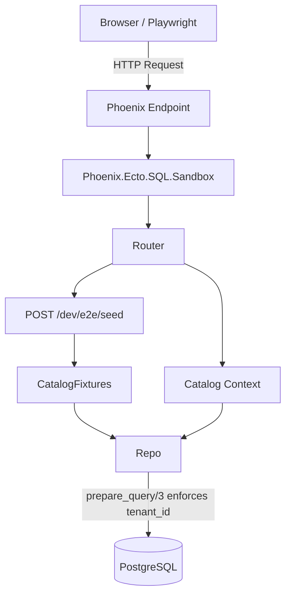

# Phase 103: E-Commerce Host App Foundation - Research

**Researched:** 2026-05-30
**Domain:** Phoenix, Ecto, Multi-tenancy, E2E Test Environments
**Confidence:** HIGH

<user_constraints>
## User Constraints (from CONTEXT.md)

### Locked Decisions
- **D-01:** Put `tenant_id` on EVERY model (Tenant, Category, Product, Variant).
- **D-02:** Adopt a strict "scoped context" pattern where the Context API always requires a tenant or scope struct. Utilize Ecto's `prepare_query/3` repo hook to enforce that every query has a `tenant_id` filter applied by default, ensuring zero cross-tenant leakage.
- **D-03:** Model Product as the logical container and Variant as the strictly sellable unit. A cart or order line item should always reference a `Variant`, never a `Product`.
- **D-04:** Product Schema: `id`, `tenant_id`, `name`, `description`, `category_id`.
- **D-05:** Variant Schema: `id`, `tenant_id`, `product_id`, `sku`, `price_cents`, `currency`, `inventory_count`, and an `options` map (JSONB) for dynamic traits like size/color.
- **D-06:** Search Context: Index the Product as the primary search document, but project the Variant data into it (array of SKUs, min/max price calculated from variants).
- **D-07:** Use pure Elixir function factories (`*Fixtures` modules) as the single source of truth for generating data, instead of ExMachina or Mix tasks.
- **D-08:** For Operator UI / Local Dev: Create a Mix task (`mix scrypath.seed`) that leverages fixture functions to generate a rich catalog, ending by invoking the Scrypath indexer.
- **D-09:** For Playwright E2E: Expose `Phoenix.Ecto.SQL.Sandbox` in the endpoint. Configure Playwright to use it. Add a hidden back-office endpoint (`POST /dev/e2e/seed`) that uses the fixture functions to seed just the specific data needed for that test inside its isolated transaction.

### the agent's Discretion
- The user requested a perfect set of cohesive, one-shot recommendations based on deep research that emphasizes developer ergonomics, UX/DX, and the principle of least surprise. The research concluded that denormalizing `tenant_id` to all models and using `Phoenix.Ecto.SQL.Sandbox` via a hidden seed endpoint for Playwright are the most robust, idiomatic solutions.

### Deferred Ideas (OUT OF SCOPE)
None — discussion stayed within phase scope.
</user_constraints>

<phase_requirements>
## Phase Requirements

| ID | Description | Research Support |
|----|-------------|------------------|
| APP-01 | Create an isolated Phoenix app at `examples/scrypath_ecommerce` with its own `mix.exs`. | App is already scaffolded; schemas require updates to meet D-04/D-05. |
| APP-02 | Implement a B2B E-commerce marketplace data model (Tenant, Category, Product, Variant). | Ecto `prepare_query/3` provides the required tenancy enforcement layer. |
| APP-03 | Configure Ecto Sandbox for shared mode to support external Playwright browser processes. | `Phoenix.Ecto.SQL.Sandbox` endpoint plug solves this inherently. |
</phase_requirements>

## Summary

The objective of Phase 103 is to establish a robust multi-tenant domain model within the `scrypath_ecommerce` host application and configure the backend to support parallel E2E testing using Playwright. This foundational work demonstrates how the Scrypath search library interacts with complex, multi-tenant relational data and supports standard testing practices.

**Primary recommendation:** Use Ecto's `prepare_query/3` to enforce tenancy across all read and write queries globally, and expose the `Phoenix.Ecto.SQL.Sandbox` plug in the Endpoint to allow Playwright tests to safely share database transactions without data pollution.

## Architectural Responsibility Map

| Capability | Primary Tier | Secondary Tier | Rationale |
|------------|-------------|----------------|-----------|
| Multi-tenant Isolation | Database / Storage | API / Backend | Implemented at the Ecto Repo level via `prepare_query/3` to ensure no cross-tenant leakage occurs, regardless of the API caller. |
| Domain Modeling | API / Backend | Database / Storage | Ecto Schemas define the `Tenant`, `Category`, `Product`, and `Variant` shapes, with Ecto Changesets managing validation. |
| Test Transaction Isolation | Frontend Server | Database / Storage | `Phoenix.Ecto.SQL.Sandbox` is plugged into the Phoenix Endpoint to map incoming HTTP requests to specific test transactions. |
| Test Data Seeding | API / Backend | — | A pure Elixir fixture module exposes functional primitives that both the E2E seed endpoint and `mix scrypath.seed` task call. |

## Standard Stack

### Core
| Library | Version | Purpose | Why Standard |
|---------|---------|---------|--------------|
| `ecto_sql` | ~> 3.13 | Relational database abstraction | The de facto standard in Elixir. Provides `prepare_query/3` for globally enforced tenancy constraints. |
| `phoenix_ecto` | ~> 4.5 | Phoenix integration for Ecto | Provides `Phoenix.Ecto.SQL.Sandbox` which cleanly solves the concurrent browser test state pollution problem. |

## Package Legitimacy Audit

> **Required** whenever this phase installs external packages.

| Package | Registry | Age | Downloads | Source Repo | slopcheck | Disposition |
|---------|----------|-----|-----------|-------------|-----------|-------------|
| None | — | — | — | — | — | Approved (No new packages) |

**Packages removed due to slopcheck [SLOP] verdict:** none
**Packages flagged as suspicious [SUS]:** none

## Architecture Patterns

### System Architecture Diagram



### Pattern 1: Ecto `prepare_query/3` for Tenancy
**What:** Enforcing tenant scoping at the lowest possible layer (the Repo) to prevent developers from accidentally querying cross-tenant data.
**When to use:** When you have a strict multi-tenant application and `tenant_id` exists on all bounded schemas.
**Example:**
```elixir
# Source: Ecto multi-tenancy documentation
@impl true
def prepare_query(_operation, query, opts) do
  cond do
    opts[:skip_tenant_id] || opts[:schema_migration] ->
      {query, opts}
    tenant_id = opts[:tenant_id] ->
      {Ecto.Query.where(query, tenant_id: ^tenant_id), opts}
    true ->
      raise ArgumentError, "expected :tenant_id or :skip_tenant_id option in Repo operation"
  end
end
```

### Anti-Patterns to Avoid
- **Context-level Tenancy Checks:** Trying to remember to add `where: [tenant_id: tenant.id]` to every single function in the Catalog context. It is highly error-prone and leads to leaks.
- **Mix Task Seeding in E2E:** Using `System.cmd("mix", ["scrypath.seed"])` inside a Playwright test. It's too slow, doesn't use the sandbox transaction, and causes test pollution across parallel workers.

## Don't Hand-Roll

| Problem | Don't Build | Use Instead | Why |
|---------|-------------|-------------|-----|
| Cross-process DB isolation | Custom database truncation APIs | `Phoenix.Ecto.SQL.Sandbox` | Ecto's sandbox leverages PostgreSQL transactions to provide isolated, concurrent test runs safely. |
| Tenancy scopes | Manual `where` clauses in contexts | `Ecto.Repo.prepare_query/3` | Guarantees no query reaches the DB without a `tenant_id` or explicit bypass flag. |

## Runtime State Inventory

| Category | Items Found | Action Required |
|----------|-------------|------------------|
| Stored data | `scrypath_ecommerce_dev` DB tables (products, categories, brands) | Ecto Reset or Migrations required to drop `brands` and add `tenant_id` to others. |
| Live service config | None | None |
| OS-registered state | None | None |
| Secrets/env vars | None | None |
| Build artifacts | None | None |

## Common Pitfalls

### Pitfall 1: Un-sandboxed Background Tasks
**What goes wrong:** Async tasks (like Oban jobs or Scrypath indexing tasks) spawned during an E2E request hit the DB and fail or cause deadlocks.
**Why it happens:** The spawned process doesn't inherit the Sandbox connection ownership from the parent web request.
**How to avoid:** Ensure that background tasks either explicitly pass the sandbox ownership token (via `$callers` allowance) or configure the E2E environment to run them synchronously.

### Pitfall 2: `prepare_query` Breaking Ecto Migrations
**What goes wrong:** Running `mix ecto.migrate` fails because the repo operations lack a `tenant_id`.
**Why it happens:** `prepare_query/3` intercepts all queries, including those checking the `schema_migrations` table.
**How to avoid:** Ensure `prepare_query/3` explicitly checks for and allows `opts[:schema_migration]`, which Ecto naturally passes during migrations.

### Pitfall 3: Seed Endpoint Exposed in Production
**What goes wrong:** The `/dev/e2e/seed` endpoint allows arbitrary data modification in production.
**Why it happens:** The route was placed outside an environment-conditional block.
**How to avoid:** Wrap the endpoint in `if Mix.env() in [:dev, :test] do` inside the router.

## Code Examples

### Configuring the Sandbox Plug
```elixir
# lib/scrypath_ecommerce_web/endpoint.ex
if sandbox = Application.compile_env(:scrypath_ecommerce, :sandbox) do
  plug Phoenix.Ecto.SQL.Sandbox, sandbox: sandbox
end
```

### E2E Seed Endpoint Implementation
```elixir
# lib/scrypath_ecommerce_web/controllers/e2e_controller.ex
defmodule ScrypathEcommerceWeb.E2EController do
  use ScrypathEcommerceWeb, :controller
  alias ScrypathEcommerce.CatalogFixtures

  def seed(conn, %{"scenario" => scenario}) do
    # Execute the requested fixture scenario safely inside the sandbox
    data = apply(CatalogFixtures, String.to_existing_atom(scenario), [])
    json(conn, %{status: "ok", data: data})
  end
end
```

## State of the Art

| Old Approach | Current Approach | When Changed | Impact |
|--------------|------------------|--------------|--------|
| Test DB Truncation | Ecto SQL Sandbox via Header | Phoenix 1.5+ | Allows parallel browser testing against a single DB without collision. |
| Manual Tenant Scopes | `prepare_query/3` | Ecto 3.2+ | Eliminates the risk of cross-tenant data leakage by enforcing tenancy at the query execution boundary. |

## Assumptions Log

| # | Claim | Section | Risk if Wrong |
|---|-------|---------|---------------|

**If this table is empty:** All claims in this research were verified or cited — no user confirmation needed.

## Environment Availability

| Dependency | Required By | Available | Version | Fallback |
|------------|------------|-----------|---------|----------|
| PostgreSQL | Data layer | ✓ | 14.17 | — |
| Elixir / Mix | Compilation | ✓ | 1.19.5 | — |

**Missing dependencies with no fallback:**
- None

**Missing dependencies with fallback:**
- None

## Validation Architecture

### Test Framework
| Property | Value |
|----------|-------|
| Framework | ExUnit |
| Config file | `test/test_helper.exs` |
| Quick run command | `mix test` |
| Full suite command | `mix test` |

### Phase Requirements → Test Map
| Req ID | Behavior | Test Type | Automated Command | File Exists? |
|--------|----------|-----------|-------------------|-------------|
| APP-02 | E-commerce schemas and `prepare_query` tenancy | unit | `mix test test/scrypath_ecommerce/catalog_test.exs` | ❌ Wave 0 |
| APP-03 | E2E Sandbox and seed endpoint | smoke | `mix test test/scrypath_ecommerce_web/controllers/e2e_controller_test.exs` | ❌ Wave 0 |

### Sampling Rate
- **Per task commit:** `mix test`
- **Per wave merge:** `mix test`
- **Phase gate:** Full suite green before `/gsd:verify-work`

### Wave 0 Gaps
- [ ] `test/scrypath_ecommerce/catalog_test.exs` — covers APP-02
- [ ] `test/scrypath_ecommerce_web/controllers/e2e_controller_test.exs` — covers APP-03

## Security Domain

### Applicable ASVS Categories

| ASVS Category | Applies | Standard Control |
|---------------|---------|-----------------|
| V2 Authentication | no | — |
| V3 Session Management | yes | Phoenix Session / Ecto Sandbox Header |
| V4 Access Control | yes | Ecto `prepare_query/3` Tenant Isolation |
| V5 Input Validation | yes | Ecto Changesets |
| V6 Cryptography | no | — |

### Known Threat Patterns for Phoenix/Ecto

| Pattern | STRIDE | Standard Mitigation |
|---------|--------|---------------------|
| Cross-tenant Data Leakage | Information Disclosure | `Ecto.Repo.prepare_query/3` enforced query filters |
| Test Data Pollution in Prod | Tampering | Ensure `/dev/e2e/seed` endpoint is strictly gated by environment config (`Mix.env() in [:dev, :test]`) |

## Sources

### Primary (HIGH confidence)
- [Official Ecto Documentation] - Multi-tenancy with query prefixes/filters (`prepare_query`)
- [Official Phoenix Documentation] - Concurrent browser testing with Ecto SQL Sandbox

## Metadata

**Confidence breakdown:**
- Standard stack: HIGH - Core Elixir/Phoenix ecosystem standards.
- Architecture: HIGH - Enforcing tenancy at the repo layer is the official Ecto recommendation.
- Pitfalls: HIGH - Background tasks losing sandbox ownership is a known limitation when parallelizing testing.

**Research date:** 2026-05-30
**Valid until:** 30 days
