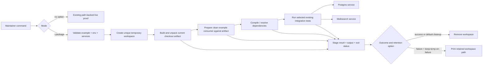

<user_constraints>
## User Constraints (from CONTEXT.md)

### Locked Decisions

### Maintainer command and adopter workflow
- **D-01:** Expose package-backed execution as `mix verify.phoenix_example --package`. Preserve the no-argument `mix verify.phoenix_example` path-backed behavior. Keep the package mode on the live Phoenix proof command rather than adding another top-level task or mixing it into the service-free `verify.adopter` default.
- **D-02:** Keep package-mode setup behind the maintainer command. The command should reuse the existing Phoenix example and its documented Postgres/Meilisearch prerequisites; consumers should not need to edit the example's normal `path: "../.."` dependency or learn temporary artifact wiring.

### CI coverage and service use
- **D-03:** Run the existing path-backed Phoenix proof and then the package-backed proof in the same existing advisory `phoenix-example` CI job. Reuse its Postgres and Meilisearch services, preserve per-run/test isolation, and retain the advisory status. Do not replace the path proof or create a separate service-backed job without new evidence that job-level isolation is needed.

### Results and diagnostics
- **D-04:** Report recognizable progress and pass/fail outcomes for the proof stages. On failure, identify the failing stage, command, and exit status, preserve the child process output, and return a failing task exit status. Keep ordinary output useful in both local terminals and CI logs; do not add a machine-readable report artifact or verbosity mode absent a concrete cross-run triage need.
- **D-05:** Keep diagnostics actionable without exposing environment variable values or secrets. The task should make the service prerequisites and failure stage clear while leaving the temporary dependency implementation as an internal detail.

### Temporary files and debug recovery
- **D-06:** Use a unique isolated temporary workspace for task-owned package/example artifacts and clean it after both successful and failed runs by default. Do not leave success artifacts behind.
- **D-07:** Provide an explicit `--keep-temp-on-failure` opt-in for local debugging. When selected and a run fails, retain only that failed run's task-owned workspace and print its full location; successful runs still clean up. Keep credentials and secret material out of the retained workspace.

### the agent's Discretion
- Choose the implementation details for presenting the unpacked artifact to a clean copy of the existing example, provided the proof demonstrably uses the built package artifact and cannot silently fall back to a repository path dependency.
- Choose helper/module boundaries, exact progress labels, subprocess handling, temporary-directory naming, and the contract-test structure while preserving the command, diagnostics, CI, and cleanup decisions above.
- Keep generated reports or CI artifact retention out of scope unless a concrete Phase 160 requirement cannot be met with deterministic task output and exit status.

### Deferred Ideas (OUT OF SCOPE)
None — discussion stayed within the Phase 160 package-backed proof boundary.
</user_constraints>

<phase_requirements>
## Phase Requirements

| ID | Description | Research Support |
|----|-------------|------------------|
| PKG-01 | A maintainer can build the library package artifact from the current checkout and compile a clean consumer schema against that artifact, without a path dependency. | Reuse `mix hex.build --unpack --output <dir>` and the existing clean-consumer compile pattern; explicitly prove that dependency resolution points at the unpacked package artifact. |
| PKG-02 | A maintainer can run the existing Phoenix adopter example’s selected real-service integration flows against the built package artifact, including its existing inline, Oban, and related-data scenarios, without changing the example’s normal path-dependency workflow. | Run the current example smoke suite from an isolated copy configured to consume the artifact; preserve its four integration tests and original repository example dependency. |
| PKG-03 | The package-backed example proof uses isolated temporary files and reports setup, service, and test failures clearly; successful and failed runs clean up task-owned temporary resources by default. | Use a unique per-run root, stage-aware subprocess results, `try/after` cleanup, and an explicit failure-only retention flag; service checks must precede package and test execution. |
| PROOF-01 | A documented, deterministic maintainer command exposes the package-backed Phoenix proof and uses the existing example and service prerequisites; the command, CI wiring, and documentation are guarded against drift by automated checks. | Extend the existing Phoenix-example capability dispatch, run path then package mode in the existing advisory service lane, and add contract assertions that connect command behavior, CI order, and docs. |
</phase_requirements>

## Project Constraints (from AGENTS.md)

- Scrypath is an Elixir OSS library with Ecto-first APIs and Phoenix-friendly integrations; preserve that ecosystem fit.
- Public v1 targets Meilisearch first and keeps any backend adapter seam internal; this phase must not widen public backend support.
- Preserve inline, Oban-backed, and manual sync flows; this proof specifically exercises existing inline and Oban scenarios.
- Prioritize low-friction Phoenix developer experience and operational clarity around consistency, deletion, backfills, and reindexing.
- Do not release publicly until the project feels complete; keep release and documentation claims accurate.
- Consult relevant files under `prompts/` when choices touch search-library architecture, Elixir/Ecto/Phoenix practices, OSS release engineering, or brand/positioning.
- Follow `CONTRIBUTING.md` for verification, CI, and release gates. Keep implementation edits focused, run the checks named there, and update `.planning/PROJECT.md` only when product scope or shipped claims intentionally change.
- Maintain green-main posture: keep required gates lean, prefer PR-first feature work, and back completion with executable tests or exact-SHA hosted evidence rather than post-implementation human verification or pending UAT.
- Resolve subjective choices before implementation or leave them nonblocking; do not simulate reviewer identity or silently auto-approve a trust gate.
- Avoid speculative milestone reopening without an active milestone, release follow-up, or concrete bug/adopter evidence.
- For the Phoenix example, follow `examples/phoenix_meilisearch/AGENTS.md`: use `mix precommit` for changes in that example; use included `Req` for HTTP; follow its Elixir/Ecto test conventions and avoid unsafe atom conversion and unnecessary dependencies.

These are binding project and local-example instructions for the plan. [VERIFIED: root `AGENTS.md` and `examples/phoenix_meilisearch/AGENTS.md`, opened this session]

## Summary

Phase 160 is a verification-orchestration change around existing Elixir package and Phoenix integration assets. The root already has a canonical `mix verify.phoenix_example` task that delegates to the live adopter path, and a package smoke test already builds/unpacks the Hex artifact and compiles a clean consumer schema from a locally tagged artifact copy. The task should compose these established pieces while ensuring the Phoenix application under test cannot accidentally resolve the repository path dependency. [VERIFIED: `lib/mix/tasks/verify/phoenix_example.ex:1-6`, `lib/mix/tasks/verify/capability.ex:50-53`, `test/release/consumer_smoke_test.exs:6-23`, `test/release/consumer_smoke_test.exs:48-69`]

The service-backed proof should continue to exercise the existing four real-service scenarios: inline sync, Oban sync, inline related-data fan-out, and Oban related-data fan-out. Existing test modules already use unique Meilisearch index prefixes and remove their test index on exit; Oban is configured for in-process testing. CI has one advisory `phoenix-example` job with Postgres 16 and Meilisearch v1.15, so planning should place the existing path proof first and package proof second within this job. [VERIFIED: `examples/phoenix_meilisearch/test/smoke/meilisearch_stack_test.exs:8-28`, `examples/phoenix_meilisearch/test/smoke/meilisearch_oban_stack_test.exs:8-30`, `examples/phoenix_meilisearch/test/smoke/meilisearch_related_inline_stack_test.exs:8-30`, `examples/phoenix_meilisearch/test/smoke/meilisearch_related_oban_stack_test.exs:8-30`, `.github/workflows/ci.yml:152-177`]

**Primary recommendation:** Add the `--package` option to the existing `verify.phoenix_example` dispatch, stage a disposable copy of the existing example that consumes the freshly built package artifact, and report each stage with its command/status/output. Preserve the no-argument path mode and the advisory job topology exactly as locked in CONTEXT.md. [VERIFIED: `.planning/phases/160-package-backed-phoenix-proof/160-CONTEXT.md` D-01, D-03, D-04]

## Architectural Responsibility Map

| Capability | Primary Tier | Secondary Tier | Rationale |
|------------|-------------|----------------|-----------|
| Maintainer command parsing and proof orchestration | API / Backend (Mix task) | — | This is a root Mix CLI capability; task owns stage sequencing and subprocess statuses. [VERIFIED: `lib/mix/tasks/verify/phoenix_example.ex:1-6`, `lib/mix/tasks/verify/capability.ex:50-53`] |
| Package artifact construction and consumer compilation | API / Backend (Mix/release tooling) | Filesystem | The root library's Hex artifact is the input to a clean consumer compile. [VERIFIED: `test/release/consumer_smoke_test.exs:23-69`, `test/release/consumer_smoke_test.exs:140-142`] |
| Live integration verification | Database / Storage and external search service | API / Backend (Phoenix example) | Postgres is used by the example Repo and Meilisearch is exercised through live indexing/search. [VERIFIED: `examples/phoenix_meilisearch/README.md` Integration coverage, `examples/phoenix_meilisearch/test/smoke/meilisearch_stack_test.exs:32-59`] |
| CI service provisioning and lane status | CDN / Static (GitHub Actions) | Database / Storage and external search service | Workflow owns the services and keeps the Phoenix service job advisory. [VERIFIED: `.github/workflows/ci.yml:152-177`] |

## Standard Stack

### Core

| Library / Tool | Version | Purpose | Why Standard |
|----------------|---------|---------|--------------|
| Elixir / Mix | Project supports `~> 1.17` in its clean consumer pattern; CI executes `1.19.0` on OTP `28.1`. | Mix task, package build, tests, subprocess orchestration. | Existing project and CI contract. [VERIFIED: `test/release/consumer_smoke_test.exs:85-109`, `.github/workflows/ci.yml:167-169`] |
| Hex `mix hex.build` | Existing installed project dependency; no new package needed. | Build/unpack the package artifact into the run workspace. | Current release smoke already uses this supported artifact path. Official docs define `--unpack` and `--output` for this use. [VERIFIED: `test/release/consumer_smoke_test.exs:140-142`; [Hex build docs](https://hex.hexdocs.pm/Mix.Tasks.Hex.Build.html)] |
| Phoenix example / ExUnit | Existing example lockfile and selected integration tests. | Exercise the package against Postgres and Meilisearch. | Reuse the canonical adopter proof rather than building a duplicate app or harness. [VERIFIED: `examples/phoenix_meilisearch/README.md` Integration coverage, `examples/phoenix_meilisearch/mix.exs`] |

### Supporting

| Tool / Pattern | Purpose | When to Use |
|----------------|---------|-------------|
| `System.cmd/3` | Capture output plus an exit status for each external command. | Run artifact build, staged example dependency setup, and tests with explicit working directory and environment. The current adopter task already captures child output/status, while the consumer smoke uses `stderr_to_stdout: true`. [VERIFIED: `lib/mix/tasks/verify.adopter.ex:88-96`, `test/release/consumer_smoke_test.exs:158-174`; [System docs](https://hexdocs.pm/elixir/System.html#cmd/3)] |
| `System.unique_integer/1`, `System.tmp_dir!/0`, and `File.rm_rf/1` | Allocate and remove task-owned temporary workspaces. | Use a unique directory per invocation; guarantee the default cleanup on all outcomes. [VERIFIED: `test/release/consumer_smoke_test.exs:176-184`, `test/release/consumer_smoke_test.exs:21`] |
| Isolated `HEX_HOME` and `MIX_HOME` | Prevent user credentials or local Hex/Mix state from affecting dependency resolution. | Apply to subprocesses that fetch dependencies or access Hex; retain no credentials in the temporary tree. [VERIFIED: `test/release/consumer_smoke_test.exs:13-19`] |

### Alternatives Considered

| Instead of | Could Use | Tradeoff |
|------------|-----------|----------|
| Editing example's normal path dependency temporarily | Build a disposable copy and replace only that copy's dependency with artifact-backed wiring | Keeps checked-out adopter workflow untouched and satisfies locked D-02. The exact artifact reference mechanism is discretionary; whichever is selected must demonstrate resolution to the artifact and reject path fallback. [VERIFIED: `.planning/phases/160-package-backed-phoenix-proof/160-CONTEXT.md` D-02 and discretion; `examples/phoenix_meilisearch/mix.exs`] |
| New CI job or promotion to a required gate | Extend the existing advisory `phoenix-example` job | A new job duplicates service setup; promotion changes required-gate posture contrary to D-03. [VERIFIED: `.planning/phases/160-package-backed-phoenix-proof/160-CONTEXT.md` D-03; `.github/workflows/ci.yml:152-177`] |

**Installation:** No new package installation is required for this phase. It reuses Mix/Hex dependencies already present in the root and example projects. [VERIFIED: `mix.exs`, `examples/phoenix_meilisearch/mix.exs`]

## Architecture Patterns

### System Architecture Diagram



Diagram captures the phase's locked stage sequence and the debug-only failure-retention branch. [VERIFIED: `.planning/phases/160-package-backed-phoenix-proof/160-CONTEXT.md` D-01, D-04, D-06, D-07]

### Recommended Project Structure

Keep the task implementation under the existing Phoenix example Mix task/capability boundary and add focused task contract coverage beside current `test/mix/tasks` tests. Keep any disposable example copy and artifact files under the OS temp root; do not write staged manifests, package tarballs, or generated dependency trees into the tracked example. [VERIFIED: `lib/mix/tasks/verify/phoenix_example.ex:1-6`, `.planning/phases/160-package-backed-phoenix-proof/160-CONTEXT.md` D-06; test directory inventory read this session]

### Pattern 1: Stage-aware subprocess wrapper

**What:** Run each external command as an explicit stage and preserve the child output, command text, and numeric exit status in the failure message. Continue returning a task-level failure after a failed stage. [VERIFIED: `.planning/phases/160-package-backed-phoenix-proof/160-CONTEXT.md` D-04]

**When to use:** Package build, artifact presentation, dependency resolution/compile, and integration test execution. Validate flags and required inputs before creating task-owned files.

**Example:**

```elixir
{output, status} =
  System.cmd(command, args,
    cd: working_dir,
    env: isolated_env,
    stderr_to_stdout: true
  )

Mix.shell().info(output)

if status != 0 do
  Mix.raise("#{stage} failed: #{command} #{Enum.join(args, " ")} exited #{status}")
end
```

This follows the existing child-command pattern; redact/suppress environment values and include only the names of missing required variables. [VERIFIED: `lib/mix/tasks/verify.adopter.ex:45-49`, `lib/mix/tasks/verify.adopter.ex:88-96`; [System.cmd/3 docs](https://hexdocs.pm/elixir/System.html#cmd/3)]

### Pattern 2: Build from current package artifact, then compile a consumer

The package operation is `mix hex.build --unpack --output <artifact-dir>`. The project already validates an artifact's contents and uses a clean consumer project that asserts there is no `path:` dependency before compiling a schema that calls `use Scrypath`. For this phase, package mode must carry the same guarantee into the staged Phoenix example. [VERIFIED: `test/release/consumer_smoke_test.exs:23-69`, `test/release/consumer_smoke_test.exs:114-142`; [Hex build docs](https://hex.hexdocs.pm/Mix.Tasks.Hex.Build.html)]

### Pattern 3: Per-run cleanup with opt-in failed-workspace retention

Allocate one unique workspace for every invocation. Cleanup should be in an `after` path that executes for argument/setup/service/package/compile/test errors, except where `--keep-temp-on-failure` is set and the run failed. Successful runs always remove it. Do not copy credential files, `.hex` state, or environment values into the workspace. The existing release consumer test uses `on_exit` cleanup and isolates its Hex/Mix homes; the Mix task needs equivalent cleanup semantics for child processes and caught task failures. [VERIFIED: `test/release/consumer_smoke_test.exs:13-21`, `test/release/consumer_smoke_test.exs:176-184`; locked D-06/D-07]

### Pattern 4: Service-check then test, no implicit service startup

Reuse the adopter's required environment-name and TCP reachability checks before invoking the example. Its documented prerequisites are Postgres and Meilisearch; the example's README explicitly directs maintainers to start the services separately, while CI provides them as workflow services. Preserve the real URL for the child process but never echo its value in errors. [VERIFIED: `lib/mix/tasks/verify.adopter.ex:45-49`, `lib/mix/tasks/verify.adopter.ex:125-198`, `examples/phoenix_meilisearch/README.md` Prerequisites and GitHub Actions]

### Anti-Patterns to Avoid

- **Mutating the tracked `examples/phoenix_meilisearch/mix.exs` during the proof:** risks leaving the developer checkout dirty or racing with path-backed execution. Stage an isolated copy. [VERIFIED: locked D-02/D-03]
- **Silently running path-backed `mix test`:** the central requirement is proof against the built package. Add a contract assertion for the staged dependency source and compile evidence, and ensure fallback to `path: "../.."` cannot occur. [VERIFIED: PKG-01/02 in `.planning/REQUIREMENTS.md`; D-02]
- **Combining package proof with `verify.adopter`'s service-free default:** package mode belongs to `verify.phoenix_example --package`, not the service-free fast proof. [VERIFIED: locked D-01]
- **Printing every inherited environment variable to aid diagnosis:** can disclose URL credentials or tokens. Report only missing variable names and host/port reachability where useful. [VERIFIED: locked D-05; existing env names at `lib/mix/tasks/verify.adopter.ex:45-49`]
- **Using a fixed shared temp name or keeping success artifacts:** risks collision and violates cleanup requirements. [VERIFIED: locked D-06/D-07]

## Don't Hand-Roll

| Problem | Don't Build | Use Instead | Why |
|---------|-------------|-------------|-----|
| Hex package archive assembly/unpack | Custom tar manipulation or copying source files to simulate the package | `mix hex.build --unpack --output <dir>` | The package tool performs the actual package build and exposes the contents that will ship. [CITED: [Hex build docs](https://hex.hexdocs.pm/Mix.Tasks.Hex.Build.html)] |
| Integration scenarios | Duplicate demo app or a new set of equivalent service tests | Existing `examples/phoenix_meilisearch` integration suite | The existing test suite already covers the requested inline, Oban, and related-data cases against real services. [VERIFIED: four `test/smoke/meilisearch*stack_test.exs` files read this session] |
| Service lifecycle | Have the verifier start Docker or silently switch to mocked services | Existing prerequisite checks and service lane | Existing live adopter task is orchestration-only and explicitly requires already-running services. [VERIFIED: `lib/mix/tasks/verify.adopter.ex:125-198`, example README] |
| Consumer compile proof | Infer package usability from archive existence alone | Compile a schema in a clean consumer project with artifact-backed dependency | Artifact existence does not prove the consumer compiler can load generated macros/schema code. Existing smoke already compiles this pattern. [VERIFIED: `test/release/consumer_smoke_test.exs:48-69`, `:114-142`] |

**Key insight:** The proof's value depends on artifact provenance and consumer isolation. Reuse Hex's builder and the existing adopter behaviors, then make the temporary dependency source observable to the contract test so a green service run cannot accidentally pass on the repository checkout. [VERIFIED: PKG-01/02 and code patterns above]

## Common Pitfalls

### Pitfall 1: Package resolution falls back to the checkout

**What goes wrong:** The test passes but it exercised the source tree rather than the package built from the current checkout.

**Why it happens:** The example's ordinary dependency is `path: "../.."`; running from an unmodified copy or editing the wrong copy preserves that path. [VERIFIED: `examples/phoenix_meilisearch/mix.exs` dependency declaration, read this session]

**How to avoid:** Prepare a disposable copy of the example and replace only its Scrypath dependency with a dependency on the unpacked artifact using a source that Mix can resolve locally. Assert or otherwise test that the generated project manifest has no repository path dependency, and compile before running integration tests. The exact handoff mechanism is at the agent's discretion, but cannot permit silent fallback. [VERIFIED: D-02 discretion; `test/release/consumer_smoke_test.exs:57-69`]

**Warning signs:** `mix deps` reports the root checkout as Scrypath source, test output shows only pre-existing example build paths, or the staged manifest still contains `path: "../.."`.

### Pitfall 2: Reusing the preceding path run's build products

**What goes wrong:** The second proof appears to use the package but loads modules compiled from the first path-backed run.

**Why it happens:** A copied app can inherit `_build`, `deps`, or lock/build state tied to the tracked checkout. [ASSUMED]

**How to avoid:** Copy only source/config/lock assets required by the example, omit `_build` and dependency build directories, and use an isolated `MIX_HOME`/`HEX_HOME` plus either a dedicated build path or clean staged tree. Preserve the existing service endpoint environment. [VERIFIED: clean consumer isolation at `test/release/consumer_smoke_test.exs:13-19`; operational recommendation]

**Warning signs:** Package mode is materially faster because it reused cached app beams, or the staged dependency tree points outside the temp workspace.

### Pitfall 3: Diagnostics leak secrets

**What goes wrong:** Failure output prints a Meilisearch URL containing credentials or dumps inherited environment.

**Why it happens:** Raw endpoint strings and child environments are convenient context to attach to errors. [ASSUMED]

**How to avoid:** Report variable names, stage, command (without secret arguments), exit status, child output, and non-sensitive reachability endpoint details. Keep credential values out of temp files and failure retention. [VERIFIED: locked D-04/D-05/D-07]

**Warning signs:** Error text includes `SCRYPATH_MEILISEARCH_URL=` value, auth token, or a captured environment dump.

### Pitfall 4: Artifact build is invoked after starting the application

**What goes wrong:** Hex task behavior may be affected by a loaded app or fail due to dependency/application startup context.

**Why it happens:** The verification task commonly calls `Mix.Task.run("app.start")` before work. Hex's documentation says `mix hex.build` should be invoked before tasks that load/start the application unless `:hex` is explicitly in `extra_applications`. [CITED: [Hex build docs](https://hex.hexdocs.pm/Mix.Tasks.Hex.Build.html)]

**How to avoid:** Keep artifact build at the start of the package workflow, before invoking child tasks that start the root app. Confirm behavior with the project's installed Hex/Mix versions when implementing.

**Warning signs:** The root Mix application is started before artifact build or package mode calls `verify.adopter` first.

### Pitfall 5: Mix task one-shot behavior skips a second invocation

**What goes wrong:** In-process tests or one invocation that dispatches multiple task paths can get a no-op on a repeated Mix task.

**Why it happens:** Mix tasks normally run once per VM; repeated invocation requires `Mix.Task.reenable/1` or `rerun/2`. [CITED: [Mix.Task docs](https://mix.hexdocs.pm/Mix.Task.html)]

**How to avoid:** When package flow invokes Mix tasks directly more than once, explicitly reenable those tasks or prefer a subprocess boundary with its own clean Mix invocation. Existing root verification tasks already use `Mix.Task.reenable("test")` before rerunning tests. [VERIFIED: `lib/mix/tasks/verify.adopter.ex:100-103`]

## Environment Availability

| Dependency | Required By | Available | Version / observation | Fallback |
|------------|------------|-----------|----------------------|----------|
| Elixir / Mix | Root task and package build | ✓ | Elixir 1.19.5 on OTP 28; `mix --version` reports Mix 1.19.5 | — |
| Docker CLI/daemon | Local service stack if services are not running | ✓ | Docker CLI 29.5.2; `docker info` returned client and server details | Use existing local services if already started |
| PostgreSQL | Phoenix example integration | ✗ | `pg_isready -h 127.0.0.1 -p 5433`: no response | Start the example Compose stack or provide compatible Postgres service |
| Meilisearch | Phoenix example integration | ✗ | `http://127.0.0.1:7700/health` connection refused | Start the example Compose stack or provide compatible Meilisearch service |
| New external packages | None | N/A | Phase installs no external package. | — |

Both live services are blocking only for executing the end-to-end service proof locally; the command should keep its existing fail-fast prerequisite behavior. The CI advisory lane supplies Postgres 16 and Meilisearch v1.15. [VERIFIED: current-session probes; `.github/workflows/ci.yml:156-165`]

## Validation Architecture

### Test Framework

| Property | Value |
|----------|-------|
| Framework | ExUnit, root Mix project |
| Config file | Root `mix.exs` aliases; example `mix.exs` defines test alias that creates/migrates DB |
| Quick run command | `mix test test/mix/tasks/verify_capability_test.exs` plus the new focused package-mode task contract test |
| Full suite command | `mix verify.core --exclude integration --exclude docs_contract` (matches required core CI shape for ordinary regression) |

### Phase Requirements → Test Map

| Req ID | Behavior | Test Type | Automated Command | File Exists? |
|--------|----------|-----------|-------------------|-------------|
| PKG-01 | Package is built/unpacked and a clean consumer schema compiles against it, with no path dependency. | Integration/contract | `mix test test/release/consumer_smoke_test.exs` | ✅ existing consumer test; extend if package task path differs |
| PKG-02 | Package-mode run targets existing inline, Oban, and two related-data service scenarios. | Live integration + command contract | `SCRYPATH_EXAMPLE_INTEGRATION=1 PGPORT=5433 SCRYPATH_MEILISEARCH_URL=http://127.0.0.1:7700 mix verify.phoenix_example --package` | ✅ existing scenario tests; package-mode wiring is new |
| PKG-03 | Setup/service/compile/test failure stage, command, status and output are preserved; cleanup default and opt-in retention behavior are correct. | Task contract/failure-injection | New isolated task tests invoking controlled failures; test temp root removed by default and retained only for failed opt-in | ❌ Wave 0 / phase task |
| PROOF-01 | Command parsing preserves path mode; CI invokes path then package in same advisory job; docs and wiring are checked for drift. | Contract | `mix test test/mix/tasks/verify_capability_test.exs test/scrypath/docs_contract_test.exs` | ✅ tests exist; extend for new flag/order/docs contract |

### Sampling Rate

- **Per task commit:** run the focused task-contract tests and package consumer smoke.
- **Per wave merge:** run root non-integration core gate and package consumer smoke.
- **Phase gate:** run the full package-backed Phoenix command against Postgres and Meilisearch; keep it in the existing advisory lane.

### Wave 0 Gaps

- Add focused automated tests for `--package` argument acceptance/rejection, ordered stages, command/status/output diagnostics, failure cleanup, and `--keep-temp-on-failure` behavior.
- Extend a workflow/docs contract test to assert both Phoenix command invocations appear in order within the same advisory job and retain `continue-on-error: true`.
- Extend documentation contract coverage so the documented command, service requirements, and package proof claims agree with executable behavior.

## Security Domain

This is developer tooling, not an authentication or authorization feature. Treat service environment values and temp workspace contents as sensitive inputs; sanitize diagnostics and exclude credentials from retained temp files. [VERIFIED: locked D-05/D-07]

### Applicable ASVS Categories

| ASVS Category | Applies | Standard Control |
|---------------|---------|-----------------|
| V2 Authentication | No | The task uses configured service prerequisites and adds no auth surface. |
| V3 Session Management | No | No user sessions or web application state. |
| V4 Access Control | No | No authorization boundary changes. |
| V5 Input Validation | Yes | Parse only declared boolean options, reject positional/unknown options, validate required environment names and service endpoint shape before work. [VERIFIED: existing `OptionParser.parse` and validation at `lib/mix/tasks/verify.adopter.ex:55-60`, `:106-122`, `:125-198`] |
| V6 Cryptography | No | No cryptographic handling; do not print/store credentials. |

### Known Threat Patterns for Mix CLI + subprocesses

| Pattern | STRIDE | Standard Mitigation |
|---------|--------|---------------------|
| Secret value leaked in task output | Information disclosure | Never echo full endpoint or environment values; show required variable names and service reachability only. |
| Staged package/example escapes intended temp workspace or clobbers tracked app | Tampering | Generate a unique task-owned temp root, use explicit `cd` for child commands, stage from source without mutating tracked files, and remove only the owned root. |
| Shell interpolation of paths/options | Tampering | Prefer direct `System.cmd/3` executable + argv over interpolated shell scripts; use a shell only when required and quote fixed script inputs. Existing adopter shell precedent uses fixed literal command. [VERIFIED: `lib/mix/tasks/verify.adopter.ex:88-92`] |

## Code Examples

Package build invocation already used by the consumer smoke test:

```elixir
System.cmd("mix", ["hex.build", "--unpack", "--output", artifact_dir],
  cd: repo_root,
  stderr_to_stdout: true
)
```

The in-repo value quote is `run_mix!(["hex.build", "--unpack", "--output", artifact_dir], cd: repo_root)` [VERIFIED: `test/release/consumer_smoke_test.exs:140-142`]. Hex documents that `--unpack` builds and unpacks the tarball and `--output` selects the destination [CITED: [Hex build docs](https://hex.hexdocs.pm/Mix.Tasks.Hex.Build.html)]. Keep this child command before application-starting tasks as described in the Hex docs.

Subprocess stage result handling should preserve output and status:

```elixir
{output, status} = System.cmd("mix", args, cd: example_dir, stderr_to_stdout: true)
Mix.shell().info(output)
if status != 0, do: Mix.raise("#{stage} failed with exit status #{status}")
```

This mirrors the existing `System.cmd("bash", ["-lc", script], cd: example_dir, stderr_to_stdout: true)` call [VERIFIED: `lib/mix/tasks/verify.adopter.ex:88-92`]. See the official [System.cmd/3 docs](https://hexdocs.pm/elixir/System.html#cmd/3) for command argument, output, and status semantics.

## Sources

### Primary (HIGH confidence)

- `.planning/phases/160-package-backed-phoenix-proof/160-CONTEXT.md` — locked decisions, phase scope, package artifact seam, diagnostics/cleanup behavior.
- `.planning/REQUIREMENTS.md` and `.planning/ROADMAP.md` — Phase 160 requirements and success criteria.
- `examples/phoenix_meilisearch/README.md`, its `mix.exs`, and four `test/smoke/meilisearch*stack_test.exs` files — service contract and live integration scenarios.
- `test/release/consumer_smoke_test.exs` and `lib/mix/tasks/verify.phase11.ex` — existing Hex unpacked artifact and clean consumer compilation patterns.
- `lib/mix/tasks/verify.adopter.ex`, `lib/mix/tasks/verify/capability.ex`, and `lib/mix/tasks/verify/phoenix_example.ex` — current task dispatch, validation, and subprocess handling.
- `.github/workflows/ci.yml` and `CONTRIBUTING.md` — advisory lane and documented command contract.
- Project prompts consulted: `prompts/elixir-opensource-libs-best-practices-deep-research.md`, `prompts/elixir-oss-lib-ci-cd-best-practices-deep-research.md`, `prompts/elixir-plug-ecto-phoenix-system-design-best-practices-deep-research.md`, `prompts/elixir-best-practices-deep-research.md`, `prompts/ecto-best-practices-deep-research.md`, `prompts/phoenix-best-practices-deep-research.md`, `prompts/elixir-search-lib-deep-research.md`, and `prompts/meileisearch best practices for scrypath deep research.md` — local conventions and domain framing.

### Secondary (MEDIUM confidence)

- [Hex `mix hex.build` documentation](https://hex.hexdocs.pm/Mix.Tasks.Hex.Build.html) — artifact unpack options and task ordering caveat.
- [Elixir `System.cmd/3` documentation](https://hexdocs.pm/elixir/System.html#cmd/3) — subprocess invocation and output/status behavior.
- [Mix.Task documentation](https://mix.hexdocs.pm/Mix.Task.html) — one-shot task behavior and reenable/rerun API.

## Assumptions Log

| # | Claim | Section | Risk if Wrong |
|---|-------|---------|---------------|
| A1 | Omitting staged `_build` and dependency build artifacts is necessary to prevent package mode from reusing app beams built from the path dependency. | Common Pitfalls | Package mode might accidentally exercise previously compiled path code and yield false confidence. |
| A2 | A disposable example copy can be made without a new external file-copy package and still preserve all configuration needed by existing integration scenarios. | Architecture Patterns | Missing a required tracked file would make package proof fail during setup; inspect the app's tracked inputs while implementing. |

## Open Questions

1. **What local dependency source form is most robust for the unpacked artifact?**
   - What we know: The package artifact contains Mix package sources; current consumer smoke locally initializes a Git repo/tag in the unpacked directory and uses a local file URL.
   - What's unclear: The cleanest resolution form for a full Phoenix project's `scrypath` dependency, including lockfile updates, has not been exercised in this phase research.
   - Recommendation: Reuse the proven local artifact Git/tag method unless a minimal experiment shows that the example's dependency graph needs a different artifact-local representation. Keep implementation behind `--package`.

2. **How to keep DB isolation when the path-backed and package-backed run share services?**
   - What we know: Existing integration tests use `DataCase` and unique Meilisearch index prefixes; CI runs both proofs in a single service job by decision.
   - What's unclear: Confirm whether the staged example's database name/config is sufficiently isolated from the first run.
   - Recommendation: Preserve the example's test DB conventions and avoid changing external service state beyond its normal test database and uniquely prefixed search indexes.

## Metadata

**Confidence breakdown:**
- Standard stack: HIGH — package build, example, and toolchain are present in-repo; official Hex build docs confirm the artifact CLI.
- Architecture: HIGH — command, integration tests, consumer smoke, and advisory service lane were inspected directly.
- Pitfalls: MEDIUM — false path fallback, temp cleanup, and secret handling follow locked decisions; staged-build isolation should be confirmed by contract tests.

**Research date:** 2026-09-23
**Valid until:** 2026-10-23 (stable in-repo architecture; recheck package tooling if Hex/Mix changes before execution)
