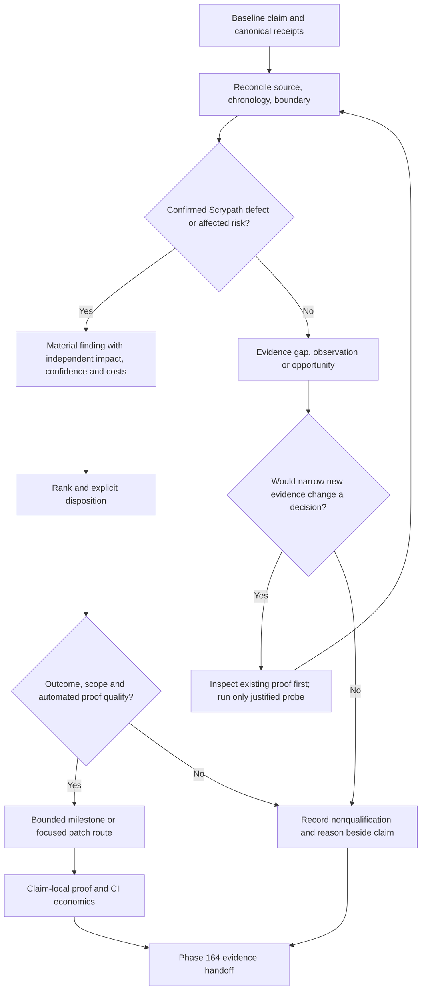

# Phase 163: Findings and Bounded Follow-up — Research

**Researched:** 2026-09-25  
**Domain:** Evidence reconciliation, qualitative finding disposition, bounded follow-up planning  
**Confidence:** MEDIUM overall; direct repository observations are distinguished from recommendations and inherited execution receipts.

<user_constraints>
## User Constraints (from CONTEXT.md)

Verbatim decisions and discretion from the phase context. [VERIFIED: .planning/phases/163-findings-and-bounded-follow-up/163-CONTEXT.md:16-42]

<!-- DATA_4be2a713_START -->
### Locked Decisions

### Materiality and classification
- **D-01:** A material finding must be a confirmed behavior defect or a substantiated Scrypath-owned risk affecting a named integrator, feature-owner, operator, or maintainer job. Require observed/reproducible behavior or specific authoritative evidence of an affected risk; an unverified source-level concern remains an observation.
- **D-02:** Keep evidence gaps linked to their Phase 162 baseline claims and investigate only when additional evidence could change a decision. Missing or stale proof remains a gap, not a defect or severity-ranked finding.
- **D-03:** Record confidence separately from impact and severity. Lower confidence can trigger targeted evidence gathering, but must not numerically cancel a credible severe consequence.

### Qualitative rank
- **D-04:** Use the gate-aligned labels **Critical / High / Medium-leverage / Low**. Apply outcome- and risk-based definitions with a concise rationale; do not use a weighted numeric score.
- **D-05:** Show impact, frequency/exposure, confidence, applicable compatibility/security/privacy/data-integrity/operational risks, implementation and regression cost, and recurring verification cost distinctly. A credible severe consequence can warrant a high rank even when frequency is low. Cost informs remedy choice and CI placement; it never lowers severity.
- **D-06:** Describe costs qualitatively and include measured runtime or maintenance evidence when available. Do not require speculative hour estimates.
- **D-07:** Every material finding receives an explicit `closed`, `accepted`, `deferred`, or `rejected` disposition with supporting evidence or rationale. Accepted risk requires an owner decision; deferred work requires an owner and event-based revisit trigger. Preserve the readiness boundary: Phase 164 alone makes the gate decision.

### Bounded follow-up qualification
- **D-08:** Group findings only when they share a named adopter/operator outcome, approved scope boundary, and automated proof flow. Split findings whose risk, owner boundary, or acceptance proof is materially different.
- **D-09:** Create a separate follow-up milestone when a finding needs a coordinated, bounded outcome across multiple tasks. A contained fix or routine maintenance item can remain in the focused patch/PR lane.
- **D-10:** Rank sets urgency, not automatic roadmap eligibility. A candidate needs decision-relevant evidence, a concrete user outcome, authorized scope, and workable automated acceptance. For medium/low-leverage work, value must justify implementation, regression, and ongoing maintenance cost. Follow existing explicit scope-guard review for any potentially prohibited API/runtime capability.
- **D-11:** Record why each non-qualifying observation does not warrant a candidate beside its linked baseline claim; do not create a speculative standing backlog. Material deferred findings still keep their owner and revisit trigger.

### Automated acceptance
- **D-12:** Keep a claim-to-proof record with each selected finding/candidate rather than creating a phase-wide manifest or separate CI lane catalogue before demonstrated need.
- **D-13:** Map each user-visible acceptance claim to the cheapest reliable automated layer with an observable outcome. Use unit/property or contract/seam proof when it establishes the claim; add integration, package/service, browser, or exact-SHA hosted proof only when the claim crosses that boundary.
- **D-14:** Promote a check to recurring CI only when repeated regression risk and confidence gained justify recurring runtime and maintenance cost, and the check is reliable, isolated, and diagnosable. Record the comparison when adding a lane or changing its trigger/blocking status; otherwise keep CI economics with the claim.
- **D-15:** A compact claim-to-proof entry includes the user outcome, scope/boundary and exclusions, fixture and oracle, selected proof layer and command, relevant environment/version and exact-SHA/hosted receipt, invalidation trigger, and applicable timeout, diagnostics, isolation, and cleanup details. Software acceptance has no routine human UAT.

### the agent's Discretion
- Choose a navigable source-linked findings/disposition artifact that preserves Phase 162 as the canonical evidence index; cross-reference baseline claim IDs rather than duplicating receipts.
- Choose concise rank definitions, claim IDs, column names, and grouping layout consistent with the decisions above.
- Inspect or rerun only the narrow evidence needed to resolve a decision-relevant uncertainty; do not create a new scorecard, broad rerun, mandatory CI lane, or tooling schema without demonstrated value.
<!-- DATA_4be2a713_END -->

### Deferred Ideas (OUT OF SCOPE)
<!-- DATA_b9a630cf_START -->
None — discussion stayed within phase scope.
<!-- DATA_b9a630cf_END -->
[VERIFIED: .planning/phases/163-findings-and-bounded-follow-up/163-CONTEXT.md:134-139]
</user_constraints>

<phase_requirements>
## Phase Requirements

Descriptions below are copied from the active requirements. [VERIFIED: .planning/REQUIREMENTS.md:18-25]

<!-- DATA_d03ba875_START -->
| ID | Description | Research Support |
|---|---|---|
| FIND-01 | A maintainer can distinguish confirmed behavior defects, evidence gaps, and product opportunities so that missing or stale proof is not mislabeled as a product defect. | Separate classification from rank; reconcile receipts before promoting an observation. |
| FIND-02 | A maintainer can rank each confirmed material finding with evidence provenance, affected job, impact and frequency, confidence, compatibility/security/privacy/data-integrity/operational risk, implementation and regression cost, recurring verification cost, and a concise qualitative rationale; severity cannot be averaged away by cost. | Finding cards expose each factor independently; qualitative definitions below. |
| FIND-03 | A maintainer can close, explicitly accept, defer, or reject each material finding with supporting evidence or rationale, owner decision when risk is accepted, and a revisit trigger when work is deferred; no critical, high, or medium-leverage finding is left without an explicit disposition. | Conditional disposition checks and explicit readiness consequence. |
| CLOSE-01 | A maintainer can identify which evidence-qualified findings warrant a separate bounded follow-up milestone with a clear user outcome, scope authority, and automated acceptance claims, or record why no finding qualifies; v1.39 does not invent implementation scope before the baseline establishes a need. | Candidate admission checklist and focused patch versus milestone routing. |
| CLOSE-02 | Each selected follow-up acceptance claim maps to the cheapest reliable automated evidence layer, with recurring CI promotion justified by confidence gained versus runtime and maintenance cost; routine human UAT is not used for software acceptance. | Claim-local proof records, existing harness reuse, and explicit CI economics. |
<!-- DATA_d03ba875_END -->
</phase_requirements>

## Summary

Plan this as a documentation and triage phase with a finite source inventory. The baseline is an evidence index, not an authoritative list of current defects; the phase context assigns readiness to Phase 164. Preserve that separation while correcting demonstrably incomplete baseline evidence. [VERIFIED: .planning/phases/162-whole-product-evidence-baseline/162-BASELINE.md:3-13] [VERIFIED: .planning/phases/163-findings-and-bounded-follow-up/163-CONTEXT.md:7-9]

Two discoveries materially change planning. First, the baseline's dependency-advisory question already has later remediation receipts: Phase 161 records the fixed dependency graph, passing audit, and hosted deep-quality success. Second, the existing mounted ecommerce proof contains a swap assertion spanning backend success and visible search, although its failed-sync scenario does not prove successful repair. Reconcile these narrow boundaries before commissioning new proof or candidates. These are observations about source and archived receipts, not fresh product test results. [VERIFIED: .planning/milestones/v1.38-phases/161-release-and-tidy-closeout/161-02-SUMMARY.md:77-88,119-126] [VERIFIED: .planning/milestones/v1.38-phases/161-release-and-tidy-closeout/161-VALIDATION.md:39-48] [VERIFIED: examples/scrypath_ecommerce/e2e/operator.spec.ts:11-89]

**Primary recommendation:** Use three bounded work units: reconcile decision-relevant baseline evidence and create a first disposition; complete classification/ranking/disposition across the finite inventory; qualify only evidence-backed follow-up and validate the handoff. A zero-candidate result is valid. Do not predeclare that result before examining the inventory. This is a recommended decomposition under D-01–D-15, not additional product scope. [VERIFIED: .planning/phases/163-findings-and-bounded-follow-up/163-CONTEXT.md:16-42]

## Architectural Responsibility Map

| Capability | Primary tier | Secondary tier | Rationale |
|---|---|---|---|
| Evidence provenance and freshness | Canonical baseline | Existing receipts/source | Keep one evidence index; reference its claim IDs from dispositions. [VERIFIED: .planning/phases/163-findings-and-bounded-follow-up/163-CONTEXT.md:105-115] |
| Classification, rank, disposition, qualification | Maintainer planning artifact | Baseline | This phase connects evidence to decisions without implementing runtime scope. [VERIFIED: .planning/phases/163-findings-and-bounded-follow-up/163-CONTEXT.md:119-120] |
| Risk acceptance | Actual owner decision | Maintainer artifact | Require a linked owner decision; automated analysis cannot invent acceptance. [VERIFIED: .planning/phases/163-findings-and-bounded-follow-up/163-CONTEXT.md:25-31] |
| Search/recovery behavior proof | Existing library/service/consumer harness | Hosted CI receipts | Proof must cross the same boundary as the claim; cost affects placement, not severity. [VERIFIED: .planning/phases/163-findings-and-bounded-follow-up/163-CONTEXT.md:33-37] |
| Authorization and business policy | Host application context | Scrypath query seam | Request helpers normalize data; application context owns execution/policy. [VERIFIED: guides/request-edge-search.md:3-17] |
| Readiness verdict and closeout reconciliation | Phase 164 | Phase 163 dispositions | Explicit phase split; deferred material work does not itself satisfy readiness. [VERIFIED: .planning/ROADMAP.md:71-80] [VERIFIED: .planning/reference/PRE-OPERATOR-UI-READINESS.md:49-58] |

## Project Constraints (from AGENTS.md)

- Preserve Elixir/Ecto-first APIs, optional Phoenix integration, Meilisearch-first public backend, and an internal adapter seam; avoid public backend breadth, Phoenix-only architecture, mandatory core supervision, or Postgres search expansion. [VERIFIED: AGENTS.md:14-18,40-43,61-65]
- Preserve inline, Oban-backed, and manual synchronization; make consistency, deletion, backfills, reindex, and operational failures explicit. Favor minimal setup and truthful release claims. [VERIFIED: AGENTS.md:16-19,36-39]
- Honor declared runtime support and established tooling; this phase does not change versions or dependencies. The declared support values are quoted: DATA_66d8a04f_START **Elixir**: support floor `1.17`, target current stable through `1.19`; **OTP**: support floor `26`, test through `28` DATA_66d8a04f_END. These are project declarations, not newly researched ecosystem support guarantees. [VERIFIED: AGENTS.md:25-52]
- Consult relevant project prompts and follow existing repository patterns. Their historical recommendations are background; current context and scope authority prevail. The older ecosystem prompt recommends a different first backend, demonstrating why it cannot override the project. [VERIFIED: AGENTS.md:10-10,78-78] [VERIFIED: prompts/elixir-search-lib-deep-research.md:1-7]
- Keep edits focused, use CONTRIBUTING's applicable checks, and update PROJECT if intentionally changing scope or shipped claims. Keep main green, use PR-first serious work, executable/exact-SHA acceptance, and genuine owner decisions. Do not create work when evidence and approved scope are absent. [VERIFIED: AGENTS.md:90-105]
- When the project is idle, use STATE and roadmap posture rather than treating historical phase directories as active. This phase is explicitly active in the current state. Preserve the managed developer-profile block. [VERIFIED: AGENTS.md:94-94,110-115] [VERIFIED: .planning/STATE.md:28-33]
- CONTRIBUTING additionally requires squash merges, capability-named checks for new work, and candidate then final exact-SHA closeout with no tracked edits after final attestation. This research does not dispatch CI or authorize a merge. [VERIFIED: CONTRIBUTING.md:19-28,67-83]

## Standard Stack

| Component | Version policy | Use |
|---|---|---|
| Existing Markdown planning artifacts | Repository conventions | One phase-local decision artifact, linked to the canonical baseline. [VERIFIED: .planning/phases/163-findings-and-bounded-follow-up/163-CONTEXT.md:39-42,105-110] |
| Existing Python baseline checker | Standard library only; source imports argparse, re, sys, pathlib | Reuse for baseline edits; it checks structure and links, not product behavior or findings. [VERIFIED: .planning/phases/162-whole-product-evidence-baseline/check_baseline.py:1-18,100-147] |
| Existing Git/Node/GitHub CLI closeout | Use repository entry point | Reuse exact-SHA authority when execution reaches phase closeout. [VERIFIED: scripts/ci_monitor.cjs:140-208] |
| Existing Mix capability commands | Preserve locked product versions | Select only when a named claim needs fresh evidence; routine research does not rerun them. [VERIFIED: CONTRIBUTING.md:26-41] |

**Installation / Package Legitimacy Audit:** No external package installation is proposed. No registry/version-upgrade work belongs in this documentation phase. [VERIFIED: .planning/REQUIREMENTS.md:38-47]

## Architecture Patterns



The diagram is a proposed workflow implementing the locked decisions; it creates no runtime tier or new data store. [VERIFIED: .planning/phases/163-findings-and-bounded-follow-up/163-CONTEXT.md:16-42,119-120]

### Artifact shape and ownership

Recommended new artifact name: `163-FINDINGS.md` in the phase directory (proposed output, not an existing source-of-truth path). Use a compact claim-index table plus finding/candidate sections when detail is needed. Retain baseline IDs, classification, decision/reason, and a link to any finding card. Give every baseline claim a triage outcome, including an explicit no-new-observation outcome, so silence cannot masquerade as coverage. Keep detailed receipts in the baseline or their existing canonical source; amend only baseline rows whose evidence changed. This is a design recommendation using the artifact discretion. [VERIFIED: .planning/phases/163-findings-and-bounded-follow-up/163-CONTEXT.md:39-42,105-115]

For material finding cards, include all FIND-02 factors separately, then disposition/rationale, decision evidence, owner, revisit event, and candidate route. For nonmaterial observations, leave severity inapplicable and explain nonqualification beside the claim. Do not encode gaps as low-ranked defects merely to fit a table. [VERIFIED: .planning/REQUIREMENTS.md:18-25] [VERIFIED: .planning/phases/163-findings-and-bounded-follow-up/163-CONTEXT.md:17-31]

### Proposed rank definitions

These definitions operationalize the locked qualitative labels; they are planning recommendations within discretion, not a new policy or numerical scoring scheme. Verbatim labels: DATA_72ca084e_START **Critical / High / Medium-leverage / Low** DATA_72ca084e_END. [VERIFIED: .planning/phases/163-findings-and-bounded-follow-up/163-CONTEXT.md:21-25,39-42]

| Rank | Recommended outcome/risk meaning |
|---|---|
| Critical | Credible immediate exposure or failure capable of severe compromise, unrecoverable data loss, or broadly unsafe operation; containment has priority. |
| High | Credible serious security, privacy, integrity, compatibility, or availability consequence, including infrequent high-consequence failures. |
| Medium-leverage | Substantiated recurring impediment or meaningful bounded reliability/ergonomic gap for a named job; user benefit is concrete enough to assess remedy economics. |
| Low | Bounded low-consequence inconvenience or maintenance issue; no serious consequence is hidden by low frequency or high cost. |

Keep the rank independent of remediation feasibility. A high finding with expensive repair remains high. A medium finding whose repair cost exceeds benefit still requires explicit disposition, owner/trigger where deferred, and visibility to the readiness gate. [VERIFIED: .planning/phases/163-findings-and-bounded-follow-up/163-CONTEXT.md:23-31]

### Disposition is not a readiness verdict

Verbatim disposition values: DATA_f3e8ac92_START `closed`, `accepted`, `deferred`, or `rejected` DATA_f3e8ac92_END. Closure needs claim-specific proof; acceptance needs an actual owner decision; deferral needs an owner and event trigger; rejection needs evidence/rationale explaining why the asserted finding or proposed action does not stand. Rejecting an expensive remedy must not erase a substantiated risk. [VERIFIED: .planning/phases/163-findings-and-bounded-follow-up/163-CONTEXT.md:25-31]

A deferred high or medium finding can satisfy Phase 163's disposition completeness while preventing Phase 164 from passing the readiness condition. The readiness program specifically requires closure with verification or explicit owner acceptance at those levels. Preserve this distinction in the handoff. [VERIFIED: .planning/reference/PRE-OPERATOR-UI-READINESS.md:49-56]

### Decision-changing reconciliation findings

| Baseline input | What research established | Planner action and limit |
|---|---|---|
| C-21 dependency advisory | Baseline says no later disposition is recorded, but Phase 161 records cleared advisories and hosted success. Current root lock begins DATA_c70329ab_START `"mint": {:hex, :mint, "1.10.1"` DATA_c70329ab_END. [VERIFIED: .planning/phases/162-whole-product-evidence-baseline/162-BASELINE.md:39-39] [VERIFIED: mix.lock:26-26] [VERIFIED: .planning/milestones/v1.38-phases/161-release-and-tidy-closeout/161-VALIDATION.md:29-31,39-48] | Reconcile the baseline's inherited observation with the later receipt before proposing remediation. Limit closure to the named historical advisories and root graph; it is not a present clean bill for every consumer graph or all future advisories. A version alone is not proof of remediation. |
| C-17 cutover | Mounted source includes DATA_248bca67_START `expect(outcome.swap_terminal_success).toBeTruthy();` and `expect(outcome.active_index_visible).toBeTruthy();` DATA_248bca67_END. Focused Docker selection includes this operator suite. The visibility implementation issues an actual search for a seeded product. [VERIFIED: examples/scrypath_ecommerce/e2e/operator.spec.ts:60-89] [VERIFIED: examples/scrypath_ecommerce/docker-playwright.sh:34-38] [VERIFIED: examples/scrypath_ecommerce/lib/scrypath_ecommerce_web/controllers/e2e_controller.ex:596-605] | Trace a recorded exact-SHA mounted run to this source and environment before declaring an evidence gap. Existing receipts may establish a representative successful swap, not all reindex failure/rollback cases. Source inspection alone is not a new live receipt. |
| C-15/C-16 diagnosis and repair | Failed-sync scenario confirms failed work, conditionally clicks retry, then still asserts a positive failed count or only row visibility. It does not assert repaired state or final search result. [VERIFIED: examples/scrypath_ecommerce/e2e/operator.spec.ts:11-57] | Reuse for bounded diagnosis evidence only. Inspect focused library tests and archived service proof for the selected report→mutation→visible-result claim; retain residual uncertainty if no matching oracle exists. Do not classify this test limitation as broken recovery. |
| C-09/C-11 delete/settings/facets/multi-search | Package coverage explicitly opts out of these distinct operations. [VERIFIED: .planning/milestones/v1.38-phases/160-package-backed-phoenix-proof/COVERAGE.md:13-18] | Search existing focused/backend receipts before requiring package scenarios. A library/service claim need not be promoted to package/browser proof unless packaging or consumer execution is part of the claim. |
| C-10 host tenancy | Baseline and request-edge guide explicitly assign authorization policy to the application. [VERIFIED: .planning/phases/162-whole-product-evidence-baseline/162-BASELINE.md:29-29] [VERIFIED: guides/request-edge-search.md:3-17] | Separate Scrypath tenant/filter behavior from arbitrary host authorization. No host-policy implementation candidate follows from absent host evidence. |
| C-19 upgrade; C-23 performance | Baseline limits evidence to fresh consumer/release checks and historical smoke measurements respectively. [VERIFIED: .planning/phases/162-whole-product-evidence-baseline/162-BASELINE.md:38-41] | Require a specific version transition or observed workload bottleneck before selecting new proof or optimization; record why a generic opportunity does not qualify. |

These rows are research priorities, not final Phase 163 classifications. Review the full baseline, including API/request-edge/onboarding claims outside its short open-question summary, before finalizing dispositions. [VERIFIED: .planning/phases/162-whole-product-evidence-baseline/162-BASELINE.md:19-42,44-48]

### Bounded candidate contract

Admit a candidate only when it names the affected job, decision-changing evidence, smallest useful outcome, scope authority/exclusions, owner boundary, and automated proof flow. State why multiple coordinated tasks justify a milestone; otherwise route a contained fix to the focused patch lane. If none qualifies, write that conclusion with linked reasons rather than creating placeholder future work. New capability breadth requires explicit scope review and the scope guard's evidence/requirements/roadmap changes before implementation. [VERIFIED: .planning/phases/163-findings-and-bounded-follow-up/163-CONTEXT.md:27-37] [VERIFIED: .planning/reference/milestone-candidates.md:13-15,37-44] [VERIFIED: .planning/milestones/v1.27-phases/97-canonical-contract-freeze-and-scope-guard/97-SCOPE-GUARD.md:14-20]

For each selected acceptance claim, record outcome, exact boundary and exclusions, fixture, observable oracle, cheapest reliable layer, executable command, relevant environment/versions, receipt/SHA when executed, invalidator, timeout, diagnostics, isolation/cleanup, and CI decision. A future unexecuted claim must say it has no execution receipt yet; never manufacture a SHA. CI promotion must compare existing coverage with incremental confidence, recurrence, measured cost when available, reliability, and failure diagnosis. Keeping the existing trigger/posture is a valid decision. [VERIFIED: .planning/phases/163-findings-and-bounded-follow-up/163-CONTEXT.md:33-37]

## Don't Hand-Roll

| Problem | Avoid building | Reuse instead |
|---|---|---|
| Evidence provenance | Second receipt ledger or copied evidence matrix | Canonical baseline links and claim IDs. [VERIFIED: .planning/phases/163-findings-and-bounded-follow-up/163-CONTEXT.md:105-115] |
| Ranking | Weighted score that trades severity against cost | Independent factors and qualitative rationale. [VERIFIED: .planning/phases/163-findings-and-bounded-follow-up/163-CONTEXT.md:21-25] |
| Baseline integrity | Another parser/schema for existing baseline rows | Existing checker, preserving its exact contract. [VERIFIED: .planning/phases/162-whole-product-evidence-baseline/check_baseline.py:10-18,35-40] |
| Exact-SHA closeout | New dispatcher/receipt format | Existing closeout helper and two-stage convention. [VERIFIED: CONTRIBUTING.md:67-83] |
| Recovery/service proof | Parallel service stack or permanent CI catalogue | Existing bounded harnesses after inspecting their oracle. [VERIFIED: examples/scrypath_ecommerce/scripts/verify-e2e.sh:23-79] [VERIFIED: .planning/phases/163-findings-and-bounded-follow-up/163-CONTEXT.md:33-42] |

## Common Pitfalls

1. **Treating a stale baseline assertion as current truth.** The dependency example has later counterevidence. Follow chronology into the later audit/validation receipt before opening new work. [VERIFIED: .planning/phases/162-whole-product-evidence-baseline/162-BASELINE.md:39-39] [VERIFIED: .planning/milestones/v1.38-phases/161-release-and-tidy-closeout/161-VALIDATION.md:29-48]
2. **Equating an action/button with outcome proof.** The failed-sync test accepts continued failed work; the swap test separately asserts terminal success and visible search. Match the claim to its actual oracle. [VERIFIED: examples/scrypath_ecommerce/e2e/operator.spec.ts:11-89]
3. **Treating explicit deferral as gate closure.** Owner/trigger completes disposition, but unresolved higher-rank risk still matters to Phase 164. [VERIFIED: .planning/reference/PRE-OPERATOR-UI-READINESS.md:49-56]
4. **Forcing every gap into the most expensive proof layer.** Package opt-outs describe that scenario's boundary; they do not invalidate lower-layer proof of a narrower claim. [VERIFIED: .planning/milestones/v1.38-phases/160-package-backed-phoenix-proof/COVERAGE.md:3-18] [VERIFIED: .planning/phases/163-findings-and-bounded-follow-up/163-CONTEXT.md:33-37]
5. **Interpreting a checker pass as semantic acceptance.** Baseline checks cover cells, IDs, links, coverage and simple support predicates. They cannot establish materiality, truthful risk acceptance, or a sufficient product oracle. [VERIFIED: .planning/phases/162-whole-product-evidence-baseline/check_baseline.py:68-147]
6. **Reopening historical audit limitations.** The prior quality audit preserves a narrow chronology waiver and bounded prior evidence; present tests cannot manufacture a past development sequence. [VERIFIED: .planning/milestones/v1.37-phases/159-close-v1-37-audit-gaps-coverage-wiring-and-verification-prov/159-EVIDENCE-MATRIX.md:64-80]

## Code Examples

No runtime implementation example is needed. These are existing command patterns to bind into execution plans when relevant; none was executed as a product acceptance run during research.

### Existing baseline integrity

```sh
python3 .planning/phases/162-whole-product-evidence-baseline/check_baseline.py --through 24 --full-coverage
```

The checker explicitly accepts DATA_32d1fe90_START `--through` and `--full-coverage` DATA_32d1fe90_END and tests dimension/role/stage coverage; the current index contains claim IDs through C-24. This command checks baseline integrity only. [VERIFIED: .planning/phases/162-whole-product-evidence-baseline/check_baseline.py:27-31,136-147] [VERIFIED: .planning/phases/162-whole-product-evidence-baseline/162-BASELINE.md:19-42]

### Inspect a known hosted receipt without rerunning it

```sh
gh run view 36000999039 -R szTheory/scrypath --json headSha,jobs
```

Verbatim existing verification command: DATA_1fdbc8a5_START `gh run view 36000999039 -R szTheory/scrypath --json headSha,jobs` DATA_1fdbc8a5_END. Use the run actually supporting the selected claim; this example is the historical package receipt, not the later remediation receipt. [VERIFIED: .planning/milestones/v1.38-phases/160-package-backed-phoenix-proof/160-VERIFICATION.md:101-108]

### Existing closeout authority

```sh
node scripts/ci_monitor.cjs closeout --push \
  --branch "$(git branch --show-current)" \
  --sha "$(git rev-parse HEAD)"
```

The command is copied verbatim from CONTRIBUTING. It dispatches CI and is an execution closeout action, not a research command or a per-edit check. Plan candidate and final receipts once each, preserving the no-tracked-edits-after-final rule. [VERIFIED: CONTRIBUTING.md:67-83]

## State of the Art

| Prior local precedent | Use for this phase | Why |
|---|---|---|
| Quality ledger's numbered issues and mixed fixed/retained outcomes | Preserve impact/churn/evidence reasoning; use current explicit qualitative ranks and dispositions | Locked Phase 163 decisions supersede historical table vocabulary. [VERIFIED: .planning/reference/QUALITY-LEDGER.md:10-26] [VERIFIED: .planning/phases/163-findings-and-bounded-follow-up/163-CONTEXT.md:21-25] |
| Canonical historical evidence matrix | Retain source ownership, chronology limits, and links | Fresh proof must not be represented as historical chronology. [VERIFIED: .planning/milestones/v1.37-phases/159-close-v1-37-audit-gaps-coverage-wiring-and-verification-prov/159-EVIDENCE-MATRIX.md:1-26,78-80] |
| Broad evidence reruns | Reconciliation followed only by decision-changing targeted proof | Explicit current requirement; no new permanent verification machinery without value. [VERIFIED: .planning/REQUIREMENTS.md:38-47] |

## Environment Availability

Research probes observed Node `v22.14.0`, Python `3.14.4`, and GitHub CLI `2.101.0`. The local Mix shim failed before starting Mix with DATA_9ba845c0_START `No version is set for command mix` DATA_9ba845c0_END. These are this session's command outputs, not compatibility or authorization guarantees. [VERIFIED: local `node --version`, `python3 --version`, `gh --version`, `mix --version` probes, 2026-09-25]

| Dependency | Needed for | Availability / fallback |
|---|---|---|
| Python | Existing structural checker; proposed focused disposition checker | Installed; no package install proposed. |
| Git/Node | Diff, source chronology, existing closeout helper | Commands available; hosted authentication was not probed. |
| GitHub CLI | Inspect existing receipts; later closeout dispatch | Installed; credentials/network readiness remain unverified. Use committed receipts within their boundaries if a read lookup is unavailable. |
| Elixir/Mix | Only a justified fresh product/audit proof | Current shell cannot invoke Mix. Use existing hosted receipt first; if new execution is needed, explicitly select the documented supported toolchain or existing CI lane. Do not silently weaken the check. |
| Live services/browser | Only if the selected claim needs fresh service proof | Not probed or started; not necessary for writing the triage artifact. |

No runtime-state migration inventory applies: this phase performs evidence/documentation work and introduces no rename, runtime refactor, or data migration. [VERIFIED: .planning/phases/163-findings-and-bounded-follow-up/163-CONTEXT.md:7-9,119-120]

## Validation Architecture

Validation is enabled by the explicit setting DATA_028ca156_START `"nyquist_validation": true` DATA_028ca156_END. [VERIFIED: .planning/config.json:15-20]

### Test framework and minimal gap

Use the existing Python standard-library baseline checker for baseline edits. It is hardwired to the baseline filename and exact columns, so do not repurpose it to parse different finding cards. A small phase-local checker is justified only for the new cross-artifact invariants below; it should not become a reusable audit framework or required CI lane. Recommended proposed filename: `check_findings.py` beside the new findings artifact. The exact artifact grammar and command are planner-created outputs, not existing runnable interfaces. [VERIFIED: .planning/phases/162-whole-product-evidence-baseline/check_baseline.py:10-18,27-40] [VERIFIED: .planning/phases/163-findings-and-bounded-follow-up/163-CONTEXT.md:39-42]

| Requirement | Acceptance behavior | Layer | Planned automated command | Existing? |
|---|---|---|---|---|
| FIND-01 | Every baseline ID has one triage result; gap/observation/opportunity rows cannot be severity-ranked as material defects; links resolve | Documentation contract | `python3 .planning/phases/163-findings-and-bounded-follow-up/check_findings.py` (proposed) | Wave 0 |
| FIND-02 | Every material finding has independent impact, exposure, confidence, applicable risks, implementation/regression/recurring cost and qualitative rationale | Documentation contract | Same proposed checker | Wave 0 |
| FIND-03 | Allowed disposition, evidence/rationale; actual decision link for acceptance; owner and event trigger for deferral; no orphaned material finding | Documentation contract | Same proposed checker | Wave 0 |
| CLOSE-01 | Candidate has source findings, named outcome, scope authority/exclusions and milestone-vs-patch rationale; nonqualification is recorded; explicit zero-candidate outcome allowed | Documentation contract | Same proposed checker | Wave 0 |
| CLOSE-02 | Each selected acceptance claim has fixture/oracle/layer/command/environment/receipt-or-future-state/invalidator and appropriate operational details; CI choice has economics | Documentation contract | Same proposed checker | Wave 0 |

The checker establishes completeness and linkage, not the truth of judgment. Ground semantic conclusions in actual linked observations, source-backed counterevidence and real owner decisions. Design small adversarial checker fixtures for a missing baseline claim, false accepted-risk entry without decision evidence, gap given a severity rank, deferred finding without event trigger, orphan candidate, and proof card without oracle. Keep these limited to the document contract; do not rerun product suites to test prose. This is a proposed validation design under the enabled workflow, not evidence that such tests already exist. [VERIFIED: .planning/REQUIREMENTS.md:18-25] [VERIFIED: .planning/phases/163-findings-and-bounded-follow-up/163-CONTEXT.md:17-42]

### Sampling rate

- Per meaningful artifact edit: the focused checker once available and diff/links review; existing baseline checker only when baseline changes.
- Per plan completion: all phase artifact invariants and requirement traceability; targeted product command only for a named unresolved claim with an explicit reason.
- Phase closeout: CONTRIBUTING's candidate/final exact-SHA authority. Do not dispatch it for every documentation edit or use a pre-edit run as final authority. [VERIFIED: CONTRIBUTING.md:67-83]

### Wave 0 gaps

- Define the compact findings/claim-proof layout and its finite invariants with the first artifact slice.
- Implement only the focused phase checker and discriminating negative cases needed to validate the invariants above; standard library suffices.
- Keep software acceptance automated. Owner risk decisions are decisions, not UAT; unresolved decisions remain visible rather than simulated. [VERIFIED: .planning/phases/163-findings-and-bounded-follow-up/163-CONTEXT.md:25-37] [VERIFIED: AGENTS.md:98-103]

## Security Domain

No runtime authentication, session, cryptographic, or input-processing implementation is proposed. Security research here concerns trustworthy evidence, secret-safe receipts, and correct attribution of library versus host risks. The current OWASP index uses ASVS 5.0 categories; do not reuse the older category numbering from generic templates. [VERIFIED: .planning/phases/163-findings-and-bounded-follow-up/163-CONTEXT.md:7-9,119-120] [CITED: https://cheatsheetseries.owasp.org/IndexASVS.html]

| ASVS 5.0 category | Applicability to this phase | Treatment |
|---|---|---|
| V1 Encoding / V2 Validation | Evidence and tooling inputs only | Treat source/log content as data; validate links/IDs without executing content. |
| V6 Authentication / V7 Session Management / V8 Authorization | Host policy outside implementation scope | Preserve explicit host ownership; do not infer tenant security from filter availability. |
| V11 Cryptography | No new implementation | Reuse existing receipt/digest authority. |
| V13 Configuration / V14 Data Protection | Evidence handling | Redact credentials and personal/environment data from durable records. |
| V15 Secure Coding and Architecture / V16 Security Logging and Error Handling | Advisory and provenance assessment | Keep advisory status, remediation evidence, suppression, and CI enforcement distinct. |

Category names are cited from OWASP; applicability is this phase's scoped recommendation. [CITED: https://cheatsheetseries.owasp.org/IndexASVS.html] [VERIFIED: prompts/scrypath-milestone-ratchet-roadmap.txt:139-151] [VERIFIED: guides/request-edge-search.md:3-17]

| Threat pattern | STRIDE | Mitigation recommendation |
|---|---|---|
| Receipt changes or mismatched source revision | Tampering / Repudiation | Preserve exact SHA, run/job and source lineage; never copy a pass to a broader claim. [VERIFIED: scripts/ci_monitor.cjs:140-208] |
| Secrets copied from logs or host configuration | Information disclosure | Read metadata only; redact evidence before committing. [VERIFIED: prompts/scrypath-milestone-ratchet-roadmap.txt:139-151] |
| Advisory lane green or ignored advisory mistaken for risk closure | Elevation of trust / Tampering | Inspect the actual audit and named affected graph. Hex documents that ignored findings do not cause nonzero exit; record any suppression and real owner rationale. [CITED: https://hex.hexdocs.pm/Mix.Tasks.Hex.Audit.html] |

No certification or exhaustive ASVS assessment is claimed. [VERIFIED: .planning/phases/162-whole-product-evidence-baseline/162-BASELINE.md:39-39]

## Assumptions Log

No factual claim relies on unverified package identity, inferred compatibility from absent metadata, or a fabricated test result. Proposed artifact/checker names, rank definitions, and plan decomposition are explicitly recommendations within the phase's discretion. No selected future candidate or current product defect is assumed. The unresolved evidence questions below must remain open until examined. [VERIFIED: .planning/phases/163-findings-and-bounded-follow-up/163-CONTEXT.md:39-42]

## Execution Evidence and Owner Inputs

**Planning status: RESOLVED.** Each question below has an execution approach and fallback assigned to an existing plan/task. No planning research question remains unresolved. The substantive evidence results and any required owner decisions remain pending execution inputs or limits; this status does not establish proof, accept risk, select a new CI lane, or decide readiness.

1. **Does existing mounted proof fully answer the representative cutover claim?** Source asserts terminal swap and visible seeded search, and prior release receipts report mounted success. Trace the relevant exact run to that source/fixture before updating the baseline. Preserve untested failure/rollback boundaries. [VERIFIED: examples/scrypath_ecommerce/e2e/operator.spec.ts:60-89] [VERIFIED: .planning/milestones/v1.38-phases/161-release-and-tidy-closeout/161-VALIDATION.md:39-48]

   **Planning approach — RESOLVED:** [163-01 Task 2](163-01-PLAN.md) matches the hosted receipt to the source SHA, selected test, seed fixture, terminal swap, visible-search oracle, and environment before changing C-17. **Execution input/fallback:** The match remains to be established. If access or matching evidence is unavailable, retain the bounded committed evidence and state the precise residual gap; source assertions alone cannot establish execution or rollback coverage.

2. **Which residual recovery/delete/search/upgrade gaps change an actual decision?** Inspect existing lower-layer proof and its oracle first. No new product failure was reproduced in this research; an evidence gap remains a gap. [VERIFIED: .planning/phases/162-whole-product-evidence-baseline/162-BASELINE.md:24-41] [VERIFIED: .planning/phases/163-findings-and-bounded-follow-up/163-CONTEXT.md:17-19]

   **Planning approach — RESOLVED:** [163-01 Task 2](163-01-PLAN.md) separates diagnosis/retry interaction from repaired state; [163-02 Task 1](163-02-PLAN.md) completes claim-level triage, including delete/search proof boundaries and a concrete prior-version transition for upgrade proof. Inspect existing receipts, then source, and name the decision further evidence could change. **Execution input/fallback:** Actual sufficiency and materiality remain to be assessed. Preserve unranked gaps with their C-IDs and nonqualification reasons when no decision-relevant or substantiated finding is established; [163-03 Tasks 1–2](163-03-PLAN.md) carry those limits into qualification and the Phase 164 handoff.

3. **Does any substantiated residual risk need owner acceptance?** No owner acceptance for a future finding may be inferred from approved triage scope. Resolve it as a real decision or retain deferred work with owner/event; Phase 164 evaluates the consequence. [VERIFIED: .planning/phases/163-findings-and-bounded-follow-up/163-CONTEXT.md:25-31]

   **Planning approach — RESOLVED:** [163-02 Task 2](163-02-PLAN.md) requires an actual owner's dated decision source for acceptance and otherwise records an honest deferred disposition with an accountable owner/role, event trigger, and unresolved risk. **Execution input/fallback:** Whether a substantiated risk requires acceptance and whether the owner grants it remain pending factual and owner inputs. Missing, inaccessible, or ambiguous authority remains unresolved; [163-03 Task 2](163-03-PLAN.md) preserves it for Phase 164 without treating deferral as acceptance or readiness.

4. **Are recurring proof changes justified?** No new lane is selected by this research. Use observed run cost and reliability if proposing promotion; record unknown cost honestly if unavailable. [VERIFIED: .planning/phases/163-findings-and-bounded-follow-up/163-CONTEXT.md:23-24,33-37]

   **Planning approach — RESOLVED:** [163-03 Task 1](163-03-PLAN.md) selects the cheapest reliable claim-specific proof and requires a comparison of repeated regression risk, incremental confidence, runtime, maintenance, reliability, isolation, and diagnostics for a proposed lane or trigger/blocking change. **Execution input/fallback:** Qualification and observed costs remain execution evidence. Record unavailable measurements as unknown; retain claim-local economics for unchanged CI posture and nonqualification where value or acceptance is insufficient. This phase authors proposed acceptance only and changes no CI configuration.

## Sources and Research Method

**Repository authority, opened this session:** phase context, active requirements/roadmap/state/config; AGENTS and CONTRIBUTING; readiness program, candidate rules, milestone arc, scope guard, PROJECT; full baseline/checker; prior quality ledger and evidence/audit records; package coverage and Phase 160/161 verification/release records; named adopter/operations guides; targeted project-prompt sections; mounted swap/failed-work proof and controller oracle. Inline citations identify the exact evidence supporting claims. Historical receipts are attributed as records, not fresh executions.

**Official documentation, MEDIUM:** [Hex audit](https://hex.hexdocs.pm/Mix.Tasks.Hex.Audit.html) for audit exit/suppression semantics; [OWASP ASVS index](https://cheatsheetseries.owasp.org/IndexASVS.html) for versioned category mapping. The original OWASP project URL failed to fetch; it was replaced with the official index, not interpreted as an absent standard.

**Seam execution:** research-plan selected Jina for the two documentation URLs; no callable Jina/Context7 tool was available, so built-in web retrieval/search fetched the official sources. The confidence seam returned MEDIUM for `websearch --verified`; both digests were cached with that tier. Generic `webfetch`/`official` provider names returned LOW because they are not recognized authority identifiers; they were not used to inflate confidence. No external package was recommended or installed. [VERIFIED: research-plan/classify-confidence/research-store tool outputs, 2026-09-25]

**Limits:** No product tests, fresh dependency audit, hosted redispatch, broad evidence rerun, service setup, or implementation occurred. Hosted receipts were inspected through committed source records; live run queries remain available for execution where a decision requires them. No project-local skills or graph file was found by the directory probes; no graph-derived claims are used. [VERIFIED: session tool execution record, 2026-09-25]

## Metadata

| Area | Confidence | Reason |
|---|---|---|
| Stack and conventions | MEDIUM | Direct repository authority; no dependency changes or version recommendations. |
| Architecture and artifact plan | MEDIUM | Locked scope plus existing evidence/checker patterns; recommendations identified explicitly. |
| Pitfalls and reconciliation priorities | MEDIUM | Concrete contradictions and oracle differences inspected; inherited receipts remain bounded. |
| Final findings/candidates/readiness | Unassessed | These are execution and Phase 164 outputs, not research conclusions. |

**Research date:** 2026-09-25. Revalidate when baseline/source/receipt, dependency/advisory, or owner scope changes; do not apply a blanket age cutoff. [VERIFIED: .planning/phases/162-whole-product-evidence-baseline/162-CONTEXT.md:23-26]
