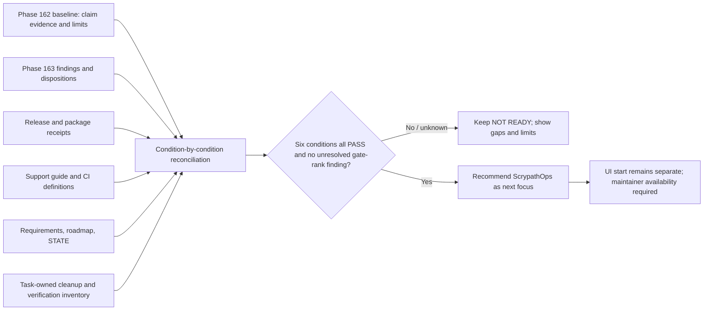

# Phase 164: Readiness Gate and Reconciliation - Research

**Researched:** 2026-09-26  
**Domain:** Evidence reconciliation and maintainer closeout  
**Confidence:** HIGH

<user_constraints>
## User Constraints (from CONTEXT.md)

### Locked Decisions
- **D-01:** Apply the six exit conditions and their approved meaning from `.planning/reference/PRE-OPERATOR-UI-READINESS.md`; do not redefine or weaken the gate.
- **D-02:** Assess each condition independently as PASS, FAIL, or UNKNOWN from dated, linked evidence. Missing, stale, or insufficient evidence is never a pass; use UNKNOWN when evidence cannot decide and FAIL when evidence contradicts a condition. Either outcome keeps overall readiness NOT READY.
- **D-03:** Reconcile the Phase 162 baseline claim-by-claim and preserve its boundaries. A residual insufficiently-supported or unknown claim does not automatically mean every gate condition fails: evaluate the actual condition language, make limits visible, and keep the overall result fail-closed unless all six conditions are evidenced as passing.
- **D-04:** Carry Phase 163's zero-material-finding and zero-candidate dispositions as findings outcomes, not as proof that readiness passes. Do not turn residual evidence gaps into defects or silently resolve them.
- **D-05:** Reuse evidence within its recorded scope and freshness. Repeat a check only when a source change, invalidator, or decision-relevant uncertainty makes the existing receipt insufficient; do not broadly rerun passing tests or service proofs.
- **D-06:** Preserve the automation-first policy: software acceptance is machine-verifiable, with no routine human UAT. Escalate only an irreducible decision, credential, permission, or physical-world dependency.
- **D-07:** A passing gate may recommend ScrypathOps as the next strategic focus, but it must explicitly avoid authorizing or beginning UI work; maintainer availability remains a separate constraint.

### the agent's Discretion
- Choose a concise, navigable readiness record in the approved readiness-program reference, linking the baseline, findings, and canonical receipts rather than duplicating them.
- Resolve reconciliation mechanics and perform only narrow, automated/source-verifiable checks needed to establish current truth or distinguish PASS, FAIL, and UNKNOWN.
- Record task-owned cleanup and verification debt explicitly; do not hide it behind a readiness recommendation.

### Deferred Ideas (OUT OF SCOPE)

None — discussion stayed within phase scope.
</user_constraints>

<phase_requirements>
## Phase Requirements

| ID | Description | Research Support |
|----|-------------|------------------|
| GATE-01 | Evaluate six approved conditions PASS/FAIL/UNKNOWN with dated linked evidence and visible limits; fail closed unless every condition and finding constraint passes. `[VERIFIED: .planning/REQUIREMENTS.md:29]` | Gate reference defines the six exact conditions; CONTEXT defines independent status and fail-closed semantics. Use a condition-by-condition evidence table and separately show the final decision rule. |
| GATE-02 | Reconcile release, package, support, CI, planning, and task-owned cleanup with no hidden verification/cleanup debt. `[VERIFIED: .planning/REQUIREMENTS.md:30]` | Phase 161 release receipt, support guide, CI workflow/CONTRIBUTING, planning state/requirements, and explicit task-owned cleanup/verification inventory provide distinct sources of truth. |
| GATE-03 | Only a passing gate recommends ScrypathOps as next focus, without authorizing or starting operator UI work. `[VERIFIED: .planning/REQUIREMENTS.md:31]` | Gate reference and milestone state make a recommendation conditional and keep maintainer availability/scope approval separate from readiness. |
</phase_requirements>

## Summary

Treat `.planning/reference/PRE-OPERATOR-UI-READINESS.md` as the single canonical readiness program and decision record. Add a dated assessment there, linking the Phase 162 baseline, Phase 163 findings, release receipt, support truth, required CI evidence, planning state, and task-owned cleanup evidence. Record all six condition statuses independently with assessment date, evidence date, exact receipt/SHA or local source, and the limits of that evidence. The approved statuses are exactly `PASS`, `FAIL`, and `UNKNOWN`; cite them literally and never promote missing, stale, or insufficient evidence to PASS. `[VERIFIED: .planning/phases/164-readiness-gate-and-reconciliation/164-CONTEXT.md:15-22]` The program defines six separate conditions and requires NOT READY until all have evidence. `[VERIFIED: .planning/reference/PRE-OPERATOR-UI-READINESS.md:47-58]`

The Phase 163 outcome is a zero-material-finding and zero-candidate disposition within its own review method. It is not a global finding that all six conditions pass. Eight named residual claim questions remain, and Phase 163 explicitly leaves the gate to Phase 164. `[VERIFIED: .planning/phases/163-findings-and-bounded-follow-up/163-FINDINGS.md:50-87]` Prefer source/date/freshness reconciliation and narrow checks against actual invalidators over rerunning passing product or service suites. The two earlier checkers validate their own document contracts; neither independently verifies source truth or readiness. `[VERIFIED: .planning/phases/163-findings-and-bounded-follow-up/163-VALIDATION.md:41-48]`

**Primary recommendation:** Update the authoritative readiness program in place with one compact, linked decision record and an automated structure/link check. Reuse the Phase 162 and 163 validators for their existing artifacts only. Any passing recommendation must say ScrypathOps is the next strategic focus while stating that the gate does not authorize UI work and maintainer availability remains separate. `[VERIFIED: .planning/reference/PRE-OPERATOR-UI-READINESS.md:58,60-67]`

## Architectural Responsibility Map

| Capability | Primary Tier | Secondary Tier | Rationale |
|------------|-------------|----------------|-----------|
| Six-condition decision and linked evidence | Maintainer / planning records | — | The deliverable is an auditable record, not application runtime behavior. |
| Required CI and hosted-receipt reconciliation | CI / release operations | Maintainer record | CI workflow and exact-SHA receipts evidence only their named jobs, commit, and environment. |
| Task-owned verification and cleanup inventory | Execution workspace / maintainer record | CI closeout | Track worktree, branch, temp service/artifact, and final verification ownership alongside the decision. |

## Standard Stack

### Core

| Library/tool | Version | Purpose | Why Standard |
|--------------|---------|---------|--------------|
| Markdown | — | Canonical readiness decision with links to evidence | Existing readiness program and the two prior phase artifacts use linked Markdown records; this avoids a competing database/ledger. `[VERIFIED: .planning/reference/PRE-OPERATOR-UI-READINESS.md:60-78]` |
| Python standard library | Local Python 3.14.4 observed | Execute existing document-contract validators and any minimal local record checker | Phase 163 explicitly uses a standard-library documentation checker and calls its output structural, not semantic evidence. `[VERIFIED: .planning/phases/163-findings-and-bounded-follow-up/163-VALIDATION.md:16-24,48-56]` |
| GitHub Actions / `scripts/ci_monitor.cjs` | Repository-defined | Exact-SHA closeout evidence for the final committed tracking artifacts | CONTRIBUTING defines staged candidate/final closeout and exact SHA requirements. `[VERIFIED: CONTRIBUTING.md:67-82]` |

### Supporting

| Tool/source | Purpose | When to Use |
|-------------|---------|-------------|
| `check_baseline.py` | Validate Phase 162 matrix completeness, values, ordering, and local links | Run only if the canonical baseline changes or its structural integrity is directly in question. `[VERIFIED: .planning/phases/162-whole-product-evidence-baseline/check_baseline.py:10-18,28-45,100-147]` |
| `check_findings.py` | Validate full claim triage, disposition/candidate summary, links, and handoff | Reuse its complete mode against Phase 163 findings; do not interpret PASS as evidence judgment or gate approval. `[VERIFIED: .planning/phases/163-findings-and-bounded-follow-up/check_findings.py:1,340-380]` |
| `CONTRIBUTING.md`, support guide, CI workflow, release evidence | Canonical current verification/support/release sources | Reconcile only the six required domains, preserving each source's date and authority. `[VERIFIED: CONTRIBUTING.md:1-18,139-157]` |

### Alternatives Considered

| Instead of | Could Use | Tradeoff |
|------------|-----------|----------|
| Updating the approved program as canonical record | A new standalone readiness ledger/report | A standalone file can improve length, but risks duplicating gate authority. If size demands it, make it a clearly linked child record and keep the program's status/pointer authoritative. |
| Narrow final record checks | Rerunning all product suites and live service proofs | Broad reruns add cost and do not repair evidence-scope mismatch; repeat only for source drift, invalidator, or decision-relevant uncertainty. `[VERIFIED: .planning/phases/164-readiness-gate-and-reconciliation/164-CONTEXT.md:18-21; .planning/REQUIREMENTS.md:42-47]` |

**Installation:** None. No external package or runtime dependency is needed for the record. Do not add audit tooling or a CI job without demonstrated decision value. `[VERIFIED: .planning/REQUIREMENTS.md:42-47]`

## Architecture Patterns

### System Architecture Diagram



### Recommended Project Structure

```text
.planning/reference/PRE-OPERATOR-UI-READINESS.md  # single authority + dated decision or pointer
.planning/phases/162-whole-product-evidence-baseline/162-BASELINE.md  # canonical claims/evidence
.planning/phases/163-findings-and-bounded-follow-up/163-FINDINGS.md  # findings/dispositions
.planning/phases/164-readiness-gate-and-reconciliation/164-*.md  # phase plan, validation, summary
```

The authoritative program already directs milestone-boundary reconciliation of the program, candidate list, milestone arc, PROJECT, STATE, and retrospective evidence. `[VERIFIED: .planning/reference/PRE-OPERATOR-UI-READINESS.md:66-67]`

### Pattern 1: Independent statuses, then fail-closed decision

**What:** One row per approved condition. Each row carries status, evidence date, assessment date, local/hosted link, exact SHA/run and environment where applicable, source scope, freshness/invalidation decision, and visible limitation. A separate final rule computes readiness: READY only when all six statuses are PASS and no Critical, High, or Medium-leverage finding is unresolved; otherwise NOT READY. The literal condition statuses are `PASS`, `FAIL`, and `UNKNOWN`. `[VERIFIED: .planning/phases/164-readiness-gate-and-reconciliation/164-CONTEXT.md:17-20]`

**When to use:** Always for this phase. Keep a residual baseline gap attached to the condition it actually affects; D-03 explicitly rejects mechanically failing every condition because any one claim is insufficiently supported. `[VERIFIED: .planning/phases/164-readiness-gate-and-reconciliation/164-CONTEXT.md:18]`

**Example record row:**

```markdown
| Condition | Status | Evidence date | Assessed | Evidence | Limit / freshness decision |
| 1. All baseline dimensions assessed; limits visible | UNKNOWN | 2026-09-25 | 2026-09-26 | [Phase 162 baseline](../phases/162-whole-product-evidence-baseline/162-BASELINE.md) | Preserve any claim-level uncertainty; do not convert a gap into a product defect. |
```

This is a shape example only; the planner must determine the actual status from closeout evidence.

### Pattern 2: Preserve evidence provenance and authority boundaries

Use evidence date separately from decision/assessment date. A hosted receipt must stay bound to its run, SHA, environment, and exercised scenario; a selected compatibility tuple is not a full cross-product guarantee. `[VERIFIED: .planning/phases/162-whole-product-evidence-baseline/162-BASELINE.md:11-13]` Link rather than copy canonical receipt data. For the support condition, inspect the support guide and its linked workflow/commands; for release, reconcile 0.3.13 publication with any later release event. `[VERIFIED: .planning/phases/164-readiness-gate-and-reconciliation/164-CONTEXT.md:43-50]`

### Anti-Patterns to Avoid

- **Treating parser completeness as semantic approval:** the Phase 163 coverage audit says its checker cannot establish owner approval, freshness/materiality, or scope judgment. `[VERIFIED: .planning/phases/164-readiness-gate-and-reconciliation/164-CONTEXT.md:48; .planning/phases/163-findings-and-bounded-follow-up/163-COVERAGE-AUDIT.md:1,20-24]`
- **Promoting unknown or stale evidence to pass:** gate semantics explicitly forbid it; annotate unknown/contradictory separately. `[VERIFIED: .planning/phases/164-readiness-gate-and-reconciliation/164-CONTEXT.md:17]`
- **Treating zero Phase 163 findings as a readiness pass:** its own record states this is not a readiness recommendation and retains residual gaps. `[VERIFIED: .planning/phases/163-findings-and-bounded-follow-up/163-FINDINGS.md:62-66]`
- **Broad proof reruns or new recurring gate infrastructure:** repeat only for decision relevance and do not increase CI/audit cost without demonstrated value. `[VERIFIED: .planning/phases/164-readiness-gate-and-reconciliation/164-CONTEXT.md:20; .planning/REQUIREMENTS.md:45-47]`
- **Starting UI from a readiness recommendation:** readiness is a recommendation; it is not UI authorization, and maintainer availability is separate. `[VERIFIED: .planning/reference/PRE-OPERATOR-UI-READINESS.md:58]`

## Don't Hand-Roll

| Problem | Don't Build | Use Instead | Why |
|---------|-------------|-------------|-----|
| Canonical claim/evidence data | Duplicate claim table or receipt ledger | Phase 162 baseline with C-ID links | It is designated the single canonical 24-claim index. `[VERIFIED: .planning/phases/162-whole-product-evidence-baseline/162-BASELINE.md:1-3]` |
| Findings/severity disposition | New severity scorecard or inferred owner treatment | Phase 163 disposition and coverage records | Phase 163's method distinguishes gap, defect, opportunity, dispositions, and parser limitations. `[VERIFIED: .planning/phases/163-findings-and-bounded-follow-up/163-FINDINGS.md:42-66]` |
| Final closeout provenance | Manually copied claim that final CI passed | `scripts/ci_monitor.cjs closeout` exact-SHA artifacts after final tracked edits | CONTRIBUTING requires exact candidate/final SHA evidence and prohibits tracked edits after final attestation. `[VERIFIED: CONTRIBUTING.md:67-82]` |

**Key insight:** The main risk is evidence laundering across layers: a structurally complete artifact, a zero-finding review, or a passing bounded hosted run can look broader than it is. Keep gate judgment linked to named source and scenario limits, and keep machine completeness checks separate from semantic source review. `[VERIFIED: .planning/phases/163-findings-and-bounded-follow-up/163-VALIDATION.md:48]`

## Project Constraints (from AGENTS.md)

- Consult `prompts/` for decisions touching OSS release engineering; the roadmap ratchet and CI/CD guidance were consulted for this closeout. `[VERIFIED: AGENTS.md:1-10]`
- Contributors follow `CONTRIBUTING.md` for verification, CI, and release gates. `[VERIFIED: AGENTS.md:41-44]`
- Keep edits focused; automated acceptance requires executable tests or exact-SHA hosted evidence, not post-implementation UAT. `[VERIFIED: AGENTS.md:45-53]`
- Preserve green-main and PR-first posture; do not simulate reviewer identity or silently approve trust gates. `[VERIFIED: AGENTS.md:45-53]`
- Preserve unrelated worktree changes and do not invent new work when no approved item exists. `[VERIFIED: AGENTS.md:45-53]`

## Common Pitfalls

### Pitfall 1: Stale status/header after assessment

**What goes wrong:** The readiness page can retain its pre-baseline text (“NOT READY — whole-product baseline not yet assessed”) after Phase 162/163 have completed. **Why:** Previous header was accurate at its last reconciliation, but is not itself the new assessment. **How to avoid:** Update current status and last-reconciled date together with the final decision; cite new evidence dates separately. **Warning signs:** Header and decision section describe different milestone stages. `[VERIFIED: .planning/reference/PRE-OPERATOR-UI-READINESS.md:3-5; .planning/phases/164-readiness-gate-and-reconciliation/164-CONTEXT.md:76]`

### Pitfall 2: Confusing support/freshness, finding severity, and gate status

**What goes wrong:** An insufficiently-supported claim becomes either a defect or an automatic failure of every readiness condition. **Why:** These are separate vocabularies and layers. **How to avoid:** Assess condition language, preserve claim limits, then separately apply unresolved finding rule. **Warning signs:** The record promotes evidence-gap rows into F-cards or says “no findings, therefore ready.” `[VERIFIED: .planning/phases/162-whole-product-evidence-baseline/162-BASELINE.md:11-13; .planning/phases/164-readiness-gate-and-reconciliation/164-CONTEXT.md:18-19]`

### Pitfall 3: Using historic release/CI proof as current without invalidation review

**What goes wrong:** A prior exact-SHA run, a published package record, support guide, or advisory job gets described as current broad truth. **How to avoid:** Compare to current tree/state and relevant invalidators; retain exact dates, job status (required/advisory), SHA, version, and limits. Only obtain newer evidence for a real change or uncertainty that affects a condition. `[VERIFIED: .planning/phases/162-whole-product-evidence-baseline/162-BASELINE.md:11-13; .planning/milestones/v1.38-phases/161-release-and-tidy-closeout/161-RELEASE-EVIDENCE.md:1-26]`

### Pitfall 4: Hiding operational cleanup in a green gate

**What goes wrong:** The decision says ready while task-owned worktrees, branch changes, service stacks, temp files, generated artifacts, or post-check tracked edits remain. **How to avoid:** Include an explicit cleanup/verification inventory and keep unrelated user changes out of that inventory. Phase 161 demonstrates this distinction. `[VERIFIED: .planning/milestones/v1.38-phases/161-release-and-tidy-closeout/161-RELEASE-EVIDENCE.md:28-44]`

## Code Examples

The appropriate “code” is a Markdown contract row, not an application code change. The Phase 164 context fixes the vocabulary exactly as `PASS`, `FAIL`, and `UNKNOWN`, and says the evidence and assessment dates differ. `[VERIFIED: .planning/phases/164-readiness-gate-and-reconciliation/164-CONTEXT.md:17,76]`

```markdown
| # | Approved condition | Status | Evidence date | Assessment date | Dated linked evidence / receipt + SHA | Boundary, freshness, or limitation |
| 1 | Every baseline dimension assessed; evidence coverage and limits visible | UNKNOWN | YYYY-MM-DD | YYYY-MM-DD | [canonical baseline](../phases/162-whole-product-evidence-baseline/162-BASELINE.md) | Identify unsupported claim limits; no universal inference. |
```

Final decision row must use the approved literal values `NOT READY` or `READY FOR OPERATOR UI`; these strings are stated in the gate reference. `[VERIFIED: .planning/reference/PRE-OPERATOR-UI-READINESS.md:49,58]` A pass also carries an explicit non-authorization note and a separate maintainer-availability constraint. `[VERIFIED: .planning/phases/164-readiness-gate-and-reconciliation/164-CONTEXT.md:22]`

## State of the Art

| Old Approach | Current Approach | When Changed | Impact |
|--------------|------------------|--------------|--------|
| Baseline-only assessment, before findings/dispositions | Reconcile Phase 162 + Phase 163 outputs against the same six approved conditions | v1.39 Phases 162–164 | Phase 163 closes finding/candidate triage; Phase 164 alone records the readiness decision. `[VERIFIED: .planning/phases/162-whole-product-evidence-baseline/162-BASELINE.md:3; .planning/phases/163-findings-and-bounded-follow-up/163-FINDINGS.md:80-87]` |
| Current status text last reconciled after v1.38 | Dated decision updated at this milestone boundary | Phase 164 | Readiness and source-of-truth must move together; update canonical page status/date with decision. `[VERIFIED: .planning/reference/PRE-OPERATOR-UI-READINESS.md:3-5,66-67]` |

## Assumptions Log

| # | Claim | Section | Risk if Wrong |
|---|-------|---------|---------------|
| A1 | No custom final-record checker exists yet; a small contract check may be needed for six rows/statuses and final fail-closed linkage. | Validation Architecture | A checker could be unnecessary; use the cheapest deterministic validation and avoid a new required CI job. |

## Open Questions

1. **Do current sources or release events invalidate any reused evidence since the Phase 162 assessment and 0.3.13 release?**
   - What we know: baseline rows name individual invalidators; Phase 161 proves a bounded release outcome for 0.3.13. `[VERIFIED: .planning/phases/162-whole-product-evidence-baseline/162-BASELINE.md:11-13; .planning/milestones/v1.38-phases/161-release-and-tidy-closeout/161-RELEASE-EVIDENCE.md:1-26]`
   - What's unclear: final branch/tree and current hosted release/CI evidence at execution time.
   - Recommendation: compare only source paths and CI/release records relevant to a condition; if evidence cannot decide, record UNKNOWN rather than launching broad reruns.
2. **Does task-owned cleanup inventory include any current phase worktree, branch, generated output, or service stack?**
   - What we know: Phase 161 documented its own cleanup and preserved unrelated user state. `[VERIFIED: .planning/milestones/v1.38-phases/161-release-and-tidy-closeout/161-RELEASE-EVIDENCE.md:28-44]`
   - What's unclear: state created during Phase 164 execution.
   - Recommendation: inspect the actual execution workspace and state the result explicitly, including “none” only after checking.

## Environment Availability

| Dependency | Required By | Available | Version | Fallback |
|------------|------------|-----------|---------|----------|
| Python | Phase 162/163 document-contract checker commands | ✓ | 3.14.4 | — |
| Git | Current tree/SHA and changed-file/cleanup inventory | ✓ | 2.41.0 | — |
| Node.js | `scripts/ci_monitor.cjs` closeout helper | ✓ | 22.14.0 | — |
| GitHub CLI | Optional current hosted receipt inspection | ✓ | 2.101.0 | Read archived receipts and GitHub web/API where access permits |
| Elixir / Mix | Only if phase edits trigger contributor Mix verification; documentation-only record does not require product suite | ✓ | Elixir 1.20.2 / OTP 29 | Python structural/source checks; exact-SHA hosted closeout for tracking changes |
| Docker | Only if a decision-relevant new service proof is justified | ✓ | 29.5.2 | Reuse bounded hosted evidence; do not rerun absent an invalidator |

Observed versions are environment facts from this research session, not proof that the toolchain matches the project-supported tuples. `[VERIFIED: CONTRIBUTING.md:145-157]` The required support/CI tuples are stated by the contributor guide; do not infer them from local Mix availability.

**Missing dependencies with no fallback:** None identified for the record/checker workflow. Hosted evidence refresh still depends on authorized GitHub access; if unavailable, preserve UNKNOWN and the exact access blocker.

## Validation Architecture

### Test Framework

| Property | Value |
|----------|-------|
| Framework | Python standard library; markdown/document contract checks |
| Config file | None for the existing Phase 162/163 validators |
| Quick run command | `python3 .planning/phases/163-findings-and-bounded-follow-up/check_findings.py` |
| Full suite command | Same focused checker; run `python3 .planning/phases/162-whole-product-evidence-baseline/check_baseline.py --through 24 --full-coverage` only if the baseline changes |

These commands are already the preceding phase's validation contract; it states structural success is not source-truth certification, owner approval, or readiness. `[VERIFIED: .planning/phases/163-findings-and-bounded-follow-up/163-VALIDATION.md:16-24,45-48]`

### Phase Requirements → Test Map

| Req ID | Behavior | Test Type | Automated Command | File Exists? |
|--------|----------|-----------|-------------------|-------------|
| GATE-01 | Exactly six unique conditions each have one valid status, evidence link/date, explicit limit; readiness computation fails closed | Documentation contract | New targeted record checker or equivalent deterministic assertions; cover missing row, UNKNOWN, FAIL, and unresolved rank cases | ❌ New contract coverage may be needed |
| GATE-02 | Canonical release/support/CI/planning links resolve; cleanup/verification inventory is explicit; final evidence is tied to final SHA | Documentation + exact-SHA hosted closeout | Existing Phase 163 checker for its input; `node scripts/ci_monitor.cjs closeout --push --branch <branch> --sha <final-sha>` after all tracked edits | Partial: source checkers and closeout tool exist; final record invariants do not |
| GATE-03 | A recommendation appears only when gate passes and explicitly says it does not authorize UI start | Documentation contract | Same targeted record assertions; reject recommendation when any condition is not PASS | ❌ New contract coverage may be needed |

### Sampling Rate

- Per task commit: run the targeted readiness-record contract check and inspect the diff/links.
- When the canonical baseline changes: run its full-coverage checker.
- Before phase completion: run the complete Phase 163 checker, verify requirement traceability, reconcile cleanup, commit final tracked artifacts, then produce exact-final-SHA closeout evidence. Follow CONTRIBUTING’s two-stage rule; no tracked edits after the final attestation. `[VERIFIED: CONTRIBUTING.md:67-82]`
- No routine human UAT. Any irreducible permissions, credential, or owner decision is a blocker/dependency, not software acceptance. `[VERIFIED: .planning/phases/164-readiness-gate-and-reconciliation/164-CONTEXT.md:21]`

### Wave 0 Gaps

- [ ] A focused machine-checkable invariant for the Phase 164 decision record. Keep it local to the record; do not add recurring CI or audit infrastructure without demonstrated value. `[VERIFIED: .planning/REQUIREMENTS.md:45-47]`

## Security Domain

This is a planning/evidence artifact phase with no web endpoint, authentication, session, database, or cryptographic implementation. Apply data-minimization to evidence: never copy credentials, personal data, environment dumps, or private hosted payloads into the durable record. `[VERIFIED: prompts/scrypath-milestone-ratchet-roadmap.txt, Privacy and durable context]`

### Applicable ASVS Categories

| ASVS Category | Applies | Standard Control |
|---------------|---------|-----------------|
| V2 Authentication | No | No authentication feature is in scope. |
| V3 Session Management | No | No session feature is in scope. |
| V4 Access Control | No | Do not change access-control behavior; use read-only hosted evidence. |
| V5 Input Validation | Yes, narrowly | Existing checker treats Markdown as data, validates values/links, and constrains resolved links to repository root. `[VERIFIED: .planning/phases/163-findings-and-bounded-follow-up/check_findings.py:1,40-62]` |
| V6 Cryptography | No | No cryptographic feature or secret handling change is in scope. |

### Known Threat Patterns for Markdown / Python Evidence Checkers

| Pattern | STRIDE | Standard Mitigation |
|---------|--------|---------------------|
| Malicious Markdown link or path escape | Tampering / Elevation of privilege | Keep validation data-only; reject absolute and out-of-root paths; do not execute commands extracted from records. Existing Phase 163 checker bounds local links to repo root. `[VERIFIED: .planning/phases/163-findings-and-bounded-follow-up/check_findings.py:47-62]` |
| Sensitive CI or release details copied into durable docs | Information disclosure | Record public run identifiers, dates, SHA, and narrow result only; do not include secrets, logs with payloads, or environment dumps. `[VERIFIED: prompts/scrypath-milestone-ratchet-roadmap.txt, Privacy and durable context]` |

## Sources

### Primary (HIGH confidence)

- `.planning/reference/PRE-OPERATOR-UI-READINESS.md` — authoritative six-condition gate, readiness transition, and operating rules.
- `.planning/phases/164-readiness-gate-and-reconciliation/164-CONTEXT.md` — locked semantics, evidence reconciliation scope, and phase boundaries.
- `.planning/phases/162-whole-product-evidence-baseline/162-BASELINE.md` and `check_baseline.py` — 24-claim canonical baseline and its structural contract.
- `.planning/phases/163-findings-and-bounded-follow-up/163-FINDINGS.md`, `163-COVERAGE-AUDIT.md`, `check_findings.py`, and `163-VALIDATION.md` — findings disposition, residual questions, checker authority, and previous validation contract.
- `.planning/milestones/v1.38-phases/161-release-and-tidy-closeout/161-RELEASE-EVIDENCE.md` — bounded Scrypath 0.3.13 release/package/CI receipts.
- `CONTRIBUTING.md`, `guides/support-and-compatibility.md`, `.planning/STATE.md`, `.planning/REQUIREMENTS.md`, `.planning/ROADMAP.md` — verification, support, scope, and current planning truth.
- `AGENTS.md`; `prompts/scrypath-milestone-ratchet-roadmap.txt`; `prompts/elixir-oss-lib-ci-cd-best-practices-deep-research.md` — repository policy and local release/verification guidance.

## Metadata

**Confidence breakdown:**
- Standard stack: HIGH — phase context specifies in-repo artifact validators and the repo records existing tools/policies.
- Architecture: HIGH — canonical ownership and phase responsibilities are directly documented.
- Pitfalls: HIGH — prior artifacts record evidence boundaries and checker limitations explicitly.

**Research date:** 2026-09-26  
**Valid until:** 2026-10-03 (hosted release/CI and planning state can change quickly)
