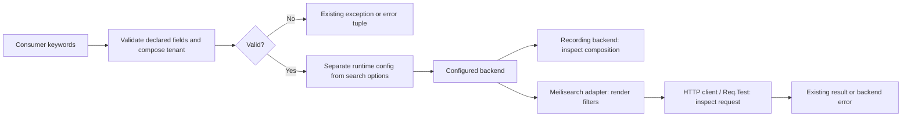

# Phase 165: Public Tenant and Facet Contracts - Research

**Researched:** 2026-09-26
**Domain:** Existing Elixir public search input contracts and Meilisearch facet request construction
**Confidence:** MEDIUM

<user_constraints>
## User Constraints (from CONTEXT.md)

The following decisions, discretion, and deferrals are copied verbatim from the phase context. [VERIFIED: .planning/phases/165-public-tenant-and-facet-contracts/165-CONTEXT.md:15-29,83-85]

<!-- DATA_P7q2J9vx_START -->
### Existing public contract boundaries
- **D-01:** Treat the approved v1.40 requirements as fixed. Exercise the named public API paths and inputs; do not expand Phase 165 into an API redesign or a general facet/settings compatibility matrix.
- **D-02:** `tenant_scope:` is a Scrypath filter-composition input, not an authorization mechanism. For a schema with a declared tenant field, it must compose with ordinary filters. A collision with that tenant field or a tenant scope on a schema without a declared tenant field must fail before backend dispatch. Host authentication, membership, trusted tenant selection, and database response scoping remain host-owned.
- **D-03:** Validate facet-value behavior from `search_facet_values/4`'s public boundary. Its supported defaults and documented keyword filters must reach the Meilisearch v1.15 facet-search endpoint in a valid request shape; a lower-level client test with already-rendered parameters alone is insufficient evidence for the public contract.

### Evidence and compatible correction
- **D-04:** C10-R1 and C11-R1 are source-backed hypotheses, not confirmed defects. Keep source observations, reproduced failures, successful contract behavior, and insufficient evidence distinct. Do not label either hypothesis a defect or pass until the corresponding public-entry probe establishes its behavior.
- **D-05:** Use the smallest deterministic proof that observes the boundary: a recording backend for tenant composition/rejection and Req.Test for public facet request construction and supported error behavior. Keep the tenant and facet probes independently executable so one cannot mask the other. Use live/package service proof only if a reproduced compatible facet defect makes it decision-relevant to Phase 166.
- **D-06:** If a supported contract failure is reproduced, make only the compatible correction needed to restore the existing contract and add a focused regression. Preserve established error and raising behavior unless a separately justified compatibility decision is required. Do not add a broad property suite, new required CI lane, routine human UAT, or broad matrix without concrete decision value.
- **D-07:** Do not repeat the v1.40 ecosystem survey. The approved research already recommends minimal public-entry probes; reopen research only if reproduction reveals a concrete compatibility question or an important adopter workflow that changes the approved boundary.

### the agent's Discretion
- Choose the smallest readable test arrangement that proves the specified public inputs and observable backend/request outcomes, reusing existing test helpers and verification lanes.
- Add property-based coverage only if implementation exposes a concrete input invariant for which generated cases add meaningful confidence beyond the named boundary examples.
- Record any Phase 166 facet-service implication as conditional on Phase 165's actual result; do not infer a package/service requirement from a historical opt-out alone.

### Deferred Ideas (OUT OF SCOPE)

None added. Authentication and tenant-policy products, broad facet/settings or backend-version matrices, public backend abstraction, operator UI, new required CI lanes, and forced publication remain outside the approved milestone scope.
<!-- DATA_P7q2J9vx_END -->
</user_constraints>

## Summary

Plan two independent public-entry proof units: tenant composition/rejection using a recording backend, and facet defaults/keyword-filter serialization using the real Meilisearch adapter with Req.Test. The existing validation layer injects the tenant criterion, but the original caller options subsequently pass through three runtime extractors. The facet client currently camelizes top-level option names without invoking the ordinary search filter renderer. These are source observations; neither hypothesis was executed during this research. [VERIFIED: lib/scrypath/options/search.ex:73-96; lib/scrypath/search/single.ex:11-15,44-54; lib/scrypath/search/many.ex:44-46,187-197; lib/scrypath/search/facet_values.ex:10-11,33-43; lib/scrypath/meilisearch/client.ex:104-123]

One concrete compatibility question required a narrow upstream check: do common default fields necessarily invalidate a v1.15 facet request? **No such inference is justified.** The pinned v1.15 source explicitly says unknown search parameters are intentionally ignored. Keep the defaults probe separate from the nonempty keyword-filter probe, and do not convert a preference for a smaller payload into a newly invented public contract. The upstream source is documentation of parser design, not a live service receipt. [CITED: https://raw.githubusercontent.com/meilisearch/meilisearch/v1.15.0/crates/meilisearch/src/routes/indexes/facet_search.rs]

**Primary recommendation:** reproduce each public boundary before changing production code; if it fails, correct only the responsible translation or option-separation seam and retain the established public error shape. This follows D-04 through D-07 above. [VERIFIED: .planning/phases/165-public-tenant-and-facet-contracts/165-CONTEXT.md:20-29]

## Architectural Responsibility Map

This is the recommended task allocation, bounded by the locked ownership decision D-02 and the inspected call chain above.

| Capability | Primary Tier | Secondary Tier | Rationale |
|---|---|---|---|
| Trusted actor, membership, tenant selection | Host API/context | Host database | Outside Phase 165; supplied tenant values do not prove identity |
| Schema-aware input validation and tenant composition | Library public API | Schema metadata | Reject invalid supplied input before dispatch |
| Search/runtime option separation | Library orchestration | Runtime configuration | Keep validated search data from becoming runtime configuration |
| Filter rendering and endpoint request shape | Internal Meilisearch adapter/client | Req transport | Backend grammar belongs beside the existing renderer |
| Backend rejection and transport error propagation | Client/orchestration | Public facade | Preserve current tuples and bang behavior |
| Executable evidence | ExUnit public-entry tests | Recording backend / Req.Test | Observe library behavior without pretending to exercise a host policy or live service |

<phase_requirements>
## Phase Requirements

Descriptions below are verbatim requirement text. [VERIFIED: .planning/REQUIREMENTS.md:12-13]

<!-- DATA_G4m8W1cr_START -->
| ID | Description | Research Support |
|---|---|---|
| API-01 | A Scrypath consumer can use the documented `tenant_scope:` option through each supported public search path (`search/3`, `search_many/2`, and `search_facet_values/4`); the declared tenant criterion is combined with ordinary filters, and conflicting or undeclared tenant inputs fail before backend dispatch. | Recording-backend proof across the three runtime extractors; explicit error compatibility table; shared multi-search options must be exercised |
| API-02 | A Scrypath consumer can pass documented public filter options to `search_facet_values/4` and receive an endpoint-valid Meilisearch v1.15 request; defaults and keyword filters are checked at the public input boundary, with a compatible correction and focused regression if a defect is reproduced. | Public Req.Test request inspection; existing renderer reuse; pinned parser evidence; focused backend error propagation |
<!-- DATA_G4m8W1cr_END -->
</phase_requirements>

## Project Constraints (from AGENTS.md)

The following directives govern the plan. They are project requirements, not new research assumptions. [VERIFIED: AGENTS.md:10-19,25-65,90-105]

- Consult relevant local prompts for Elixir/Ecto/search architecture. Preserve Ecto-first APIs and Phoenix-friendly integration.
- Target Meilisearch publicly; retain the internal behavior seam without promising public backend portability.
- Preserve inline, Oban-backed, and manual synchronization flows; avoid introducing mandatory core supervision or a Phoenix-only design.
- Keep setup ergonomic and operational failure/consistency semantics explicit. Preserve the high release quality bar.
- Retain the declared support posture: verbatim `support floor 1.17` / `through 1.19` for Elixir and `support floor 26` / `through 28` for OTP, as expressed with inline code in AGENTS.md. Do not change support floors in this phase.
- Keep existing Ecto, Telemetry, Oban, GitHub Actions, setup-beam, Release Please, Hex, ExDoc, Credo, Dialyxir, and test-tool choices. Do not add Postgres-native search to the product promise.
- Follow existing code patterns and CONTRIBUTING verification/release requirements. Keep edits focused; update project scope/shipped claims only when intentionally changed.
- Keep main green on lean required gates; serious feature-depth work is PR-first. Completion needs executable or exact-SHA hosted evidence, never pending routine UAT.
- Resolve subjective choices before implementation or leave them nonblocking. Do not impersonate reviewers or auto-approve trust gates.
- Do not reopen idle milestones speculatively. When state says awaiting a milestone, historical phase inventories are not active work; use state and roadmap posture. This phase has explicit current authorization.

Relevant local prompt guidance is to separate pure request construction from IO, use narrow behavior seams, keep schemas thin, and keep orchestration in explicit functions/contexts. These are historical design inputs, subordinate to the current locked scope; the historical Typesense-first proposal does not apply. [VERIFIED: prompts/elixir-best-practices-deep-research.md:675-736; prompts/ecto-best-practices-deep-research.md:7-65; prompts/elixir-search-lib-deep-research.md:245-290; .planning/phases/165-public-tenant-and-facet-contracts/165-CONTEXT.md:48-50]

Project configuration explicitly contains `"agent_skills": {}` and `"nyquist_validation": true`. The filesystem discovery found neither project skills directory nor a planning graph in this checkout; no graph-derived claims or additional project skills are used. [VERIFIED: .planning/config.json:19,47; filesystem discovery 2026-09-26]

## Standard Stack

Retain the locked repository stack. This phase recommends **no installation or upgrade**; registry latest-version/publish-date discovery would reopen an irrelevant dependency decision. The values below are current checkout lock values, not claims about newest upstream releases. [VERIFIED: mix.exs:107-120; mix.lock:11,21,27,31,33]

| Component | Existing version / verbatim lock value | Use |
|---|---|---|
| Ecto | `"ecto": {:hex, :ecto, "3.14.0"` | Consumer-shaped embedded schema fixture [VERIFIED: mix.lock:11] |
| NimbleOptions | `"nimble_options": {:hex, :nimble_options, "1.1.1"` | Preserve existing validation [VERIFIED: mix.lock:27] |
| Req / Req.Test | `"req": {:hex, :req, "0.6.3"` | Observe actual public request construction [VERIFIED: mix.lock:33] |
| Jason | `"jason": {:hex, :jason, "1.4.5"` | Existing JSON encoder and request-body decoder [VERIFIED: mix.lock:21] |
| Plug | `"plug": {:hex, :plug, "1.19.5"` | Existing Req.Test body/response boundary [VERIFIED: mix.lock:31] |
| ExUnit / Mix | Local version probe: `Mix 1.19.5 (compiled with Erlang/OTP 28)` | Existing test framework; execution tuple, not a support change [VERIFIED: environment probe 2026-09-26] |

**Installation:** none. **Package Legitimacy Audit:** not applicable: no external package installation is proposed. Do not install a separate mock framework or backend SDK for these proofs.

## Architecture Patterns

### System architecture diagram

The inspected flow is public facade → schema-aware validation → runtime config → configured backend; the backend determines request translation. The diagram shows the planning boundaries, not a new architecture. [VERIFIED: lib/scrypath/search.ex:15-29,73-111; lib/scrypath/search/single.ex:14-28; lib/scrypath/search/facet_values.ex:10-26; lib/scrypath/search/many.ex:19-21,44-69]



### Component responsibilities and proposed test arrangement

Use two new, independently executable test files (proposed names, not existing artifacts): `test/scrypath/tenant_scope_contract_test.exs` and `test/scrypath/facet_values_contract_test.exs`. Keeping fixtures local avoids widening global test support. Reuse the conventions visible in the existing search tests and client tests. [VERIFIED: test/scrypath/search_test.exs:1-67,107-142; test/scrypath/meilisearch/client_test.exs:127-151]

| Existing component to inspect if reproduction fails | Responsibility / correction boundary |
|---|---|
| `Scrypath.Options.Search` | Tenant declaration/collision handling already lives here; do not redesign it |
| `Scrypath.Search.Single`, `.Many`, `.FacetValues` | Runtime extraction is the likely tenant correction seam |
| `Scrypath.Meilisearch` and `.Client` | Common options enter the backend here; preserve internal rendered-client use where practical |
| `Scrypath.Meilisearch.Query` | Existing common filter grammar and literal escaping; reuse it if facet rendering needs repair |

The component mapping comes from the opened definitions. [VERIFIED: lib/scrypath/options/search.ex:1-25,73-96; lib/scrypath/search/single.ex:1-15; lib/scrypath/search/many.ex:1-21; lib/scrypath/search/facet_values.ex:1-25; lib/scrypath/meilisearch.ex:65-74; lib/scrypath/meilisearch/client.ex:102-123; lib/scrypath/meilisearch/query.ex:76-105]

### Pattern 1: observe public tenant dispatch, not just normalization

The option injector explicitly performs `Keyword.delete(:tenant_scope)` followed by `Keyword.put(:filter, Keyword.put(existing, tenant_field, tenant_scope))`. The orchestration layer then uses original caller options for config. Therefore a successful validator-only test does not prove public dispatch. [VERIFIED: lib/scrypath/options/search.ex:93-95; lib/scrypath/search.ex:27-28,87-88]

Recommendation: use a small real declared schema, an undeclared control schema, and a recording backend that delegates unrelated callbacks to existing test behavior. Assert backend input contains both tenant and ordinary predicates; record a message before returning a normal result. For rejection, assert the public error and absence of a dispatch message. Use synthetic scalar tenant values and a single ordinary status predicate. Keep a minimal valid multi-search result rather than testing federation ranking.

Exercise shared tenant input in multi-search. The code resolves config from `runtime_opts(shared_opts)`, while entry options merge with `Keyword.merge(shared, entry_core, fn _k, _s, e -> e end)`. An entry-only positive case would not exercise the shared runtime extraction. Preserve entry precedence: preventing hostile overrides is the host's responsibility, not a new library merge rule. [VERIFIED: lib/scrypath/search/many.ex:44-46; lib/scrypath/multi_search/entries.ex:80-89; .planning/phases/165-public-tenant-and-facet-contracts/165-CONTEXT.md:17]

Telemetry also calls `backend.name()` and `backend.index_name(schema_module, config)`. Make the recording backend satisfy those hooks so a fixture failure cannot masquerade as a tenant defect. [VERIFIED: lib/scrypath/telemetry.ex:18-25]

### Pattern 2: inspect the encoded facet request at the public boundary

Run the facet probe without tenant scope initially, using a schema whose ordinary filter field is declared. That prevents a tenant runtime error from hiding facet serialization. Assert the request reaches Req.Test, decode its body, inspect the route and rendered filter meaning, and return a tiny facet response. Run a separate defaults case. After any tenant repair, one combined tenant-plus-filter facet assertion may cover the joined boundary; it must not replace the independent facet case. This arrangement implements D-03 and D-05. [VERIFIED: .planning/phases/165-public-tenant-and-facet-contracts/165-CONTEXT.md:18,22]

Do not replace the public input with backend filter strings to make the test pass. The existing lower-level test does exactly `Client.facet_search("posts_v2", "genre", "co", [filter: ["status = 'published'"]], ...)`; it proves a different boundary. [VERIFIED: test/scrypath/meilisearch/client_test.exs:147-150]

### Pattern 3: preserve error compatibility

| Boundary | Source-defined behavior to reproduce and retain |
|---|---|
| Single and facet invalid common input | `{:error, {:validation, message}}` and `{:error, {:invalid_options, _field, message}}` become `raise ArgumentError, message`. [VERIFIED: lib/scrypath/search.ex:17-22,77-82] |
| Multi-search preflight validation | `{:halt, {:error, {:validation_failed, schema, reason}}}`; preserve the wrapper. [VERIFIED: lib/scrypath/search/many.ex:73-81] |
| HTTP backend rejection | `{:error, {:http_error, status, body}}`. [VERIFIED: lib/scrypath/meilisearch/client.ex:173-175] |
| Transport error | `{:error, {:transport_error, exception}}`. [VERIFIED: lib/scrypath/meilisearch/client.ex:177-179] |
| Facet bang operational failure | `{:error, reason} -> raise Scrypath.Search.Error, reason: reason`. [VERIFIED: lib/scrypath/search.ex:94-98] |

Recommendation: cover one meaningful backend HTTP error and one transport error through the public facet path, with retries disabled for deterministic transport failure. Ensure failure does not trigger an unfiltered fallback request. Existing lower-level tests already demonstrate `Req.Test.transport_error(conn, :timeout)` and `retry: false`. [VERIFIED: test/scrypath/meilisearch/client_test.exs:40-50]

## Don't Hand-Roll

| Problem | Don't build | Use instead | Basis |
|---|---|---|---|
| Meilisearch filter literals and operators | A second string interpolation grammar | Existing renderer, with only a narrow internal reuse seam if needed | `format_value` uses `Jason.encode!`; operators are explicitly mapped. [VERIFIED: lib/scrypath/meilisearch/query.ex:76-105] |
| HTTP capture | A custom HTTP server or alternate client | Existing Req.Test plug path | Existing request test uses `req_options: [plug: {Req.Test, stub}]`. [VERIFIED: test/scrypath/meilisearch/client_test.exs:148-150] |
| Tenant authorization | A library membership/session system | Host-owned policy, outside phase | D-02 [VERIFIED: .planning/phases/165-public-tenant-and-facet-contracts/165-CONTEXT.md:17] |
| Evidence automation | New CI lanes or general evidence framework | Existing fast/core and focused verify tasks | Lean proof decision retained in the quality ledger. [VERIFIED: .planning/reference/QUALITY-LEDGER.md:18,23] |

## Common Pitfalls

### Mistaking source observations for reproduced failures

The three runtime extractor lists contain `:filter`, `:sort`, `:page`, `:facets`, `:facet_filter`, `:global_schemas`, and `:per_query`; the search option declaration separately includes `tenant_scope:`. This is a concrete seam to exercise, not permission to mark API-01 failed before executing it. [VERIFIED: lib/scrypath/search/single.ex:44-54; lib/scrypath/search/facet_values.ex:33-43; lib/scrypath/search/many.ex:187-197; lib/scrypath/options.ex:185-189]

### Treating extra default keys as a proven backend rejection

Pinned upstream source has the explicit comment below. It contradicts the stronger inference that every unrecognized default field is rejected. A defaults case must inspect the actual body and document why it is valid; a stub that rejects every unknown key would model the wrong parser. [CITED: https://raw.githubusercontent.com/meilisearch/meilisearch/v1.15.0/crates/meilisearch/src/routes/indexes/facet_search.rs]

<!-- DATA_T6w9K2pa_START -->
```rust
// Intentionally don't use `deny_unknown_fields` to ignore search parameters sent by user
```
<!-- DATA_T6w9K2pa_END -->

The same source defines the facet name/query and a JSON filter input alongside selected document-query fields. Modern live documentation corroborates the facet-name/filter purpose but is not the source of truth for the pinned version. Do not add support for newer fields while fixing common keyword input. [CITED: https://raw.githubusercontent.com/meilisearch/meilisearch/v1.15.0/crates/meilisearch/src/routes/indexes/facet_search.rs] [CITED: https://www.meilisearch.com/docs/reference/api/facet-search/search-for-facet-values]

### Repairing runtime leakage by relaxing all validation

Recommendation: if reproduced, remove the search-only option from the affected runtime extraction while retaining schema validation. Do not accept arbitrary runtime keys or change the public tenant merge rule. Original caller options and validated options have distinct jobs in the inspected code. [VERIFIED: lib/scrypath/search/single.ex:11-15; lib/scrypath/config.ex:13-17; lib/scrypath/options.ex:388-392,424-431]

### Overgeneralizing a facet correction

Ordinary search rendering also emits pagination, sorting, facets, and tuning fields. Reusing its entire payload blindly would copy unrelated endpoint semantics. Reuse only the needed filter translation if the keyword probe fails; keep existing low-level rendered-filter compatibility. Broader facet-filter, ranking, and settings semantics need an actual supported-contract failure, not this phase's proximity to those features. [VERIFIED: lib/scrypath/meilisearch/query.ex:15-24; test/scrypath/meilisearch/client_test.exs:147-150; .planning/phases/165-public-tenant-and-facet-contracts/165-CONTEXT.md:16,23-24]

### Confusing historical wrapper success with new probe execution

The existing tenant wrapper lists `"test/scrypath/schema_test.exs"`, `"test/scrypath/options_test.exs"`, `"test/scrypath/projection_test.exs"`, `"test/scrypath/metadata_test.exs"`, and `"test/scrypath/docs_contract_test.exs"`. The facet wrapper lists `"test/scrypath/search_test.exs"`, `"test/scrypath/meilisearch_test.exs"`, and `"test/scrypath/docs_contract_test.exs"`. Run any new dedicated files explicitly; wrappers need not be expanded just to make the receipt look comprehensive. [VERIFIED: lib/mix/tasks/verify.phase94.ex:7-13; lib/mix/tasks/verify.phase96.ex:7-11]

## Code Examples

These are verbatim existing patterns, not newly executed proof. Proposed tests must call the public facade and observe dispatch/request outcomes in addition to these lower-level examples.

### Existing normalization assertion

Source and verbatim values: `MockTenantSchema`, `tenant_scope: 123`, `filter: [status: "active"]`, and `[tenant_id: 123, status: "active"]`. [VERIFIED: test/scrypath/options_test.exs:641-648]

<!-- DATA_Y5d3Q8rn_START -->
```elixir
opts =
  Options.validate_search_options!(MockTenantSchema,
    tenant_scope: 123,
    filter: [status: "active"]
  )

assert opts[:filter] == [tenant_id: 123, status: "active"]
```
<!-- DATA_Y5d3Q8rn_END -->

### Existing encoded-body observation

The request assertion pattern below reads the encoded request at the plug boundary. Its exact values are `"POST"`, `"/indexes/posts_v2/facet-search"`, `"facetName"`, and `"genre"`. Reuse the technique in a public-entry test with its own declared schema and expected index. [VERIFIED: test/scrypath/meilisearch/client_test.exs:131-137]

<!-- DATA_L2s7C4mv_START -->
```elixir
Req.Test.stub(stub, fn conn ->
  assert conn.method == "POST"
  assert conn.request_path == "/indexes/posts_v2/facet-search"
  {:ok, body, conn} = Plug.Conn.read_body(conn)
  params = Jason.decode!(body)

  assert params["facetName"] == "genre"
```
<!-- DATA_L2s7C4mv_END -->

This is an excerpt: finish the callback with the existing response helper. The local test already uses `Req.Test.json(conn, ...)` and returns a facet response; do not interpret this unfinished excerpt as a runnable new test. [VERIFIED: test/scrypath/meilisearch/client_test.exs:141-145]

## State of the Art

No ecosystem reassessment was performed. The relevant change in evidence practice is from validator-only or lower-client proof to public-entry proof with the same existing tools. The v1.40 synthesis expressly calls for independent minimal probes and limits any later package/service implication to the actual facet result. [VERIFIED: .planning/research/v1.40/SUMMARY.md:73-87,103-107]

| Existing evidence | Required increment | Consequence |
|---|---|---|
| Validator tenant injection assertions | Public facade reaches recorder after config resolution | Classify the orchestration hypothesis |
| Client receives pre-rendered filter strings | Public keyword input reaches encoded HTTP body | Classify serialization independently |
| Historical facet package opt-out | Conditional handoff based on reproduced supported failure | Do not precommit Phase 166 to a broad matrix |

The first two existing evidence forms are visible in the opened tests; the conditional boundary is locked in context. [VERIFIED: test/scrypath/options_test.exs:635-663; test/scrypath/meilisearch/client_test.exs:127-151; .planning/phases/165-public-tenant-and-facet-contracts/165-CONTEXT.md:22,29]

## Assumptions Log

| # | Claim | Section | Risk if wrong |
|---|---|---|---|
| A1 | The focused tests should complete within a short local development loop once dependencies are compiled; no timing was measured. [ASSUMED] | Validation Architecture | Setup/compilation may dominate; measure the first run rather than promise a 30-second bound |

Neither suspected defect is an assumption being locked into the plan: both are unresolved hypotheses with an explicit executable decision step. No new product choice requires user confirmation before reproducing them.

## Open Questions

1. **Does each tenant path actually fail after injection?** Source shows the suspected extraction seam; execute the public recording-backend probes first. Classify each independently as a reproduced failure, successful contract, or insufficient evidence. No test was run by this researcher.
2. **What exactly happens to a nonempty facet keyword filter?** The public validator and current client have been read, but encoded execution remains unobserved. Capture any exception before HTTP separately from a bad captured request. Do not call either a service rejection.
3. **Do defaults need any production correction?** Extra fields alone do not establish a problem under the pinned parser's explicit behavior. Record defaults success if supported; do not add a whitelist-only test oracle as though the backend required it.
4. **Does Phase 166 need the facet service case?** Decide from the reproduced result under D-05, and carry forward the exact fixed scenario, source identity, and limits. This research does not itself trigger service or package work.

Questions 1–4 follow the observed source seams and the locked evidence decisions; they are execution decisions, not reasons to block planning. [VERIFIED: lib/scrypath/search/single.ex:44-54; lib/scrypath/meilisearch/client.ex:104-123; .planning/phases/165-public-tenant-and-facet-contracts/165-CONTEXT.md:20-29] [CITED: https://raw.githubusercontent.com/meilisearch/meilisearch/v1.15.0/crates/meilisearch/src/routes/indexes/facet_search.rs]

## Environment Availability

Read-only availability checks were performed on 2026-09-26. No test, service startup, dependency download, or application-code change occurred during research. [VERIFIED: research command record 2026-09-26]

| Dependency | Available | Observed version/state | Execution guidance |
|---|---|---|---|
| Default Elixir shim | Not selected | `No version is set for command elixir` | Use an explicit installed asdf tuple |
| Elixir / OTP | Yes with overrides | `Elixir 1.19.5 (compiled with Erlang/OTP 28)`; runtime reports OTP 28 | Prefix commands with `ASDF_ELIXIR_VERSION=1.19.5-otp-28 ASDF_ERLANG_VERSION=28.5` |
| Mix | Yes with overrides | `Mix 1.19.5 (compiled with Erlang/OTP 28)` | Same command-local overrides |
| Existing dependency directories | Present | Req, Jason, Ecto, NimbleOptions, Plug directories found | Presence is not a successful compile receipt |
| Live Meilisearch / database | Not required for selected probes | Not probed | Req.Test and recorder are the authorized deterministic boundaries |

Table evidence is the direct shim/version/filesystem command output; no claim of new support or successful application execution follows. Missing default selection has the demonstrated command-local fallback above; it does not require editing repository toolchain files. [VERIFIED: environment probes 2026-09-26]

## Validation Architecture

Configuration explicitly enables `"nyquist_validation": true`. ExUnit starts in the existing test helper, which loads `"test/support/**/*.ex"` and excludes `[:integration, :requires_clean_workspace]` unless integration is enabled. [VERIFIED: .planning/config.json:19; test/test_helper.exs:1-11]

### Test framework

| Property | Plan |
|---|---|
| Framework | Existing ExUnit; local executable Elixir/Mix 1.19.5, OTP 28 |
| Config | Existing test helper; no new framework/config |
| Quick command | `mix test test/scrypath/tenant_scope_contract_test.exs` or `mix test test/scrypath/facet_values_contract_test.exs` (proposed files, run independently) |
| Full fast suite | `mix test --exclude integration --exclude docs_contract` |
| Core gate | `mix verify.core --exclude integration --exclude docs_contract` |

The full fast/core commands are verbatim existing contributor commands. New test commands are proposed plan commands, not prior receipts. Apply the explicit asdf environment prefix locally. [VERIFIED: CONTRIBUTING.md:44-47,145-147]

### Phase requirements → test map

| Requirement | Named behavior | Type | Proposed automated command | Exists? |
|---|---|---|---|---|
| API-01 | All three public paths dispatch combined tenant + ordinary filter; shared multi-search input included | Public contract / recorder | `mix test test/scrypath/tenant_scope_contract_test.exs` | Proposed Wave 0 |
| API-01 | Conflicting and undeclared scope never dispatch; preserve path-specific error shape | Public contract / recorder | Same tenant file, individually named tests | Proposed Wave 0 |
| API-02 | Defaults reach HTTP with v1.15-compatible body | Public HTTP contract / Req.Test | `mix test test/scrypath/facet_values_contract_test.exs` | Proposed Wave 0 |
| API-02 | Nonempty documented keyword filter renders correctly; one escaping/range example only if changed renderer warrants it | Public HTTP contract / Req.Test | Same facet file, separately selectable tests | Proposed Wave 0 |
| API-02 | Backend and transport errors retain established public shape without unfiltered retry | Public HTTP contract / Req.Test | Same facet file, separately selectable tests | Proposed Wave 0 |

The map is the recommended acceptance design. Timing is unmeasured (A1); no fixture needs live services. D-05 authorizes these proof layers. [VERIFIED: .planning/phases/165-public-tenant-and-facet-contracts/165-CONTEXT.md:22]

### Sampling rate and required gates

- During each correction: run the corresponding independent contract file; retain pre-fix failing output with source SHA before calling a finding a reproduced defect.
- After both units: run the fast suite once and the applicable contributor tasks. Exact contributor task names are `mix verify.phase94`, `mix verify.phase96`, and, for multi-search changes, `mix verify.phase41`. Meilisearch integration changes also require the existing `mix verify.backend` policy; use its documented `--skip-integration` fallback locally if a service is unavailable, without claiming live proof. [VERIFIED: CONTRIBUTING.md:98-130]
- If changing test support/infrastructure, use the contributor warning-fatal compile/test command; avoid adding support infrastructure solely for these local fixtures. [VERIFIED: CONTRIBUTING.md:84-90]
- Phase completion follows the existing candidate then exact-final-SHA closeout protocol; keep it distinct from quick-loop tests. Do not add CI jobs or routine human UAT. [VERIFIED: CONTRIBUTING.md:66-82; .planning/phases/165-public-tenant-and-facet-contracts/165-CONTEXT.md:23]

### Wave 0 gaps

- Create the two proposed contract files with independently runnable named tests and local minimal fixtures.
- Ensure the recorder observes dispatch and the Req.Test case inspects the encoded body through the public facade.
- No framework install or new service fixture is needed for this recommended design.
- Write the result disposition into execution/verification artifacts with exact SHA, command, test name, output, and claim limit; do not mark either hypothesis closed from this research document alone.

## Security Domain

Security analysis is included because configuration does not explicitly disable enforcement. The table deliberately uses the **ASVS 4.0.3** taxonomy required by the research template; it is not a claim that these are the latest category numbers or that Scrypath is ASVS certified. The chapter names were checked against the versioned official source. [VERIFIED: .planning/config.json:1-65] [CITED: https://github.com/OWASP/ASVS/tree/v4.0.3/4.0/en]

| ASVS category | Applicability to this phase | Standard control / boundary |
|---|---|---|
| V2 Authentication | Host-owned, no new authentication work | Synthetic supplied tenant proves composition only |
| V3 Session Management | Outside this library input phase | No session/cookie/token design |
| V4 Access Control | Supplied-scope preservation is relevant; authorization is host-owned | Reject collisions/undeclared tenant before dispatch; keep host claim limits |
| V5 Validation, Sanitization and Encoding | Directly applicable | Existing schema-aware validator and contextual filter literal encoding |
| V6 Stored Cryptography | No new cryptographic operation | Preserve existing transport/config boundary; no custom token/crypto helper |

Applicability follows D-02 and the existing validation/renderer code, not an invented security requirement. Official V5 guidance supports schema validation and encoding near the target interpreter. [VERIFIED: .planning/phases/165-public-tenant-and-facet-contracts/165-CONTEXT.md:17; lib/scrypath/options/search.ex:73-136; lib/scrypath/meilisearch/query.ex:98-105] [CITED: https://raw.githubusercontent.com/OWASP/ASVS/v4.0.3/4.0/en/0x13-V5-Validation-Sanitization-Encoding.md]

| Threat pattern considered | STRIDE | Planning mitigation |
|---|---|---|
| Caller filter displaces trusted tenant | Tampering / information disclosure | Assert both predicates at dispatch and reject the declared collision; do not change host ownership |
| Filter literal becomes backend syntax | Tampering | Reuse existing encoder; if touched, add one discriminating quote/backslash example |
| Backend error silently falls back to broader query | Information disclosure | Assert error propagation and no unfiltered fallback request |
| Logs or fixtures disclose real credentials/documents | Information disclosure | Synthetic fixtures and bounded request assertions; no environment dumps |

These are prospective threat checks, not claims that exploitation was demonstrated. The first three are directly motivated by the named input/serialization boundaries; fixture limits follow the approved v1.40 guidance. [VERIFIED: .planning/research/v1.40/C10-C11-HOST-BOUNDARIES.md:129-135]

## Sources

### Direct project sources

- Phase context, requirements, state, roadmap, project context, v1.40 synthesis and C10/C11 report, and quality ledger were read for scope and historical evidence limits. Their source observations were not promoted to executed results.
- Opened public/orchestration/option/client/query definitions and the existing option, search, multi-search, client, schema-support, test-helper, and verify-task sources cited inline. Discrete source values are quoted beside their references.
- CONTRIBUTING and AGENTS govern verification and workflow; relevant portions of the three required local prompts informed architecture recommendations.

### Official external sources (MEDIUM)

- [Pinned Meilisearch v1.15 facet route](https://raw.githubusercontent.com/meilisearch/meilisearch/v1.15.0/crates/meilisearch/src/routes/indexes/facet_search.rs): narrow compatibility question about ignored unknown parameters; fetched with curl after web cache miss.
- [Facet search documentation](https://www.meilisearch.com/docs/reference/api/facet-search/search-for-facet-values): corroborates filter purpose and filterable facet prerequisite; live docs do not establish pinned-version coverage.
- [ASVS 4.0.3 chapters](https://github.com/OWASP/ASVS/tree/v4.0.3/4.0/en) and [V5 text](https://raw.githubusercontent.com/OWASP/ASVS/v4.0.3/4.0/en/0x13-V5-Validation-Sanitization-Encoding.md): explicit versioned security taxonomy and applicable input/encoding guidance.

### Method and limitations

The research-plan seam selected Context7 for the two narrow questions. Neither Context7 MCP nor its CLI was available; official source pages were used as fallback. The confidence seam returned MEDIUM for verified websearch, and both digests were stored with that tier. Generic unrecognized provider names returned LOW and were not used to manufacture higher confidence. Direct local source citations mean the file was opened this session; they do not imply an executable result. No Read/Write tools are exposed in this runtime, so reads used numbered shell file reads and this canonical artifact used apply_patch. No dependency installation or ecosystem survey was performed. [VERIFIED: research tool record 2026-09-26]

## Metadata

| Area | Confidence | Reason |
|---|---|---|
| Existing stack and seams | MEDIUM | Opened source/lock definitions; no upgrade recommendation or execution receipt |
| Architecture and proof arrangement | MEDIUM | Locked decisions plus observed public call paths |
| Pitfalls and compatibility | MEDIUM | Pinned upstream parser evidence refines the hypothesis; public outcomes remain to be executed |

**Source checkout observed:** `14409ebb40b8e7e17e38780618c1f6772fa93dfe` from the research git probe; refresh against execution HEAD. [VERIFIED: git rev-parse HEAD, 2026-09-26]
**Research date:** 2026-09-26.
**Validity:** Re-read changed source before execution; no calendar interval can substitute for public-entry reproduction.
**Runtime-state inventory:** Not applicable: the phase is contract evidence and conditional compatible corrections, not a rename, rebrand, data migration, or planned broad refactor.
