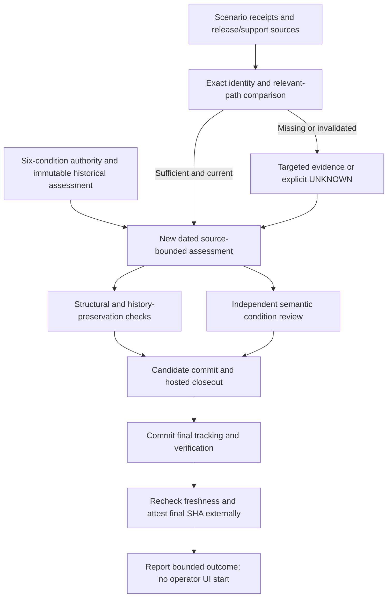

# Phase 167: Dated Readiness and Closeout - Research

**Researched:** 2026-09-27
**Domain:** Readiness evidence, source reconciliation, and exact-source closeout
**Confidence:** MEDIUM — current source and hosted observations are strong; a final assessment and final-source receipt do not exist yet.

<user_constraints>
## User Constraints (from CONTEXT.md)

The following is copied verbatim from the phase context. [VERIFIED: .planning/phases/167-dated-readiness-and-closeout/167-CONTEXT.md:14-33,113-117]

<!-- DATA_79f14bea_START -->
### Readiness gate and evidence semantics
- **D-01:** Use the six condition definitions and operating rules in `.planning/reference/PRE-OPERATOR-UI-READINESS.md` without redefining or weakening them. Evaluate each condition independently as PASS, FAIL, or UNKNOWN. Missing, stale, or insufficient evidence is UNKNOWN; evidence that contradicts a condition is FAIL.
- **D-02:** Keep the prior Phase 164 dated assessment, including its condition 3/6 UNKNOWN entries and overall NOT READY decision, unchanged. Record evidence dates separately from the new assessment date. Overall readiness is READY FOR OPERATOR UI only if all six current conditions pass and no unresolved Critical, High, or Medium-leverage finding remains; otherwise it is NOT READY.
- **D-03:** Treat structural checkers as record-shape validation only. They do not establish source truth, semantic completeness, owner approval, or readiness. Link evidence to the exact source, scenario, and receipt identity, and state the claim boundary and freshness limit for each claim.

### Condition 3 and v1.40 workflow evidence
- **D-04:** Reconcile Phase 165 and 166 receipts only within their named contracts and workflows. Phase 166's host-membership, local package-artifact, repair-to-visible-search, and C-09 freshness records are evidence for their stated scenarios; they do not prove arbitrary host authorization, public Hex installation, all deletion/recovery semantics, or general production guarantees.
- **D-05:** Reuse the historical C-09 hard-delete receipt only after a relevant-path freshness comparison against the new assessment source. If an invalidator exists, use targeted fresh evidence or record the bounded claim as UNKNOWN. Recheck freshness at the final Phase 167 source SHA as required for final closeout; do not edit tracked artifacts merely to record the external result.
- **D-06:** Keep the 11 unresolved probe rows and six descriptor-less prohibitions from Phase 166 visible and within the already-approved six-condition meanings. They are not additional gate criteria and must not be promoted into passes or defects without evidence.

### Condition 6 and exact-source closeout
- **D-07:** Trace archived v1.39 closeout, package/release, support, and planning claims to their actual source identities, distinguishing the planning tag from package version and closeout receipt. Explicitly disposition the observed release-reference mismatch, the accepted v1.39 planning metadata debt, and only Phase 167-owned cleanup or verification debt. Preserve unrelated local state and historical records.
- **D-08:** Bind every v1.40 software acceptance claim to automated, scenario-specific evidence at its exact source SHA. The named advisory-lane scenario must pass for its recorded source while remaining advisory. Use the existing exact-SHA closeout topology and its two-stage candidate/final-source discipline; do not add a required service lane, broaden the matrix, or require routine human UAT.

### the agent's Discretion
- Choose a concise dated assessment and cleanup-inventory layout consistent with the existing readiness authority and Phase 164 record.
- Choose focused structural/source checks and links that validate the new record without presenting them as semantic readiness proof.
- Inventory task-owned worktree, branch, generated output, temporary file, service, and verification state using repository ownership evidence; do not classify pre-existing or unrelated state as Phase 167 debt.

### Deferred Ideas (OUT OF SCOPE)

No new ideas were added. Operator UI, auth/tenant-authorization product work, public backend abstraction, broad compatibility matrices, new required service lanes, routine human UAT, and a forced Hex release remain outside this phase.
<!-- DATA_79f14bea_END -->
</user_constraints>

## Summary

Plan this as evidence reconciliation plus a small structural contract, followed by the existing candidate/final closeout sequence. The approved authority already defines the six conditions, and the historical assessment has condition 3 and condition 6 `UNKNOWN` with overall `NOT READY`. Preserve that historical section and cleanup inventory byte-for-byte; link a separately dated current assessment from the authority's current posture. Completion of this phase does not depend on obtaining a passing readiness decision. [VERIFIED: .planning/reference/PRE-OPERATOR-UI-READINESS.md:54-74,87-119; .planning/phases/167-dated-readiness-and-closeout/167-CONTEXT.md:9,17-28]

The existing receipts support narrower claims than a general product certification. Phase 166 binds host path, fresh local artifact consumption, and selected-ID repair to `50d5c12d36ec560525e245bcb992c40e5927854f`; archived v1.39 closeout and C-09 bind to `dc400b2b57aec0ca6b0ef16c9477d266fd41a433`; published `scrypath-v0.3.13` binds to `28d3877a05479f2cc104754fc24ab0c9d545c01b`. These identities were also rechecked with GitHub API and remote Git refs during this research. [VERIFIED: .planning/phases/166-host-tenant-and-repair-evidence/166-EVIDENCE.md:5-15,37-51; .planning/milestones/v1.38-phases/161-release-and-tidy-closeout/161-RELEASE-EVIDENCE.md:14-26; GitHub API and git ls-remote, 2026-09-27]

**Primary recommendation:** Create a current assessment with an explicit source cutoff, a requirement-to-scenario evidence map, a release/debt/ownership inventory, and a focused structural validator; retain truthful unresolved results and finish with external exact-final-SHA proof. This implements locked D-01 through D-08. [VERIFIED: .planning/phases/167-dated-readiness-and-closeout/167-CONTEXT.md:17-33]

## Architectural Responsibility Map

This is a proposed division of responsibility implementing the locked context, not a new product architecture. [VERIFIED: .planning/phases/167-dated-readiness-and-closeout/167-CONTEXT.md:17-33]

| Capability | Primary Tier | Secondary Tier | Rationale |
|---|---|---|---|
| Six-condition decision | Maintainer planning/evidence record | Readiness authority | Record a reasoned result for each existing condition. |
| Evidence identity and freshness | Git/source inspection | GitHub run/job/artifact metadata | Distinguish measured source from current assessment source. |
| Structural validation | Local Python standard-library tooling | Focused fixtures | Validate dates, links, record shape, preservation, and fail-closed arithmetic. |
| Software behavior proof | Existing test/CI lanes | Prior exact-source receipts | Reuse named automated scenarios within their limits. |
| Package/support reconciliation | Existing release/support sources | Hosted publication/parity receipts | Planning tags do not identify package releases. |
| Final closeout | Existing hosted CI and Node monitor | External final-source receipt | The final tracked commit must be the attested source. |

<phase_requirements>
## Phase Requirements

Descriptions are verbatim from the requirements authority. [VERIFIED: .planning/REQUIREMENTS.md:29-31]

<!-- DATA_b2547e18_START -->
| ID | Description | Research Support |
|---|---|---|
| GATE-04 | A maintainer can make a separate, uniquely dated assessment of all six readiness conditions using linked evidence and explicit claim limits, while preserving Phase 164's historical condition 3/6 UNKNOWN statuses and overall NOT READY decision. | Separate assessment, preservation assertion, independent condition reasoning, structural-only checks. |
| CLOSE-03 | A maintainer can trace archived v1.39 closeout, package/release and support evidence to their exact source identities, explicitly disposition the observed release-reference mismatch and accepted planning metadata debt, and record current task-owned cleanup without treating unrelated state as debt. | Identity table, current-source comparisons, explicit mismatch/debt disposition, owned-resource inventory. |
| VERIFY-02 | Every v1.40 software acceptance claim has automated evidence tied to its scenario and exact source SHA, routine human UAT is not required, and verification reuses existing CI lanes without adding a new required service lane or broad compatibility matrix. | Scenario ledger, independent advisory job inspection, candidate/final-source closeout. |
<!-- DATA_b2547e18_END -->
</phase_requirements>

## Project Constraints (from AGENTS.md)

- Consult relevant local prompts when decisions touch architecture, ecosystem, release practice, or positioning. Keep Ecto-first/Phoenix-friendly APIs, Meilisearch-first public backend, internal adapter seam, and explicit inline/Oban/manual operational semantics. Optimize setup ergonomics without concealing consistency, deletion, backfill, or reindex realities. Preserve the release quality bar. [VERIFIED: AGENTS.md:10-19]
- Respect the recorded Elixir/OTP floor and supported targets; Ecto and Telemetry remain core, Oban remains optional production integration, and the existing GitHub Actions/Release Please/Hex/ExDoc and quality-tool conventions apply. No dependency or stack changes are needed here. [VERIFIED: AGENTS.md:25-60]
- Do not introduce a public multi-backend facade, Phoenix-only architecture, mandatory core supervision, or an initial PostgreSQL-search product promise. Follow existing code patterns where mappings/conventions are not established. [VERIFIED: AGENTS.md:61-78]
- Follow CONTRIBUTING's applicable checks; keep edits focused; update PROJECT only when intentionally changing product scope or shipped claims. Maintain green main and prefer PR-first serious work. Software acceptance needs executable or exact-SHA hosted evidence; no routine pending UAT, simulated reviewer, or silently approved trust gate. [VERIFIED: AGENTS.md:90-103]
- Respect explicit idle-state authority instead of reopening historical phases when no active milestone exists; do not invent work. This phase is currently approved, with `current_phase: 167` and `status: planning`. [VERIFIED: AGENTS.md:94-103; .planning/STATE.md:3-9]
- Follow GSD artifact conventions and do not manually edit the managed developer profile. [VERIFIED: AGENTS.md:105,110-115]

Local guidance reinforces bounded representative proof, exact source claims, owned cleanup, durable decisions, and unchanged historical assessments. The generic CI prompt is advisory background; its suggested matrices do not override this phase's frozen topology. [VERIFIED: prompts/scrypath-milestone-ratchet-roadmap.txt:125-171,189-214; prompts/elixir-oss-lib-ci-cd-best-practices-deep-research.md:155-197; .planning/phases/167-dated-readiness-and-closeout/167-CONTEXT.md:28]

## Standard Stack

Reuse existing tools. This phase installs no packages; registry version/publish-date and package-legitimacy audits are therefore not applicable. Runtime versions below are observed environment versions, not new support claims. [VERIFIED: .planning/phases/167-dated-readiness-and-closeout/167-CONTEXT.md:9,28; environment probes, 2026-09-27]

| Tool | Observed version / source | Purpose |
|---|---|---|
| Python standard library | Python 3.14.4 locally | New focused structural validator and unittest fixtures; follow the archived standard-library pattern. |
| Node | v22.14.0 locally | Existing closeout monitor; do not build another orchestrator. |
| GitHub CLI | 2.101.0 locally | Read run/job/artifact identity and use the existing closeout monitor. |
| Git | Existing repository installation | Source identity, two-tree diffs, history preservation, ownership inventory. |
| Elixir / ExUnit | Explicit local Elixir 1.19.5, OTP 28; hosted 1.19.0/28.1 | Existing targeted contract suites if needed; CI already owns service proof. |

Sources: [VERIFIED: environment probes, 2026-09-27; .github/workflows/ci.yml:167-178; .planning/milestones/v1.39-phases/164-readiness-gate-and-reconciliation/check_readiness.py:1-11; scripts/ci_monitor.cjs:5-16,140-237]

**Installation:** none. Do not add a Markdown parsing package, new CI service lane, or package matrix. [VERIFIED: .planning/phases/167-dated-readiness-and-closeout/167-CONTEXT.md:9,28,31-33]

## Architecture Patterns

### System Architecture Diagram

Proposed data flow implementing the existing gate and closeout contract. [VERIFIED: .planning/reference/PRE-OPERATOR-UI-READINESS.md:54-74; CONTRIBUTING.md:67-83]



### Recommended Artifact Arrangement

Proposed new files, not existing verified paths:

- One dated Phase 167 assessment artifact linked from the current posture of the readiness authority.
- One concise reconciliation/evidence artifact, optionally machine-readable if it avoids duplicate facts.
- One current-phase structural checker and focused fixture file.
- Normal summary, validation, verification, and source-coverage artifacts.

Keep the historical assessment and cleanup block unchanged; keep prior receipts canonical rather than copying their log payloads. This follows the existing historical/current distinction and explicit discretion. [VERIFIED: .planning/phases/167-dated-readiness-and-closeout/167-CONTEXT.md:17-33; .planning/reference/PRE-OPERATOR-UI-READINESS.md:87-119]

### Pattern 1: Separate Historical Record, Current Decision, and Final Attestation

Give the new assessment a unique ID/UTC cutoff, exact assessment source, and separate evidence-observation dates. Dates may truthfully share a calendar day; do not manufacture an older evidence date. Evaluate each condition from the approved text. Preserve `PASS`, `FAIL`, `UNKNOWN`, `READY FOR OPERATOR UI`, and `NOT READY` exactly. [VERIFIED: .planning/phases/167-dated-readiness-and-closeout/167-CONTEXT.md:17-19; .planning/milestones/v1.39-phases/164-readiness-gate-and-reconciliation/check_readiness.py:349-350,394-413]

The archived checker is unsuitable unchanged: it selects `## Phase 164 dated assessment`, requires `## Phase 164 cleanup and verification inventory` and `#phase-164-cleanup-and-verification-inventory`, rejects `evidence_date == assessment_date`, and computes defaults relative to its pre-archive depth. Reuse the validation ideas while placing current-phase behavior in a new scoped tool; preserve archived code. [VERIFIED: .planning/milestones/v1.39-phases/164-readiness-gate-and-reconciliation/check_readiness.py:220-236,301-332,399-402,432-450]

Do not declare condition 6 cleared while its own required final verification is pending. Record the dated cutoff truth, then report the final external receipt separately. A valid phase completion may retain a dated `UNKNOWN`/`NOT READY`; the final receipt does not retroactively alter that assessment. This avoids falsely solving the self-referential final-SHA problem. [VERIFIED: .planning/phases/167-dated-readiness-and-closeout/167-CONTEXT.md:9,18,23,28; CONTRIBUTING.md:76-83; .planning/reference/PRE-OPERATOR-UI-READINESS.md:98-116]

### Pattern 2: One Claim, One Scenario, One Measured Source

| Acceptance scope | Canonical evidence and exact source | Claim limit / planning action |
|---|---|---|
| Public tenant and facet contracts | Phase 165 verification records `384c8839db2f021db421d0beff096ee439fd721`, 17 focused tests and unchanged implementation at refresh. | Library composition and encoded HTTP evidence; reconcile the live/package follow-up separately. |
| Host membership/search/facets and artifact consumption | `host-path`, `host-package`; source `50d5c12d36ec560525e245bcb992c40e5927854f`, run `36321613553`, job `108626420623`. | Synthetic persisted-membership policy and deterministic corpus; fresh local artifact, not public registry installation. |
| Selected-ID repair visibility | `root-repair`; same source/run, job `108626420717`. | Read-only observation, explicit selected IDs, exact returned task/index, same-search raw projection, fixed controls/repeat. |
| Historical deletion | Source `dc400b2b57aec0ca6b0ef16c9477d266fd41a433`, run `36257182675`, job `108446076619`, artifact `10910932671`. | One raw-hit hard-delete/controlled Oban drain with surviving sibling; no all-mode, retry, concurrency, or package-delete claim. |

Sources: [VERIFIED: .planning/phases/165-public-tenant-and-facet-contracts/165-VERIFICATION.md:117-159; .planning/phases/166-host-tenant-and-repair-evidence/166-EVIDENCE.json:26-37,90-99,162-171,251-318; .planning/phases/166-host-tenant-and-repair-evidence/166-EVIDENCE.md:45-58]

For every reused claim, record scenario/oracle, source SHA, run/attempt/job, actual conclusion, observation time, service/dependency mode, receipt link, and freshness disposition. Artifact metadata exposes `id`, `digest`, `expired`, `expires_at`, and `workflow_run.head_sha`; metadata confirmation and downloaded-content rehashing are different claims. [CITED: https://docs.github.com/en/rest/actions/artifacts] [CITED: https://docs.github.com/en/rest/actions/workflow-runs]

### Pattern 3: Freshness Is a Semantic Two-Tree Comparison

The C-09 source record explicitly lists `["lib", "examples", "config", "test/support", ".github/workflows", "mix.exs", "mix.lock"]`. Its Phase 166 comparison covers the candidate source only and requires final-source rechecking. Preserve the existing 16-path explanation, then inspect the delta to the new assessment and final source. A touched path needs an oracle-specific reason, not automatic invalidation or automatic clearance. [VERIFIED: .planning/phases/166-host-tenant-and-repair-evidence/166-EVIDENCE.json:251-289,318; .planning/phases/166-host-tenant-and-repair-evidence/166-EVIDENCE.md:41-51]

Research observed no changed paths between the Phase 166 candidate and research HEAD `cd920481a9976834f2e3e832b4e326b5a7803b65` across runtime/tests/examples/config/workflow/package inputs. That observation expires when the assessment or final source changes; it is not a final-phase freshness receipt. [VERIFIED: git diff --name-only and git rev-parse, 2026-09-27]

### Pattern 4: Required Closeout and Advisory Acceptance Are Separate Checks

The monitor checks exactly `"core (required)"`, `"package (required)"`, `"repository-contracts (required)"`, `"backend (required)"`, `"ecommerce-mounted (required)"`, plus `"coverage (advisory)"` and `"closeout-attestation"`. It requires one successful instance and live SHA-bound artifacts. [VERIFIED: scripts/ci_monitor.cjs:10-16,125-137,187-208]

The Phoenix job is `name: phoenix-example (advisory)` with `continue-on-error: true`; its two commands are `mix verify.phoenix_example` and `mix verify.phoenix_example --package`. The closeout attestation does not depend on it. Inspect that job and named scenario independently before accepting its software claim. Do not change branch protection or promote it to required. [VERIFIED: .github/workflows/ci.yml:152-178,277-280]

Live reinspection confirmed run `36321613553`, attempt `1`, source `50d5c12d36ec560525e245bcb992c40e5927854f`, with both named Phoenix and backend jobs `success`. Both coverage/attestation artifacts remained unexpired; their metadata expires on 2026-10-04. Existing receipt dates/digests remain canonical. [VERIFIED: GitHub run/jobs/artifacts API, 2026-09-27; .planning/phases/166-host-tenant-and-repair-evidence/166-EVIDENCE.json:5-24]

## Closeout and Source Reconciliation

| Surface | Source-backed observation | Required disposition |
|---|---|---|
| Archived planning closeout | `v1.39` peels to `dc400b2b57aec0ca6b0ef16c9477d266fd41a433`; run `36257182675` succeeds there. | Mark the historical final-closeout obligation discharged for that source only; leave older pending wording historical. |
| Published package | `scrypath-v0.3.13` resolves to `28d3877a05479f2cc104754fc24ab0c9d545c01b`; publication receipt describes `0.3.13`. | Identify release tag, package, publication/parity receipt separately from planning tags and freshly built artifacts. |
| Release-reference mismatch | Source says `@source_ref "v#{@version}"`; releasing guide says `vX.Y.Z`; actual release tag is `scrypath-v0.3.13`. | Record the concrete link/reference inconsistency and bounded impact. Recommend explicit carry-forward with owner/responsibility and revisit trigger within this evidence phase; a small correction is optional only if deliberately scoped. No retag/republish. |
| Accepted metadata debt | Audit `status: tech_debt`; missing Phase 164 requirement summary references; Phase 163 legacy `status: complete`; Phase 164 draft validation. | Carry forward as accepted historical bookkeeping with responsibility and trigger. Do not flip validation flags or rewrite the audit. |
| Support | Guide declares Elixir `~> 1.17`, OTP 26–28, Meilisearch `v1.15`, and `:inline`, `:manual`, `:oban`. | Compare source and tested tuple receipts; preserve narrow support wording and unreleased-main distinction. |
| Current task-owned state | Must be inventoried at execution and finalization. | Record branch/worktree, generated output, temporary files, services, verification, and unrelated state with ownership evidence. |

Sources: [VERIFIED: .planning/PROJECT.md:13-15; .planning/milestones/v1.38-phases/161-release-and-tidy-closeout/161-RELEASE-EVIDENCE.md:14-26; mix.exs:4-6,21; docs/releasing.md:5; .planning/milestones/v1.39-MILESTONE-AUDIT.md:4,41-60; .planning/milestones/v1.39-ROADMAP.md:137-146; guides/support-and-compatibility.md:7-10,31-40,56-69; .planning/milestones/v1.39-phases/164-readiness-gate-and-reconciliation/check_readiness.py:28-36; GitHub API/git ls-remote, 2026-09-27]

Readiness conditions 1, 2, and 5 require current reasoning against the archived baseline/findings and any new observations. Do not mechanically carry prior PASS values forward. In particular, Phase 166's summary records new dependency advisory output; reconcile its source/lock identity before repeating a claim of no current ranked security finding. This is a targeted evidence disposition, not authorization for dependency remediation. [VERIFIED: .planning/reference/PRE-OPERATOR-UI-READINESS.md:58-63,93-100; .planning/phases/166-host-tenant-and-repair-evidence/166-03-SUMMARY.md:163-167]

## Don't Hand-Roll

| Problem | Use existing mechanism | Why |
|---|---|---|
| Hosted final-source orchestration | Existing Node closeout command | Already rejects source mismatch and missing/expired/wrong-source artifacts. |
| Host/package behavior proof | Existing Phase 166 scenario receipts | Rebuilding a consumer or matrix changes cost and scope without improving a named decision. |
| Product readiness policy | Six-condition authority | A second definition weakens auditability and violates locked decisions. |
| Version/release truth | Existing release/parity receipt and current sources | A locally tagged artifact is not a published release. |
| Security assurance | Bounded source and scenario review | Do not manufacture authentication, certification, or generic production guarantees. |

Sources: [VERIFIED: scripts/ci_monitor.cjs:125-208; .planning/phases/167-dated-readiness-and-closeout/167-CONTEXT.md:17-28; .planning/phases/166-host-tenant-and-repair-evidence/166-EVIDENCE.md:53-58]

## Common Pitfalls

1. **A successful workflow masks an advisory failure.** Inspect the named job and scenario result separately; the monitor's required list omits Phoenix. [VERIFIED: scripts/ci_monitor.cjs:187-208; .github/workflows/ci.yml:152-178]
2. **A structural PASS becomes readiness evidence.** The archived success message explicitly says it checks record shape only; retain that boundary in the new tool and verification report. [VERIFIED: .planning/milestones/v1.39-phases/164-readiness-gate-and-reconciliation/check_readiness.py:458-460]
3. **Archive movement breaks checker defaults or links.** Explicitly resolve current evidence to archived sources; preserve historical bytes and record any historical broken link separately. The checker computes paths by parent depth and requires local targets to exist. [VERIFIED: .planning/milestones/v1.39-phases/164-readiness-gate-and-reconciliation/check_readiness.py:245-273,449-450]
4. **The final receipt creates an endless commit loop.** Commit final tracking before final attestation; retain the last receipt externally and write no tracked files afterward. [VERIFIED: CONTRIBUTING.md:76-83]
5. **Seventeen unresolved items become new gate criteria.** Preserve the 11 probe rows and six descriptor-less prohibitions, link their current status, and reason only within the approved conditions. A narrow passing scenario does not resolve an unspecified edge. [VERIFIED: .planning/phases/166-host-tenant-and-repair-evidence/166-SOURCE-AUDIT.md:80-113; .planning/phases/167-dated-readiness-and-closeout/167-CONTEXT.md:24]
6. **Package fixes are claimed as published.** The current local artifact uses version `v0.3.13` while its build source is the later Phase 166 candidate. Preserve both facts. [VERIFIED: .planning/phases/166-host-tenant-and-repair-evidence/166-EVIDENCE.json:119-127]
7. **Source dates are changed to satisfy a checker.** Keep truthful same-day observations in separate fields and use a unique assessment timestamp. Adapt the current-phase contract, not the historical evidence. [VERIFIED: .planning/phases/167-dated-readiness-and-closeout/167-CONTEXT.md:18; .planning/milestones/v1.39-phases/164-readiness-gate-and-reconciliation/check_readiness.py:399-402]

## Code Examples

The canonical closeout command is quoted verbatim; execute once for the candidate and once after final tracking commits. [VERIFIED: CONTRIBUTING.md:70-83]

<!-- DATA_b07ad692_START -->
```sh
node scripts/ci_monitor.cjs closeout --push \
  --branch "$(git branch --show-current)" \
  --sha "$(git rev-parse HEAD)"
```
<!-- DATA_b07ad692_END -->

For a focused public documentation contract check, the existing test source records the exact command `mix test test/scrypath/readiness_contract_test.exs`. This checks documentation routing and statements, not six-condition readiness. [VERIFIED: test/scrypath/readiness_contract_test.exs:4-14,34-60]

Suggested read-only source comparison pattern (planner-selected placeholders, not a new repository API):

```sh
git diff --name-status "$receipt_source" "$assessment_source" -- \
  lib examples config test/support .github/workflows mix.exs mix.lock
```

The path values are quoted in the canonical receipt as `["lib", "examples", "config", "test/support", ".github/workflows", "mix.exs", "mix.lock"]`; those are comparison inputs, not claims that this phase creates those filesystem locations. [VERIFIED: .planning/phases/166-host-tenant-and-repair-evidence/166-EVIDENCE.json:251-254]

## State of the Art

| Established practice | Phase 167 application | Source |
|---|---|---|
| Candidate/final exact-source machine acceptance | Keep both stages and external final receipt | [VERIFIED: CONTRIBUTING.md:67-83] |
| Scenario-specific service proof | Reuse bounded host/artifact/repair evidence; separately inspect advisory result | [VERIFIED: .planning/phases/166-host-tenant-and-repair-evidence/166-EVIDENCE.md:11-19,53-58] |
| Separately dated readiness reassessment | Preserve historical UNKNOWN/NOT READY and record a new source cutoff | [VERIFIED: .planning/phases/167-dated-readiness-and-closeout/167-CONTEXT.md:17-28] |

No ecosystem migration or new library selection is called for. [VERIFIED: .planning/phases/167-dated-readiness-and-closeout/167-CONTEXT.md:9]

## Assumptions Log

No unsourced technical or compatibility assertion is required to plan this phase. Proposed artifact arrangement and validator design are recommendations within explicit discretion, not locked additional requirements. Remaining evidence gaps are listed below and must not be silently promoted into facts. [VERIFIED: .planning/phases/167-dated-readiness-and-closeout/167-CONTEXT.md:30-33]

## Open Questions

1. **Does current evidence satisfy condition 3?** The selected scenarios are proved; broader historical residual questions and unresolved probes remain. Evaluate importance and claim scope explicitly; leave UNKNOWN where insufficient. No default READY outcome. [VERIFIED: .planning/phases/166-host-tenant-and-repair-evidence/166-VERIFICATION.md:93-103; .planning/reference/PRE-OPERATOR-UI-READINESS.md:60,95]
2. **How should the release-reference mismatch be dispositioned?** Prefer a bounded documented carry-forward for this evidence phase; if correcting it, name the exact files and focused docs/package checks in the plan. Do not treat package publication as failed solely from the reference mismatch. [VERIFIED: mix.exs:4-6,21; docs/releasing.md:5; .planning/milestones/v1.38-phases/161-release-and-tidy-closeout/161-RELEASE-EVIDENCE.md:21-26]
3. **What does the latest dependency warning mean?** Phase 166 reports Mint advisory notices while older evidence reports bounded remediation. Inspect the current lock and relevant exact-source audit receipt before repeating a no-ranked-finding claim. This research did not establish a fresh dependency vulnerability verdict. [VERIFIED: .planning/phases/166-host-tenant-and-repair-evidence/166-03-SUMMARY.md:167; .planning/milestones/v1.39-phases/162-whole-product-evidence-baseline/162-BASELINE.md:39]
4. **What is the final source and cleanup state?** It cannot be known before execution. Snapshot ownership first, finalize tracking, repeat freshness, and attest the resulting source. [VERIFIED: CONTRIBUTING.md:67-83; .planning/phases/167-dated-readiness-and-closeout/167-CONTEXT.md:23,33]

## Environment Availability

Observed read-only on 2026-09-27. [VERIFIED: environment/Git/GitHub probes in this research session]

| Dependency | Required by | Available | Version / limitation | Fallback |
|---|---|---|---|---|
| Python | Structural tooling | Yes | 3.14.4 | Existing standard library; no install |
| Node | Closeout monitor | Yes | v22.14.0 | Existing hosted workflow |
| Git / GitHub CLI | Identity and hosted evidence | Yes | gh 2.101.0; authenticated read access and API reads succeeded | Report exact permission failure if later dispatch cannot run |
| Elixir/OTP | Focused existing ExUnit checks if needed | Explicit selection works | Elixir 1.19.5 / OTP 28 using existing ASDF selections; default invocation reports no selected Elixir version | Use explicit installed selection; no global config change |
| Postgres/Meilisearch | Only invalidator-driven fresh scenarios | Local service availability not probed | Existing hosted scenario receipts confirmed | Existing hosted service lanes |
| Git worktree | Ownership inventory | One observed worktree | Existing branch `gsd/v1.38-cleanup-merged`; pre-existing research cache untracked | Preserve unrelated state |

**Blocking dependencies:** none identified for planning. Hosted dispatch/push was not attempted by this researcher; read access is not a dispatch receipt. No runtime state migration is involved, so the rename/refactor Runtime State Inventory is inapplicable; the task-owned cleanup inventory remains mandatory. [VERIFIED: .planning/phases/167-dated-readiness-and-closeout/167-CONTEXT.md:9,28,33; research action scope]

## Validation Architecture

### Test Framework

| Property | Recommendation |
|---|---|
| Framework | Python standard-library unittest for new record contracts; existing ExUnit only where source/docs touched |
| Config | Follow archived standalone checker/fixture structure; use explicit repo root and artifact argument |
| Quick check | New current-phase checker plus its focused fixtures; planner defines exact new file names |
| Existing support check | `mix test test/scrypath/readiness_contract_test.exs` |
| Final gate | Existing exact-SHA closeout, plus independent named advisory-scenario receipt inspection |

Sources: [VERIFIED: .planning/milestones/v1.39-phases/164-readiness-gate-and-reconciliation/test_check_readiness.py:180-298; test/scrypath/readiness_contract_test.exs:53-60; CONTRIBUTING.md:67-83]

### Phase Requirements → Test Map

| Req ID | Behavior | Type | Automated check / evidence | Exists? |
|---|---|---|---|---|
| GATE-04 | Six exact condition rows, independent status/date/source/limit fields, fail-closed decision, unchanged historical block | Focused structural + source-preservation fixtures | Current-phase checker and byte comparison against pinned pre-edit historical block | Wave 0 |
| CLOSE-03 | Exact identities, release-reference/debt disposition, six-surface owned cleanup, no hidden pending debt | Focused schema/source checks plus Git/GitHub receipts | Current-phase validator, remote refs, run/job/artifact reads; support ExUnit command if docs changed | Mixed |
| VERIFY-02 | Every software claim resolves to scenario/source/result; advisory scenario actually passed | Evidence-join checks + exact-source hosted acceptance | Existing monitor command; independently inspect named job conclusion and scenario excerpt | Existing topology; current-phase join check Wave 0 |

This mapping implements the three requirements without adding a service lane or broad regression matrix. [VERIFIED: .planning/REQUIREMENTS.md:29-31,46; .planning/phases/167-dated-readiness-and-closeout/167-CONTEXT.md:28,32]

### Sampling Rate

- Each record/checker edit: focused structural and history-preservation checks.
- After evidence reconciliation: inspect source joins, actual run/job conclusions, and relevant-path freshness.
- Candidate and final source: use the two required closeout stages; avoid extra broad local reruns absent a named invalidator.

These are proposed sampling steps grounded in the existing verification contract. [VERIFIED: CONTRIBUTING.md:67-83; .planning/phases/167-dated-readiness-and-closeout/167-CONTEXT.md:23,28,32]

### Wave 0 Gaps

- Define the current assessment selector and timestamp contract without mutating the archived checker.
- Add discriminating fixtures for changed historical bytes, wrong source/receipt, missing/duplicate condition, insufficient status paired with READY, hidden/fenced false rows, unsafe/unresolved current links, and claimed clear cleanup with pending verification.
- Preserve same-calendar-day evidence/assessment fields without invented dates.
- Verify old receipts remain bounded and the current assessment does not silently resolve the unresolved probe/prohibition ledger.
- Keep source truth and semantic review separate from these fixtures.

The old fixture suite provides concrete adversarial precedents; the current selectors and preservation check are new work. [VERIFIED: .planning/milestones/v1.39-phases/164-readiness-gate-and-reconciliation/test_check_readiness.py:180-298; .planning/phases/167-dated-readiness-and-closeout/167-CONTEXT.md:18-24]

## Security Domain

Security enforcement is retained. Apply security reasoning to evidence/tooling boundaries; this phase does not implement host authentication or sessions. The official ASVS 5.0 taxonomy uses V2 Validation and Business Logic, V6 Authentication, V7 Session Management, V8 Authorization, V11 Cryptography, V13 Configuration, V14 Data Protection, and V16 Security Logging and Error Handling. Do not reuse older category numbers while labeling them 5.0. [CITED: https://cheatsheetseries.owasp.org/IndexASVS.html] [VERIFIED: .planning/phases/167-dated-readiness-and-closeout/167-CONTEXT.md:9,22,28]

| ASVS 5.0 area | Application to this phase | Standard control |
|---|---|---|
| V2 Validation / V5 File Handling | Local record and evidence-link parsing | Treat files as data, validate exact fields, enforce in-root relative links and HTTPS remote links |
| V6 Authentication / V7 Sessions | No product work; existing CLI identity only | Use configured GitHub authentication, never persist tokens or claim host login coverage |
| V8 Authorization | Hosted read/dispatch and task ownership | Use existing access; do not invent approval or delete unrelated resources |
| V11 Cryptography | Artifact/checksum integrity | Existing SHA-256 tooling and hosted digest metadata; no custom cryptography |
| V13 Configuration / V14 Data Protection / V16 Logging | Receipt capture and workflow provenance | Preserve exact source/workflow identity, sanitized excerpts, no environment or secret dumps |

Taxonomy source: [CITED: https://cheatsheetseries.owasp.org/IndexASVS.html]. Phase-specific controls follow existing link validation, exact-source monitor, and sanitized evidence patterns. [VERIFIED: .planning/milestones/v1.39-phases/164-readiness-gate-and-reconciliation/check_readiness.py:245-273; scripts/ci_monitor.cjs:119-208; .planning/phases/166-host-tenant-and-repair-evidence/166-EVIDENCE.json:225-249]

| Threat | STRIDE | Mitigation |
|---|---|---|
| Wrong-SHA or rewritten historical evidence presented as current | Tampering / Repudiation | Pin source, compare preserved bytes, link run/job/attempt/artifact identity |
| Global workflow success masks failed advisory scenario | Spoofing / Repudiation | Inspect actual job and named oracle independently |
| Local links escape repository or logs disclose credentials | Information disclosure | Data-only safe path resolution and sanitized minimal excerpts |
| Resource cleanup crosses task ownership | Tampering | Snapshot ownership and preserve unrelated state |
| Broad reruns consume unnecessary CI resources | Denial of service | Existing lanes and named-invalidator-only additional proof |

Controls derive from locked D-02/D-03/D-07/D-08 and existing source safeguards; this is not an ASVS certification claim. [VERIFIED: .planning/phases/167-dated-readiness-and-closeout/167-CONTEXT.md:18-28]

## Sources

### Primary repository and hosted observations

- Readiness authority, full historical assessment, current phase context, requirements, project, state, roadmap, and AGENTS; inline source ranges identify each claim.
- Archived Phase 164 checker/fixtures/context/summary/verification; archived v1.39 audit/roadmap/requirements; Phase 161 release receipt.
- Phase 165 context, summary and verification; Phase 166 context, evidence Markdown/JSON, summary, source audit and verification.
- CONTRIBUTING, CI workflow, closeout monitor, current support guide, mix project and release guide.
- GitHub API read-only checks for archived and Phase 166 runs, named Phoenix/backend jobs, artifact metadata, latest release, and remote tags; observed 2026-09-27. Prior artifact byte digests were not recomputed in this research.

### Official documentation (MEDIUM from confidence seam)

- https://docs.github.com/en/rest/actions/artifacts — metadata, digest, expiration, source linkage.
- https://docs.github.com/en/rest/actions/workflow-runs — run source and attempt identity.
- https://cheatsheetseries.owasp.org/IndexASVS.html — ASVS 5.0 category mapping.
- Local prompt guidance is treated as project reference, with current context/CONTRIBUTING taking precedence over generic recommendations.

## Metadata

**Confidence breakdown:**
- Standard stack: MEDIUM — no packages added; existing tooling and installed runtimes observed.
- Architecture: MEDIUM — prescribed by locked source/evidence scope and existing closeout topology.
- Pitfalls: MEDIUM — concrete archived checker constraints and hosted/source identities inspected.

The research-plan seam selected websearch; classify-confidence with official cross-check returned MEDIUM. The current seam does not assign HIGH to non-package web findings, so no higher external-source confidence is invented. Repository VERIFIED tags describe inspected source facts and quoted values, not a readiness certification. [VERIFIED: gsd-tools research-plan/classify-confidence output, 2026-09-27]

Literal Read/Write tools are unavailable in this runtime; source files were opened through exec_command and this artifact was written with apply_patch. No heredoc creation, source-code edit, test run, hosted dispatch, package install, or publication was performed. No graph or project skill directory was found in the scoped discovery; configured agent_skills is empty. [VERIFIED: tool inventory, scoped discovery and .planning/config.json read, 2026-09-27]

**Research date:** 2026-09-27
**Valid until:** Recheck on assessment/final source change; hosted artifact inspection is retention-bound. Do not interpret a calendar TTL as proof of source freshness.

