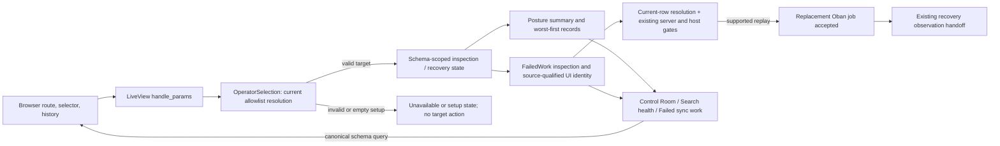

# Phase 174: Recovery Entry and Diagnosis - Research

**Researched:** 2026-10-06
**Domain:** Phoenix LiveView operator recovery navigation, source-aware failed work diagnosis, and schema-context continuity
**Confidence:** HIGH for current code contracts and existing test seams; MEDIUM for framework/documentation guidance; HIGH for the observed tool availability

<user_constraints>
## User Constraints (from CONTEXT.md)

### Locked Decisions

### Research, design and dependency posture

- **D-01:** Use bounded specialist consideration followed by a coherent synthesis and one adversarial challenge. Cover relevant operator/product, design/accessibility/mobile, Phoenix/browser/rendering, security, asynchronous evidence and maintenance perspectives. Stop when another pass would not change the recommendation; do not enumerate unrelated specialties or reopen completed work.
- **D-02:** Prefer small owned code and modest repetition over another external dependency. Existing components, URL helpers and platform affordances cover the identified decisions; no new dependency is recommended. Extract a helper/component only when concrete repeated usage justifies it.
- **D-03:** Apply Impeccable Operate guidance within the delivered Phase 173 visual world. Next run `$gsd-ui-phase 174`, using realistic light/dark compositions to resolve hierarchy and responsive placement before `$gsd-plan-phase 174`. The delivered `173-UI-SPEC.md`, current tokens/components and explicit refinement brief govern the inherited appearance; older PRODUCT/DESIGN/inventory descriptions do not reopen the accepted palette or replay historical fixes. Do not repair Impeccable sidecars/config as incidental work.

### Control Room priorities — OPUX-16

- **D-04:** Lead with current observed state, affected allowed-schema scope and one next safe, read-only step. Connect the summary to that step; remove duplicate recovery explanations and controls that merely repeat the same destination. Keep verification and exploration available as quieter destinations, with direct navigation and command palette retained. No wizard or automatic mutation.
- **D-05:** Keep claims bounded by the actual check and configured allowlist. Zero observed failures do not mean all backends are healthy, documents are fresh or promotion is ready. Distinguish setup missing, backend configuration missing, unavailable/partial observations and remotely failed work. Identify affected schemas where evidence supports it, with complete identifiers; do not infer remote failure from a fetch failure or pretend unavailable observations are zero.
- **D-06:** Keep fleet evidence and recovery-target context separate. A chosen target can be healthy while another schema has worse signals. Label the CTA's scope and the current recovery target where present; never make an implicit worst-first recommendation replace an explicit choice.

### Search health scanning — OPUX-17

- **D-07:** Retain existing worst-first schema records and classification semantics. Use one neutral meaningful surface per schema, readable full schema/index identity and sync mode, with plain Backend/Queue diagnostic groups inside it. Prefer this rich-record layout over a new fleet table or nested decorative panels. Do not add pagination/filtering or redesign severity rules without separately scoped evidence.
- **D-08:** Keep local state text and restrained cues near the affected source; avoid duplicate badges/labels conveying the same fact. Zero counts stay neutral. Observation unavailable, retained older evidence, no success observed, queue not used, queue retrying and terminal failure remain distinct. Reuse Phase 173 snapshot-stable time and exact-value access where applicable without changing the meaning of a source time or adding routine Checked copy controls.
- **D-09:** Put schema-specific next checks with their record and give them explicit target identity. Fleet-level guidance serves genuine fleet setup/diagnosis needs; do not repeat a row action or send a specific incident to an unscoped default. A row action for another schema is a deliberate target-changing navigation when clicked.
- **D-10:** Preserve meaningful reading/focus order through responsive reflow and manual-refresh reordering. Keep stable schema/action identity and focused context rather than moving focus to the new worst row. Wrap complete long values, stack groups when space requires, and keep primary controls reachable. Use incumbent body/action sizes and spacing; do not shrink text to fit columns or impose equal-height disclosure groups.

### Failed-work recovery — OPUX-18

- **D-11:** Name records by source: Backend task / Queue job, with complete work identity. Show operation, relevant index/source facts, failure reason, time and recovery availability in the normal reading order before collapsed verbose diagnostics. Keep useful reason/attempt rollups concise and derive them from the displayed inspection. Retain existing bounded reason summaries; do not expand raw payloads or authentication details into the primary flow or invent a new redaction policy.
- **D-12:** A supported manual retry is an ordinary per-row action, using standard readable controls rather than extra-small advanced treatment. Explain unavailable recovery from known source/operation/replay facts; use an honest generic explanation when the specific cause is unknown. A backend task without in-page replay must not acquire an invented action.
- **D-13:** Determine executable recovery from the existing recovery action and current server rules, not reason class, badge color or an automatic-retry label. Oban automatic retry and Scrypath manual replay availability are separate concepts. A discarded historical job may still expose supported replay data; preserve existing eligibility semantics rather than adding a policy that forbids it.
- **D-14:** Keep existing host authorization, allowlist validation, server-side action checks and the delete confirmation showing schema, index, document count and exact IDs. Client row/source/schema values identify a current inspected object; they are not trusted recovery payloads or authorization. Do not change auth policy or claim a visible button guarantees host authorization.
- **D-15:** Keep the accepted replacement-job receipt, original failure history and existing Check sync status handoff. Acceptance is not completion. A subsequent observation failure remains unknown rather than a remote task failure. Keep the current duplicate-acceptance guard without claiming cross-session exactly-once behavior, automatic replay or automatic verified success.
- **D-16:** Use source-qualified identity for internal rendered rows, action lookup, receipts and delete confirmations so equal numeric backend-task and queue-job IDs cannot collide. Preserve public/full source IDs and existing library contracts; this is a UI identity/lookup correction. Resolve the qualified identifier against the current inspection and chosen schema before acting.

### Schema context — OPUX-19

- **D-17:** The canonical validated `schema` query parameter is recovery-target authority. Use existing allowlist string resolution and URL encoding; do not create atoms from external text or add browser/session/global sticky-selection state. This keeps tabs, bookmarked routes and browser history independent and understandable.
- **D-18:** An explicit allowed selection wins over worst-first recommendations. Preserve existing first-allowlist behavior only when the parameter is truly absent on a schema-specific page. Invalid, blank, hostile or removed explicit targets show unavailable with no target action; never substitute another schema. An empty allowlist is a setup state, with no selected target or recovery action.
- **D-19:** Control Room and Search health remain fleet-wide even with target context. Visibly identify the recovery target and carry it through recovery handoffs, return links, desktop/mobile navigation and command-palette recovery destinations. No implicit selection from the worst-first row. Broader Search/Playbooks state propagation remains Phase 176 work.
- **D-20:** Explicit rendered selector changes update URL/history so Back restores the prior validated target; refresh/reconnect restore the same target. Keep context-bound result, confirmation and receipt-generation invalidation when schema changes, including protection against stale asynchronous results. Do not carry a confirmation or successful observation from schema A into schema B.
- **D-21:** Command-palette link targets must actually update after a selector patch despite its current ignored DOM subtree. Initial-render schema links alone are insufficient. Preserve the existing keyboard/focus lifecycle while correcting contextual destinations; choose the bounded implementation in research/planning.
- **D-22:** Preserve validated schema context through the existing sudo interruption/return seam, whose fallback currently drops the query. Retain host-owned authentication/authorization and safe return-path constraints; do not blindly forward arbitrary query data or change auth policy. Returning from confirmation must not silently land on another schema or replay a mutation automatically.

### Acceptance and agent discretion

- **D-23:** Each slice closes its own acceptance with direct before/after inspection and relevant executable proof in existing lanes: component/LiveView state and rendered-event checks; token AA contrast for shared styles; focused browser navigation, geometry, keyboard/focus and actual mounted recovery seams. Include realistic healthy, degraded, setup/missing-backend, partial/unavailable, empty, busy/disabled, long-content and retained-history states as applicable, light/dark and relevant desktop/narrow/intermediate widths, with System and reduced-motion parity preserved. Screenshots alone do not establish visual quality; no pending routine human UAT or new required CI/paid judge.
- **D-24:** Extend existing changed-selection proof through the newly touched fleet/global navigation/palette/auth-return seams. Cover selected A while B is worse, non-first schema selection via rendered controls, Back/reload, invalid/removed target, source-qualified equal IDs, schema change during confirmation/pending observation, double/stale clicks, refresh reordering and palette navigation after a patch. Run mutating fixtures only in disposable stacks; never reseed the retained feedback preview.

### the agent's Discretion

Choose exact concise copy, source-qualified UI-key representation, component extraction where repeated use warrants it, and bounded navigation/hook implementation within these decisions. Resolve material composition in the Phase 174 UI contract before planning. Reuse existing evidence within its source/scenario limits; no product verification is claimed by this discussion.

### Deferred Ideas (OUT OF SCOPE)

No new capability was approved. Rich table/filter/pagination tools for very large fleets need actual scale evidence and separate scope. Browser-global sticky selection, automatic retry orchestration, cross-session exactly-once guarantees, a new auth/redaction product and infrastructure automation are outside this phase. Phase 175 retains ownership of repair/verification presentation; Phase 176 owns Search/Playbooks; Phase 177 consolidates delivered documentation.

Inherited broad advisory browser failures, the unchanged Ops lock's documented Cloak advisories and historical Phase 173 evidence limitations remain visible in STATE and 173-CLOSEOUT/SECURITY. This discussion grants no dependency exception, risk acceptance, release approval, full-matrix pass or replay of a completed phase. Impeccable config/sidecar maintenance is not incidental scope.
</user_constraints>

<phase_requirements>
## Phase Requirements

| ID | Description | Research Support |
|----|-------------|------------------|
| OPUX-16 | Operators entering Control Room can identify the current state, affected search scope, and next safe action in a clear reading order without duplicated explanations or competing secondary controls. | Reuse `Posture.summary/2` evidence and existing Control Room structure; add the selected-target distinction and one read-only health CTA, verified against allowlist/state contracts. |
| OPUX-17 | Operators inspecting Search health can scan worst-first schema records with readable complete identifiers/times, one meaningful surface per schema, and plain Backend/Queue diagnostic groups; section spacing and concise next-check actions remain clear without redundant nested containers. | Keep `PostureLive`'s existing worst-first fleet data and row links; extend rendered state/layout and nav context tests without changing classification. |
| OPUX-18 | Operators inspecting Failed sync work can see the failure reason, source/work identity, and recovery availability before opening verbose evidence; the common supported recovery action is discoverable while retained history, eligibility rules, and safety gates stay explicit. | Preserve `FailedWork` public fields and `RecoveryAction`; qualify Ops-only row/action/receipt/confirmation keys by source and verify accepted replacement work separately from terminal backend-task observation. |
| OPUX-19 | Operators retain their selected allowed schema across rendered recovery handoffs, refresh, and back navigation after changing selection; invalid/unavailable targets cannot silently become actions on a different schema. | Extend `OperatorSelection.resolve/path`, fleet shell/palette destinations, and Sigra return path only with validated canonical `schema`; reuse current generation invalidation and mounted recovery proof. |
</phase_requirements>

## Summary

Phase 174 is an existing ScrypathOps LiveView change. Keep the work in the current `ControlRoomLive`, `PostureLive`, and `FailedSyncLive` flows, the shared `OpsUi` shell, and the already-existing `OperatorSelection` helper. Do not add a package, route surface, public core API, adapter, or authorization policy. The Ops dependency declares Phoenix LiveView `~> 1.1.33`, and the lock resolves `1.1.33`; use that version's API and the existing component/hook vocabulary. [VERIFIED: `scrypath_ops/mix.exs:41-52`; `scrypath_ops/mix.lock:40`]

The main data-flow correction is source-qualified work identity: the failed-work view currently finds rows, receipts, and delete confirmations by bare ID, while the core model distinguishes `:meilisearch` and `:oban` sources. Preserve the public row contract, derive an Ops-local key from the selected schema, source, and complete source ID, and resolve every event against the current inspection before acting. Backend task replay is unavailable by construction; retryable Oban work uses existing replay data and server gates. An accepted replay is a replacement queue job receipt, not observed task completion. [VERIFIED: `lib/scrypath/operator/failed_work.ex:52-99`; `lib/scrypath/operator/failed_work/translation.ex:9-57`; `scrypath_ops/lib/scrypath_ops_web/live/failed_sync_live.ex:218-273,395-424`]

The main navigation correction is to carry only a canonical, allowlisted `schema` query through rendered recovery destinations, including the ignored command-palette subtree and the existing Sigra return seam. Keep Control Room and Search health fleet-wide. Preserve the existing absence-versus-invalid distinction, generation invalidation, and no-atom-creation resolver; carry no arbitrary query string or sticky selection state. [VERIFIED: `scrypath_ops/lib/scrypath_ops/operator_selection.ex:11-39`; `scrypath_ops/lib/scrypath_ops_web/components/ops_ui.ex:1483-1538`; `scrypath_ops/lib/scrypath_ops/integrations/sigra/gating.ex:33-80`]

**Primary recommendation:** Start with one real selected-schema journey through Control Room → Search health → Failed sync work → accepted replacement receipt → Sync and drift status, then extend coverage to source-ID collision, shell/palette patching, history, invalid target, and sudo return in the existing disposable browser/test lanes.

## Architectural Responsibility Map

| Capability | Primary Tier | Secondary Tier | Rationale |
|------------|-------------|----------------|-----------|
| Fleet state and affected-scope summary | Frontend Server (Phoenix LiveView) | Browser / Client | The server's `Posture.summary/2` supplies bounded allowlist/source observations; HEEx renders them. Keep health claims tied to these observations. [VERIFIED: `scrypath_ops/lib/scrypath_ops_web/live/control_room_live.ex:40-43`; `scrypath_ops/lib/scrypath_ops/posture.ex:1-120`] |
| Worst-first Search health records | Frontend Server (Phoenix LiveView) | Browser / Client | `PostureLive` owns the fleet summary and row-level links; CSS/HEEx controls the scan order and responsive presentation. [VERIFIED: `scrypath_ops/lib/scrypath_ops_web/live/posture_live.ex:103-131,315-340,515-519`] |
| Failed-work diagnosis and retry authorization | API / Backend | Frontend Server (Phoenix LiveView) | Core `FailedWork`/translation supplies source facts and recovery actions; Ops performs current-selection checks and delegates sensitive actions through existing host gates. [VERIFIED: `lib/scrypath/operator/failed_work.ex:125-155`; `lib/scrypath/operator/failed_work/translation.ex:9-82`; `scrypath_ops/lib/scrypath_ops_web/live/failed_sync_live.ex:218-273`] |
| Recovery target and browser history | Frontend Server (Phoenix LiveView) | Browser / Client | The server validates URL params against the current allowlist; browser history stores the canonical URL and restores it through `handle_params`. [VERIFIED: `scrypath_ops/lib/scrypath_ops/operator_selection.ex:11-28`; [CITED: Phoenix LiveView v1.1.33](https://hexdocs.pm/phoenix_live_view/1.1.33/Phoenix.LiveView.html)] |
| Command palette destinations and focus lifecycle | Browser / Client | Frontend Server (Phoenix LiveView) | The existing hook owns keyboard behavior, but its links are rendered in an ignored subtree; contextual href updates must be delivered through that seam without replacing the keyboard/focus lifecycle. [VERIFIED: `scrypath_ops/lib/scrypath_ops_web/components/ops_ui.ex:1473-1538`] |
| Sudo interruption and return path | API / Backend | Frontend Server (Phoenix LiveView) | Existing Sigra auth stays host-owned. The Ops boundary should preserve only the validated schema context within the existing safe return path. [VERIFIED: `scrypath_ops/lib/scrypath_ops/integrations/sigra/gating.ex:19-80`] |

## Project Constraints (from AGENTS.md)

- Keep this as an Elixir/Phoenix operator UI refinement using existing Ecto/Scrypath integration boundaries; do not broaden public search/backend or auth products. [VERIFIED: `AGENTS.md:6-19`]
- Consult relevant `prompts/` guidance for Phoenix/LiveView changes; the relevant local reference is `prompts/phoenix-live-view-best-practices-deep-research.md`. [VERIFIED: `AGENTS.md:10`; reference opened this session]
- Prefer focused edits and the existing `OpsUi` components; no new dependencies or custom UI framework. Keep templates under `Layouts.app`, use HEEx and existing components, and use existing LiveView navigation APIs. [VERIFIED: `scrypath_ops/AGENTS.md:1-17,125-174`; `174-CONTEXT.md` D-02]
- Never turn URL or event input into atoms. Revalidate schema/work identity and authorization on the server; the UI is not an authorization boundary. [VERIFIED: `scrypath_ops/AGENTS.md:45-54,139-174`; `scrypath_ops/lib/scrypath_ops/operator_selection.ex:11-28`]
- Test rendered controls and user-visible state transitions. Run the Ops `mix precommit` check for app changes and the focused/mounted checks that cover changed seams; use the repository's PR-first posture and do not claim pending human UAT as completion evidence. [VERIFIED: `scrypath_ops/AGENTS.md:4,157-174`; `CONTRIBUTING.md:198-220,232-248`; `AGENTS.md:96-103`]
- Preserve the prepared planning checkout and original preview. Do not edit the original checkout, reset unrelated state, or reseed `http://127.0.0.1:4012/admin/search`. [VERIFIED: `.planning/STATE.md` Session Continuity and Preview and Cleanup sections; user-provided task boundary]

## Standard Stack

### Core

| Library / component | Version | Purpose | Why standard |
|---------------------|---------|---------|--------------|
| Phoenix LiveView | `1.1.33` locked | URL-driven selection, LiveView events, patches/navigation, server-rendered Ops flows | Already used by ScrypathOps; project dependency and lock agree on this version. [VERIFIED: `scrypath_ops/mix.exs:51`; `scrypath_ops/mix.lock:40`] |
| `ScrypathOps.OperatorSelection` | in-repo | Canonical schema string, allowlist resolution, encoded mounted paths | Existing helper has the exact URL, validation, and mounted-path responsibilities needed here. [VERIFIED: `scrypath_ops/lib/scrypath_ops/operator_selection.ex:1-39`] |
| `Scrypath.Operator.FailedWork` / `RecoveryAction` | in-repo public contract | Source-qualified failure facts and replay capability | Core owns source translation/recovery shape; keep these contracts unchanged and fix only Ops UI identity/lookup. [VERIFIED: `lib/scrypath/operator/failed_work.ex:46-99,144-155`; `lib/scrypath/operator/failed_work/translation.ex:9-82`] |
| Existing `ScrypathOpsWeb.OpsUi` | in-repo | Record, status, action, disclosure, time, selector, modal and palette rendering | It is the shared system and already supplies the needed component kinds. [VERIFIED: `scrypath_ops/lib/scrypath_ops_web/components/ops_ui.ex:1473-1538`; `174-UI-SPEC.md:30-45`] |

### Supporting

| Existing tool | Version | Purpose | When to use |
|---------------|---------|---------|-------------|
| ExUnit + Phoenix.LiveViewTest / LazyHTML | versions from `scrypath_ops/mix.lock` | State, validation, rendered event, and rendered URL assertions | For source-qualified ID collisions, invalid target, stale inspection, receipt and confirmation behavior. [VERIFIED: `scrypath_ops/mix.exs:51-53,75-96`] |
| Playwright | package lock `1.60.0`; browser image defaults to `1.60.0` | Real browser navigation, geometry, keyboard/focus, and mounted route proof | Extend the existing disposable browser journey and cover mounted plus standalone Ops entrypoints. [VERIFIED: `examples/scrypath_ecommerce/package-lock.json:30-35`; `examples/scrypath_ecommerce/Dockerfile.e2e:1-8`] |
| Docker Compose | observed `5.1.3` | Isolated browser/server fixtures for mounted and standalone paths | Only for real disposable browser proof; preserve running preview `:4012`. [VERIFIED: environment probe; `examples/scrypath_ecommerce/scripts/verify-phase173.sh:26-33,48-65`] |

### Alternatives Considered

| Instead of | Use | Tradeoff |
|------------|-----|----------|
| New client state store or global sticky selection | Validated canonical URL query, existing resolver and browser history | Keeps tabs/bookmarks/history independent and avoids an unvalidated second source of truth. [VERIFIED: `174-CONTEXT.md` D-17–D-20; `operator_selection.ex:11-36`] |
| Public source-ID/schema changes in core | Ops-local qualified keys resolved against the current inspection | Avoids changing `FailedWork` and caller contracts while preventing equal backend/queue IDs from colliding. [VERIFIED: `174-CONTEXT.md` D-16; `failed_work.ex:52-99`] |
| New UI or test dependency | Existing LiveView components and Docker Playwright lane | Existing component and test infrastructure already cover these interaction types. [VERIFIED: `scrypath_ops/mix.exs:41-66`; `examples/scrypath_ecommerce/package.json:5-24`] |

**Installation:** None. No package is recommended or required by this phase. [VERIFIED: `174-CONTEXT.md` D-02; `174-UI-SPEC.md:216-220`]

## Architecture Patterns

### System Architecture Diagram



This is a server-owned state flow. The browser supplies query/event values; the server resolves them against the current schema allowlist and current inspection before displaying target actions or invoking existing recovery behavior. A queue receipt remains an accepted replacement-job observation until the existing recovery observer supplies terminal evidence. [VERIFIED: `operator_selection.ex:11-39`; `failed_sync_live.ex:218-326`; `sync_drift_live.ex:53-96,560-590`]

### Recommended Project Structure

No new product directory is needed. Keep ownership in the existing modules:

```text
scrypath_ops/lib/scrypath_ops/operator_selection.ex               # canonical query validation and URL building
scrypath_ops/lib/scrypath_ops_web/live/control_room_live.ex        # state → scope → one read-only entry
scrypath_ops/lib/scrypath_ops_web/live/posture_live.ex             # fleet-wide worst-first records and row handoffs
scrypath_ops/lib/scrypath_ops_web/live/failed_sync_live.ex          # source-qualified row/action/receipt/modal identity
scrypath_ops/lib/scrypath_ops_web/components/ops_ui.ex             # shared palette, controls, records and dialogs
scrypath_ops/lib/scrypath_ops/integrations/sigra/gating.ex          # safe schema context through existing auth return
scrypath_ops/test/...                                              # LiveView/component behavior coverage
examples/scrypath_ecommerce/e2e/operator.spec.ts                    # real mounted selected-schema journey
examples/scrypath_ecommerce/scripts/verify-phase174.sh              # add only if dual-entrypoint fixture runner is needed
```

The path for a possible Phase 174 runner is a proposed new test-only script; no such file exists yet. Do not repurpose the completed Phase 173 source receipt or its current supported scope list. [VERIFIED: `examples/scrypath_ecommerce/scripts/verify-phase173.sh:5-11,26-33`; `173-CLOSEOUT.md`]

### Pattern 1: Validate URL target once, use it as the recovery authority

**What:** Route/query state is public client input; use the existing resolver with current allowlist, and feed its result into server state. Only `{:ok, module}` grants a target. `:setup` and `:unavailable` render distinct non-actionable guards. [VERIFIED: `operator_selection.ex:11-28`]

The current resolver's exact result values are:

> `[] ->` / `:setup`; `nil -> :unavailable`; `module -> {:ok, module}`; when `"schema"` is absent, `{:ok, first}`. [VERIFIED: `scrypath_ops/lib/scrypath_ops/operator_selection.ex:13-28`]

**When to use:** Selector changes, recovery navigation, return links, shell/palette destinations, and any new server event that accepts schema context.

**Example:**

```elixir
case OperatorSelection.resolve(params, allowlist) do
  {:ok, schema} -> load_for_valid_target(socket, schema)
  :setup -> render_setup_without_target_actions(socket)
  :unavailable -> render_unavailable_without_target_actions(socket)
end
```

The example uses the exact resolver result values quoted above. Build handoffs through `OperatorSelection.path/3`, which canonicalizes the loaded module and applies `URI.encode_query/1`; do not concatenate user-supplied schema text. [VERIFIED: `operator_selection.ex:31-39`]

### Pattern 2: Derive a source-qualified Ops identity and resolve it against the live inspection

**What:** The core row's required fields include source and ID. Keep the full source ID, but use an Ops-only stable key incorporating selected canonical schema, source, and full ID in rendered DOM IDs, event values, receipts, and confirmation state. On every event, reconstruct the key and find its row only in the current selected-schema inspection. [VERIFIED: `lib/scrypath/operator/failed_work.ex:52-70,83-99`; `174-CONTEXT.md` D-16]

The source contract is quoted verbatim as `source: :meilisearch | :oban | atom()` and `id: term()`; the existing Ops implementation compares only `to_string(row.id)` in `failed_work_row/2` and uses `to_string(id)` for receipt lookup. [VERIFIED: `lib/scrypath/operator/failed_work.ex:83-99`; `scrypath_ops/lib/scrypath_ops_web/live/failed_sync_live.ex:223-228,395-424`]

**When to use:** Every identity-bearing work row/action, the accepted-receipt map, delete-confirmation assignment/lookup, and the HEEx DOM ID. Never trust a client row or recovery struct as authorization/replay input.

**Example:**

```elixir
defp ui_work_key(schema, row) do
  {OperatorSelection.canonical(schema), row.source, to_string(row.id)}
end

defp current_row(socket, key) do
  Enum.find(socket.assigns.inspection.entries, fn row ->
    ui_work_key(socket.assigns.selected_schema, row) == key
  end)
end
```

This is an Ops-local representation recommendation. Preserve `row.id` unchanged when showing the exact source identity and when passing a validated `RecoveryAction` to the existing core retry API. [VERIFIED: `failed_sync_live.ex:247-273,283-326`; `failed_work.ex:144-155`]

### Pattern 3: Keep fleet ranking and selected recovery target as separate state

**What:** Search health continues to show every allowlisted schema in its established worst-first order, while an optional validated query context names the target for a subsequent recovery link. A row action changes target explicitly. [VERIFIED: `posture_live.ex:315-340,515-519`; `174-CONTEXT.md` D-06, D-09, D-19]

**When to use:** Control Room CTA and fleet navigation, plus per-schema failed-work or sync/drift handoffs.

**Example:** Rebuild each row's destination from the row module via `OperatorSelection.path/3`; build fleet-level recovery navigation from the separately resolved selected target only when one was explicitly supplied. Do not infer the target from the first/worst row. [VERIFIED: `operator_selection.ex:31-39`; `posture_live.ex:68-78,430-485`]

### Pattern 4: Update ignored palette link targets while preserving its hook lifecycle

`ops_command_palette/1` renders its destination links inside `#ops-command-palette[phx-update="ignore"]`; server-side assign changes therefore do not update the existing DOM subtree on patch. The plan must choose one bounded bridge that updates contextual destinations on selector patch and retains current open/close, filter, keyboard, and focus behavior. Do not treat initial rendered hrefs as proof. [VERIFIED: `scrypath_ops/lib/scrypath_ops_web/components/ops_ui.ex:1473-1538`; `174-CONTEXT.md` D-21]

The official LiveView v1.1.33 module describes `handle_params` as running after mount and on live patches, and identifies URL params as public values that may be modified by the user. Keep validation server-side; use the matching locked-version APIs. [CITED: https://hexdocs.pm/phoenix_live_view/1.1.33/Phoenix.LiveView.html]

### Pattern 5: Preserve only validated schema context through sudo return

`Gating.gate_sensitive_action/3` sends stale-sudo actions to the configured confirmation path with a `return_to` query. The current fallback derives return from `socket.host_uri.path`, so it drops the original query. Thread the existing validated schema value into the existing return construction under its local-path boundary; after return, revalidate it against the current allowlist. Do not forward arbitrary query params, change host-owned authorization, or automatically repeat the interrupted mutation. [VERIFIED: `scrypath_ops/lib/scrypath_ops/integrations/sigra/gating.ex:19-80`; `174-CONTEXT.md` D-14, D-22]

### Component Responsibilities

| Component | Responsibility |
|-----------|----------------|
| `ControlRoomLive` | Render bounded current fleet evidence, affected allowlisted scope, one read-only “Review Search health” CTA, and a separately labeled target when a valid target exists. [VERIFIED: `control_room_live.ex:40-43,69-129`; `174-UI-SPEC.md:61-65`] |
| `PostureLive` | Keep fleet summary and worst-first per-schema records; carry valid target context through their recovery links without filtering the fleet. [VERIFIED: `posture_live.ex:81-100,209-340,432-519`] |
| `FailedSyncLive` | Render source/type, full ID, operation, index/source facts, time, bounded reason, eligibility, then Diagnostics; resolve source-qualified actions against current inspection. [VERIFIED: `failed_sync_live.ex:218-273,395-424,616-747`] |
| `OperatorSelection` | Resolve canonical string to current allowlisted module or setup/unavailable; encode handoff URLs. [VERIFIED: `operator_selection.ex:1-39`] |
| `OpsUi` and `OnMount` | Reuse shared selector, record, action, disclosure, modal, shell and navigation; update contextual palette destination through the existing hook seam. [VERIFIED: `ops_ui.ex:1473-1538`; `on_mount.ex:10-44`] |
| `Gating` | Preserve host-owned authorization, stale-sudo interruption and a validated local return path. [VERIFIED: `gating.ex:19-80`] |

### Anti-Patterns to Avoid

- **Use numeric work ID as a global row key:** equal Backend task and Queue job IDs can route to the wrong retry, receipt, confirmation, or DOM element. [VERIFIED: current ID-only lookups at `failed_sync_live.ex:223-228,395-424`; distinct sources in `failed_work.ex:83-99`]
- **Trust posted source/schema/work payload:** event values identify a current inspected object; reconstruct and authorize from current server state. Phoenix documents that params are public client data. [CITED: https://hexdocs.pm/phoenix_live_view/1.1.33/Phoenix.LiveView.html; VERIFIED: `failed_sync_live.ex:52-89,145-169`]
- **Treat `retryable?`, reason class, or Oban retry state alone as proof of executable replay:** use `row.recovery`, existing `FailedWork.recovery_action/1`, and current server gates. [VERIFIED: `failed_work.ex:144-155`; `failed_work/translation.ex:34-57,71-82`; `failed_sync_live.ex:218-273`]
- **Say a replacement was verified when retry returned accepted:** render the existing replacement-job receipt and let the observer establish later evidence. [VERIFIED: `failed_sync_live.ex:260-326`; `174-CONTEXT.md` D-15]
- **Default after an explicit invalid selection:** only `OperatorSelection.resolve/2`'s absent-parameter path selects the first allowlist entry; a present but invalid value resolves unavailable. [VERIFIED: `operator_selection.ex:13-28`]
- **Let worst-first fleet order overwrite selected target:** the target is explicit URL context and remains independent of row severity. [VERIFIED: `posture_live.ex:315-340,515-519`; `174-CONTEXT.md` D-06, D-18, D-19]
- **Assume LiveView patches refresh an ignored subtree:** verify actual palette hrefs after a selector change in a real browser. [VERIFIED: `ops_ui.ex:1497-1502`; `174-CONTEXT.md` D-21]
- **Forward all current query params through sudo return:** carry only validated canonical schema within existing safe return-path rules. [VERIFIED: `gating.ex:33-80`; `174-CONTEXT.md` D-22]
- **Reuse Phase 173's runner as-is for recovery:** it accepts only its existing `shell|status|time|copy` scopes and serves health fixture routes. Add a scoped Phase 174 run if standalone recovery browser proof is needed; do not alter the Phase 173 receipt. [VERIFIED: `verify-phase173.sh:5-11,67-110`; `173-VERIFICATION.md:74-82,104-105`]

## Don't Hand-Roll

| Problem | Don't Build | Use Instead | Why |
|---------|-------------|-------------|-----|
| Schema parsing/atom creation | Parse URL module names into atoms | `OperatorSelection.resolve/2` and its current allowlist | Already distinguishes setup, absent default and invalid explicit input without creating atoms. [VERIFIED: `operator_selection.ex:11-28`] |
| Mounted/encoded schema handoff | String-concatenate arbitrary query values | `OperatorSelection.path/3` | Already encodes the canonical module identity and respects the mount path. [VERIFIED: `operator_selection.ex:31-39`] |
| Retry/replay logic | New retry policy or reimplementation of payload replay | Existing `FailedWork.recovery_action/1`, `Scrypath.retry_sync_work/2`, and `Gating` | Core owns the recovery contract; host authorization and current server checks must remain the action boundary. [VERIFIED: `failed_work.ex:144-155`; `failed_sync_live.ex:247-273`; `gating.ex:19-46`] |
| Source operation state | Treat queue acceptance as Meilisearch task completion | Existing `RecoveryObservation` handoff and Sync and drift observer | The queue receipt holds replacement job identity; observed task status is a later evidence step. [VERIFIED: `failed_sync_live.ex:276-326,382-393`; `sync_drift_live.ex:53-96`] |
| Palette keyboard/dialog behavior | Replace the command palette or invent a new keyboard model | Existing `CommandPalette` hook plus a narrow destination update | The hook already owns keyboard/focus behavior; only contextual links are stale across the ignored DOM boundary. [VERIFIED: `ops_ui.ex:1473-1538`; `scrypath_ops/assets/js/ops_hooks.js` read this session] |
| Accessible modal interaction | Custom confirmation overlay | Existing `ops_modal` component and exact delete evidence | It already renders the confirmation and supports keyboard/touch controls. Keep schema/index/count/IDs and current gates. [VERIFIED: `failed_sync_live.ex:395-416,697-747`] |

**Key insight:** Scrypath already has the hard domain primitives: allowlist resolution, source-aware failure translation, recovery actions, schema-generation invalidation, host gating, and observation handoff. Phase 174 should repair the identity and context joins around those primitives, rather than create new recovery semantics. [VERIFIED: cited source ranges above]

## Common Pitfalls

### Pitfall 1: A correct schema label with stale or implicit target state
**What goes wrong:** A user clicks a contextual action and lands in the first configured schema, the worst fleet row, or a prior page's schema rather than the intended one. **Why:** links are built without validated URL context, a present-invalid parameter is treated like absence, or fleet sorting mutates selected target state. **How to avoid:** use OperatorSelection.resolve/2 as the boundary and carry its canonical result explicitly with path/3; prove selector changes, Back, reload and reconnect in a browser. **Warning signs:** row order changes the destination or a query disappears after a palette/auth transition. [VERIFIED: operator_selection.ex:11-39; posture_live.ex:315-340,515-519; gating.ex:33-80]

### Pitfall 2: Cross-source work-key collision
**What goes wrong:** Backend task 501 and Queue job 501 share a DOM/action/receipt/delete key. **Why:** current Ops rows and action resolutions use bare to_string(id) although the core value contains a source. **How to avoid:** key every visible work operation by canonical schema plus source plus stable ID; resolve the action against current inspection and preserve the core ID unchanged. Test duplicate IDs across both sources through retry, receipt and delete confirmation. **Warning signs:** a row action resolves the other source or row state moves after refresh. [VERIFIED: failed_sync_live.ex:223-228,247-273,395-424; failed_work.ex:83-99,144-155]

### Pitfall 3: Presenting diagnosis before enough identity/evidence
**What goes wrong:** operators must expand diagnostics to learn which source, job, schema, operation or index failed, or a backend task is offered a replay action that does not exist. **Why:** the existing row prioritizes Diagnostics and translated eligibility is mistaken for actionability. **How to avoid:** follow the UI-SPEC's required order and use existing recovery eligibility/action values; label Backend and Queue neutrally; keep reason bounded. **Warning signs:** the primary row only says “failed”, or an accepted retry is labeled completed. [VERIFIED: failed_sync_live.ex:616-747; failed_work/translation.ex:34-57,71-82; 174-UI-SPEC.md:107-130]

### Pitfall 4: Testing only mounted HTML or initial palette render
**What goes wrong:** server-rendered tests pass although an ignored palette subtree retains stale links, or browser state/history differs between direct entry points. **Why:** mounted tests do not prove DOM lifecycle, focus, browser history, or a real mounted and standalone route. **How to avoid:** complete one rendered schema-selection-to-recovery journey in the existing mounted browser example first; then run both disposable entry points with rendered DOM assertions. Keep the Phase173 receipt untouched and do not use the Phase173 scope-limited runner as Phase174 proof. **Warning signs:** assertions inspect assigns/HTML before a patch but never re-read live hrefs or navigate back. [VERIFIED: ops_ui.ex:1497-1502; operator.spec.ts:43-169; verify-phase173.sh:5-11,67-110]

## Code Examples

### Resolve URL selection only through the allowlist

The source-of-truth cases are shown verbatim here:

    [] ->
      :setup
    nil ->
      :unavailable
    module ->
      {:ok, module}

When a schema parameter is absent, the existing first-configured default returns {:ok, first}; when it is present but cannot resolve, it remains unavailable. Call OperatorSelection.resolve(socket, params) from the existing selection lifecycle and use the returned module/canonical value to build links through OperatorSelection.path/3. Do not convert incoming strings to atoms. [VERIFIED: scrypath_ops/lib/scrypath_ops/operator_selection.ex:13-39]

### Distinguish a work row by schema, source, and ID

The existing core fields have these exact source types: source: :meilisearch | :oban | atom() and id: term(). [VERIFIED: scrypath/lib/scrypath/operator/failed_work.ex:52-99]

An Ops-local UI key can combine the already-resolved schema identity, row.source, and to_string(row.id). Keep the original row.id for RecoveryAction and core API calls. Re-find the row in the current inspection when handling an event; the posted key is a locator, not authority. [VERIFIED: failed_sync_live.ex:247-273,283-326; failed_work.ex:144-155]

### Carry only the selected schema through an auth return

The official LiveView lifecycle calls handle_params/3 after mount and on live patches; query parameters are public, client-modifiable values. Resolve them against the configured allowlist at each entry/return, then supply only the resolved canonical schema to the existing return-path construction. Preserve the existing local-path validation and do not forward arbitrary query data. [CITED: https://hexdocs.pm/phoenix_live_view/1.1.33/Phoenix.LiveView.html; VERIFIED: gating.ex:19-80; operator_selection.ex:11-39]

## State of the Art

| Existing seam | Phase 174 direction | Impact |
|---|---|---|
| Schema selection already resolves URL values against configured modules and has a mounted-path helper. [VERIFIED: operator_selection.ex:1-39] | Reuse it as the only canonical selection authority, including fleet, palette and auth return. | No new global/browser sticky state or public API is needed. |
| Failed work is translated into source-qualified data and a recovery action; backend translation may be ineligible while queue replay can be eligible. [VERIFIED: failed_work.ex:52-99,144-155; failed_work/translation.ex:34-57,71-82] | Preserve distinction and repair Ops row/action/receipt keys. | Accepted Queue replay remains a replacement job; later observer evidence determines completion. |
| Phoenix LiveView supports parameter handling after mount and on patches; params remain untrusted public input. [CITED: https://hexdocs.pm/phoenix_live_view/1.1.33/Phoenix.LiveView.html] | Keep URL as durable navigation context but validate each new lifecycle event against the current allowlist. | Browser history works without granting query parameters authority. |

No dependency, adapter, backend, persisted-data, or public core contract change is indicated by phase context. [VERIFIED: 174-CONTEXT.md D-02, D-08, D-13, D-16, D-20, D-23]

## Approved UI Acceptance Contract (30 criteria)

All 30 criteria below are carried verbatim from the approved UI-SPEC. They are implementation acceptance criteria, not claims that current code already satisfies them. The plan must preserve all criteria; working UI review follows implementation under the approved maintainer-authorized auto-follow decision. [VERIFIED: 174-UI-SPEC.md:183-214; 174-CONTEXT.md D-24]

| Category | Element | Status | Resolution / Reason |
| --- | --- | --- | --- |
| empty | E1 | ✅ covered | With no configured schemas, Control Room shows configuration-empty guidance from Copywriting Contract and no target recovery action; it does not present zero observations as healthy. |
| loading | E1 | ✅ covered | Control Room refresh keeps a meaningful icon and label with busy feedback and preserves the previous successful evidence snapshot; a request being dispatched does not change health facts. |
| error | E1 | ✅ covered | Control Room distinguishes missing runtime/setup from observation failure, states the observed source/reason and read-only refresh path, and never equates unavailable observation with a remote task failure. |
| populated | E1 | ✅ covered | Control Room leads with observed fleet state, complete affected schema scope and one read-only Review Search health destination, with verification and exploration quieter. A healthy selected A remains the recovery target while B is worse. |
| partial | E1 | ✅ covered | Control Room names unavailable or retained source observations and their evidence boundary; known fleet facts remain readable without claiming universal backend health, document freshness or promotion readiness. |
| overflow | E1 | ✅ covered | Control Room summary, affected-scope items, target identity and actions wrap or stack within the incumbent page at desktop, narrow and changed breakpoints without horizontal page overflow. |
| zero-one-many | E1 | ✅ covered | Control Room distinguishes no configuration, one affected schema and multiple affected schemas with source-backed counts and correct singular/plural copy, without changing the selected target implicitly. |
| long-text | E1 | ✅ covered | Control Room preserves complete affected module identifiers, current target and readable explanation/action labels; long values wrap at body size rather than clip or shrink. |
| empty | E2 | ✅ covered | Search health with no allowlisted schemas shows the configuration-empty guidance from Copywriting Contract and no target action; empty observed failure counts do not prove freshness or universal health. |
| loading | E2 | ✅ covered | Search health refresh retains its icon/label and busy semantics, the prior successful per-source observation and its stable time reference until a successful replacement observation exists. |
| error | E2 | ✅ covered | Search health labels the affected source and observation failure/reason with a refresh path, preserves retained known history, and does not turn unknown values into zero counts or terminal remote failure. |
| populated | E2 | ✅ covered | Search health presents existing worst-first schema records, one neutral surface per schema with full schema/index/mode, plain Backend/Queue groups, explicit local state and record-specific next checks. |
| partial | E2 | ✅ covered | Known Backend/Queue observations remain readable alongside independently unavailable or retained evidence; no success observed, success time not observed, queue unused, automatic retry and terminal failure remain distinct. |
| overflow | E2 | ✅ covered | Full schema/index/work identity and exact evidence wrap in their owning surface; Backend/Queue groups stack as content requires with 24px record rhythm, reachable actions and no horizontal page overflow. |
| zero-one-many | E2 | ✅ covered | Zero schemas uses setup guidance; one and many use the same record structure, truthful counts and correct singular/plural copy. A manual refresh may reorder records but keeps the focused schema/action identity and does not jump focus to the new worst row. |
| long-text | E2 | ✅ covered | Long full module/index identifiers, source reasons, source times and action labels remain readable without ellipsis or tiny essential copy; Phase173 exact timestamp access remains available where applicable, and routine Checked has no copy control. |
| empty | E3 | ✅ covered | Only a successful inspection with no failed work uses the Copywriting Contract empty-history message. Invalid target, missing runtime and unavailable inspection render their distinct guards and expose no recovery action from absent evidence. |
| loading | E3 | ✅ covered | Failed-work refresh/retry retains meaningful label and busy feedback; an in-flight request does not assert acceptance or completion. Selection changes invalidate confirmations/receipts/results and reject prior-generation responses. |
| error | E3 | ✅ covered | Failed-work observation/action failure displays the relevant source/reason and existing refresh/recovery path; backend task failures, queue job failures and failed observations remain distinct. No dispatched event alone creates a success receipt. |
| populated | E3 | ✅ covered | Failed-work records show source-qualified Backend task/Queue job identities, operation/index/source facts, time, bounded reason and eligibility before Diagnostics. Existing supported replay is a standard readable action; absent backend replay never gains an invented executable control. |
| partial | E3 | ✅ covered | Available inspection/history remains readable when a source is unavailable; unavailable retry has a source-backed reason or honest generic explanation. An accepted replacement queue job preserves original history and Check sync status, replaces that row’s retry control and does not assert terminal completion. |
| overflow | E3 | ✅ covered | Work records, Diagnostics, receipts and the existing delete modal reflow without clipping identifiers, confirmations or controls; the modal’s content may scroll while exact schema/index/count/IDs and confirmation controls remain keyboard/touch reachable. |
| zero-one-many | E3 | ✅ covered | Zero failures uses inspected-empty copy; one and many preserve source-qualified stable row/action/receipt/confirmation identity. Backend task501 and Queue job501 are distinct and cannot receive each other’s recovery action or receipt. |
| long-text | E3 | ✅ covered | Bounded reasons and full source IDs/schema/index/document IDs wrap at readable size. Optional verbose diagnostics use the existing selectable/scrollable evidence area; primary diagnosis does not expand raw payload/authentication detail or invent a new redaction policy. |
| empty | E4 | ✅ covered | An empty allowlist shows setup guidance with no target/action. On a schema-specific page, an absent schema parameter may select the existing first allowlisted default; a present blank/invalid/removed value never defaults to another target. |
| loading | E4 | ✅ covered | Selection, patch, navigation and reconnect preserve the URL’s validated target. Pending prior-target observations cannot change the new context; confirmation/receipt/result generations invalidate when schema changes, and labels/focus follow the existing lifecycle. |
| error | E4 | ✅ covered | Invalid or removed explicit targets show the unavailable message and no target actions. Existing host auth/sudo interruption preserves a safe return path with only validated schema context and never automatically replays a mutation. |
| partial | E4 | ✅ covered | If the selected target remains allowed while another source/schema lacks observations, fleet views retain known evidence and that selected target. If current allowlist validation removes it, actions stop without silently substituting a healthy or worse schema. |
| overflow | E4 | ✅ covered | Desktop recovery navigation, narrow drawer, palette and target selector retain reachable labels/controls at the existing1280px rail boundary without horizontal page overflow or clipped overlays. |
| long-text | E4 | ✅ covered | Full canonical schema strings and navigation labels remain readable and encoded through existing mounted path helpers. Palette recovery destinations actually update after a selector patch, and Back/reload/reconnect restore the validated target without hidden global/session/browser sticky selection. |

## Assumptions Log

| # | Claim | Section | Risk if Wrong |
|---|---|---|---|
| A1 | The Phase174 disposable browser runner should be newly scoped, with its own project name/fixture and cleanup boundary; the Phase173 script is not extended. | Environment Availability / Validation Architecture | Reusing broad cleanup or fixture state could damage retained app state or invalidate the Phase173 receipt. |
| A2 | The 30 UI-SPEC rows should be carried as acceptance criteria without turning every row into an independent test case. | Approved UI Acceptance Contract | A one-criterion-per-test plan may be unnecessarily brittle; omitting criteria loses approved design constraints. |

## Open Questions

1. **What exact narrow bridge should update the ignored palette links after selector patches?**
   - What we know: the subtree uses phx-update="ignore" and a client hook; initial href rendering does not establish patch correctness. [VERIFIED: ops_ui.ex:1497-1502; ops_hooks.js]
   - What's unclear: the least invasive hook/server update mechanism that fits the existing palette lifecycle.
   - Recommendation: keep this bounded to contextual destination updates and settle it during plan/task design; verify through actual DOM hrefs, keyboard access, Back and reload. No new dependency.

2. **How should the disposable standalone Ops entrypoint receive equivalent recovery fixture data?**
   - What we know: the mounted ecommerce Playwright journey is executable; Phase173's dual-entrypoint runner has unrelated scopes and health fixtures. [VERIFIED: operator.spec.ts:43-169; verify-phase173.sh:5-11,67-110]
   - What's unclear: which existing fixture hooks can supply the same controlled source-qualified rows to the standalone route.
   - Recommendation: trace the mounted journey first, then add a narrowly scoped disposable runner/fixture for the standalone entrypoint; do not make retained preview or product changes to solve fixture setup.

## Environment Availability

| Dependency | Required By | Available | Version | Fallback |
|---|---|---:|---|---|
| Elixir / OTP | Ops LiveView and ExUnit verification | Yes | Elixir 1.19.5 / OTP 28.4.1 under the prescribed ASDF selection | — |
| Docker / Compose | Disposable mounted and standalone browser verification | Yes; engine reachable | Docker 29.5.2 / Compose 5.1.3 | — |
| Node / npm | E2E helper and Playwright package | Yes | Node 22.14 / npm 11.1 | — |
| Host Playwright package | Direct local browser tests | No (@playwright/test not resolvable) | — | Repository Docker E2E image/lock provides Playwright 1.60.0. |
| Browser sandbox | Live browser proof | Not exercised during research; earlier scoped browser escalation was needed | — | Run in the disposable repo-owned Docker browser fixture; document if host approval blocks it. |

The probes used the requested ASDF Elixir 1.19.5-otp-28, Erlang 28.4.1, HEX_HOME, DOCKER_CONFIG, and DOCKER_HOST values. No app was started, reseeded or modified during this research. Do not stop or rewrite the retained preview on :4012. The Phase173 runner writes Playwright artifacts in the example tree and tears down its named Compose project with volumes; do not invoke it blindly as a Phase174 runner. [VERIFIED: scripts/verify-phase173.sh:5-11,67-110; Dockerfile.e2e:1-8; package-lock.json pins 1.60.0]

**Missing dependencies with no fallback:** None observed for code/test execution. Browser verification remains to be run in its scoped disposable environment.

## Validation Architecture

Nyquist validation is enabled (.planning/config.json, workflow.nyquist_validation: true). The work spans Ops LiveView tests and rendered browser behavior; no mandatory manual UAT is needed. [VERIFIED: .planning/config.json; CONTRIBUTING.md:198-248]

### Test Framework

| Property | Value |
|---|---|
| Framework | ExUnit with Phoenix.LiveViewTest; Playwright browser E2E for mounted and standalone app paths |
| Config file | scrypath_ops/test/test_helper.exs; root Ops aliases in mix.exs; browser package in examples/scrypath_ecommerce/package.json |
| Quick run command | cd scrypath_ops && mix test test/scrypath_ops_web/live/failed_sync_live_test.exs test/scrypath_ops_web/live/posture_live_test.exs |
| Full suite command | cd scrypath_ops && mix precommit |
| Required mounted browser command | make -C examples/scrypath_ecommerce verify-mounted |

For CI-like Ops UI validation, the repository also names mix verify.ops_ui; use focused tests during each task, mix precommit for a wave gate, then the mounted example verification for the real mounted journey. The standalone recovery path still requires a Phase174-specific disposable browser command/fixture in planning; the Phase173 runner is scope-limited. [VERIFIED: CONTRIBUTING.md:198-248; scrypath_ops/AGENTS.md; scripts/verify-phase173.sh:5-11]

### Phase Requirements → Test Map

| Req ID | Behavior | Test Type | Automated Command | File Exists? |
|---|---|---|---|---|
| OPUX-16 | Control Room states observed fleet health, complete affected scope, keeps selected schema target independent of a worse fleet row, and offers one read-only Search health action. | LiveView + browser | cd scrypath_ops && mix test test/scrypath_ops_web/live/control_room_live_test.exs test/scrypath_ops_web/live/posture_live_test.exs; make -C examples/scrypath_ecommerce verify-mounted | LiveView files exist; browser journey exists, selected-A/worse-B assertion needs adding. |
| OPUX-17 | Search health remains fleet-wide and worst-first, with neutral Backend/Queue records, full schema/index/mode, independently truthful source evidence and stable focused identity after reorder. | LiveView + browser responsive/history | cd scrypath_ops && mix test test/scrypath_ops_web/live/posture_live_test.exs; mounted browser command above | Existing LiveView/browser tests cover portions; Phase174 fleet target/focus/responsive cases need coverage. |
| OPUX-18 | Failed work shows source identity/reason/eligibility before Diagnostics; action, receipt and delete confirmation remain distinct when sources reuse an ID; accepted replay is a replacement Queue job. | Unit + LiveView + browser | From repo root: mix test test/scrypath/operator/failed_work_test.exs; from scrypath_ops: mix test test/scrypath_ops_web/live/failed_sync_live_test.exs; mounted browser command above | Files exist; duplicate-source-ID action/receipt/delete and before-diagnostics assertions need adding. |
| OPUX-19 | Validated canonical schema persists through navigation, palette, history and auth return; invalid explicit input never defaults to another allowed target. | Unit + LiveView + browser | cd scrypath_ops && mix test test/scrypath_ops/operator_selection_test.exs test/scrypath_ops_web/live/failed_sync_live_test.exs test/scrypath_ops_web/live/posture_live_test.exs test/scrypath_ops/integrations/sigra/gating_test.exs; mounted browser command above | Existing tests cover selection/gating; add palette actual DOM patch and Back/reload/auth-return selected context browser proof. |

### Sampling Rate

- **Per task commit:** run the smallest affected ExUnit test file(s), including failed_sync_live_test.exs for source identity or retry changes.
- **Per wave merge:** cd scrypath_ops && mix precommit.
- **Phase gate:** focused Ops UI suite, mix precommit, mounted browser journey, and new scoped standalone browser journey must pass before verification. Exact requirement-to-behavior evidence should be executable; no required manual UAT.

### Wave 0 Gaps

- Existing ExUnit framework and fixtures are present; no install/configuration Wave 0 is needed.
- Add focused source-qualified duplicate-ID assertions to failed_sync_live_test.exs for row key, action dispatch, accepted receipt, and delete modal.
- Add fleet selected-target-is-independent-from-worst-row coverage and focus preservation after reorder to posture_live_test.exs / browser test.
- Extend the existing production-like mounted Playwright journey first with selected-schema route and history proof, then add palette actual-link-update and safe auth-return coverage.
- Add a Phase174-only disposable standalone entrypoint runner/fixture, with unique Compose project name, explicit port isolation, artifacts outside retained state where possible, and teardown scoped only to its project. Verify cleanup paths before execution. Do not touch Phase173 script/receipt or :4012 preview.

The repository has test infrastructure; these are missing behavior assertions/fixtures, not setup gaps. [VERIFIED: files cited in test map; scripts/verify-phase173.sh:5-110]

## Security Domain

Security enforcement is enabled by default because .planning/config.json does not disable it. Phase scope preserves Ops authorization and only propagates a validated schema through local navigation. [VERIFIED: .planning/config.json; gating.ex:19-80; operator_selection.ex:11-39]

### Applicable ASVS Categories

| ASVS 5.0 category | Applies | Standard control |
|---|---|---|
| V2 Validation and Business Logic | Yes | Treat schema, source, IDs and query values as untrusted; resolve against current server-side allowlist and current inspection. |
| V6 Authentication | Yes, preserve only | Leave host-owned identity and sudo gate behavior unchanged; do not infer authorization from the URL. |
| V7 Session Management | Yes, preserve only | Keep the existing host session/sudo lifecycle; do not add sticky browser/session selection. |
| V8 Authorization | Yes | Keep action authorization in existing host gate; verify current target and inspected evidence before retry/delete. |
| V11 Cryptography | No new cryptographic behavior | No token, secret, cryptographic or storage change is in phase scope. |

ASVS category names are from the official OWASP ASVS 5.0 taxonomy. [CITED: https://cornucopia.owasp.org/taxonomy/asvs-5.0; https://owasp.org/www-project-application-security-verification-standard/]

### Known Threat Patterns

| Pattern | STRIDE | Mitigation to preserve |
|---|---|---|
| Forged/changed query selects a module or bypasses current allowlist | Spoofing / Elevation of Privilege | Re-resolve each URL value through OperatorSelection; explicit invalid input is unavailable. |
| Forged posted source/ID selects a different failed record | Tampering / Elevation of Privilege | Treat event values only as lookup keys; locate source-qualified row in current inspected data and run existing recovery gates. |
| Return URL open redirect or arbitrary query forwarding | Spoofing / Information Disclosure | Preserve existing local return-path validation; thread only canonical validated schema. |
| Stale request/receipt crosses schema selection generation | Tampering | Keep existing generation invalidation and reject old results; verify with switching-target tests. |
| Diagnostics expose raw payload/auth data while explaining a failure | Information Disclosure | Keep primary diagnosis bounded; retain existing opt-in diagnostics area and do not invent a new redaction contract. |

No new risk acceptance is implied. Inherited Cloak advisories in Phase173 state/verification remain as recorded; this research does not resolve, broaden or suppress them. [VERIFIED: .planning/STATE.md and Phase173 verification read this session]

## Sources

### Primary (HIGH confidence)

- Phase174 source of truth: 174-CONTEXT.md, 174-UI-SPEC.md, REQUIREMENTS.md, STATE.md.
- Current Ops implementation and tests cited inline above: operator_selection.ex, Control Room/Posture/Failed Sync LiveViews, core FailedWork and translation, Gating, Ops UI component/hooks, and matching ExUnit/browser tests.
- Project operating instructions: root AGENTS.md, scrypath_ops/AGENTS.md, CONTRIBUTING.md, Phase173 verification and browser runner.

### Official documentation (CITED)

- Phoenix LiveView v1.1.33 Phoenix.LiveView module docs — handle_params/3 lifecycle and public URL parameters: https://hexdocs.pm/phoenix_live_view/1.1.33/Phoenix.LiveView.html
- OWASP ASVS 5.0 taxonomy and project standard: https://cornucopia.owasp.org/taxonomy/asvs-5.0 and https://owasp.org/www-project-application-security-verification-standard/

## Metadata

**Confidence breakdown:**
- Standard stack: HIGH — existing pinned LiveView/Elixir/test stack and instructions were read from source this session.
- Architecture: HIGH — production seams and matching tests were inspected; palette and safe-return behavior have concrete, bounded gaps.
- Pitfalls: HIGH — source-level identity/context seams and Phase173 runner boundaries are established from opened files.
- External docs: MEDIUM — official Phoenix and OWASP documentation verified by browser lookup; Context7 provider was unavailable.

**Research date:** 2026-10-06
**Valid until:** 2026-11-05 (implementation architecture is repository-specific; recheck dependency versions if execution is delayed).
